# Part 1 — Steps 1 to 6

Part 1 establishes the project, models enough of the structure to know what steel is needed, and gets the long-lead material onto a requisition — all before connection design is finished.

Use practice job `TRN-001` throughout.

*Screenshots for Steps 2–6 were captured on practice job TRN-003. The click path is identical — only the job number on screen differs.*

---

## Step 1 — Create a Project Management job

**Role:** Project Manager · **Module:** Project Management

**Why this matters**

Every structure needs a single container in the management system before anything else can attach to it. The Project Management job is what contacts, drawings, schedules, RFIs, and submittals all hang from. Skip it and Tekla PowerFab will force you to create one later anyway, when the Production Control import demands it — except it will be disconnected from whatever planning has already been done.

**How to do it**

1. Open Tekla PowerFab and click the **Project Management** button on the main toolbar. The *Select Project Management Job* dialog opens.

    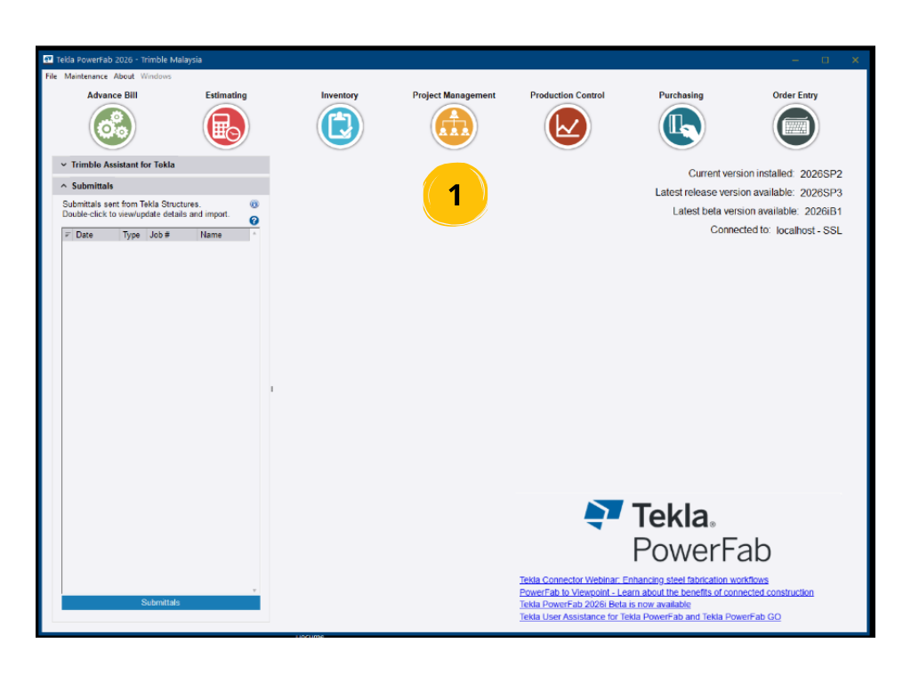
    <figcaption>Figure 1.1. Opening the Project Management module.</figcaption>

2. Click **Add (F1)** at the bottom of the window.

    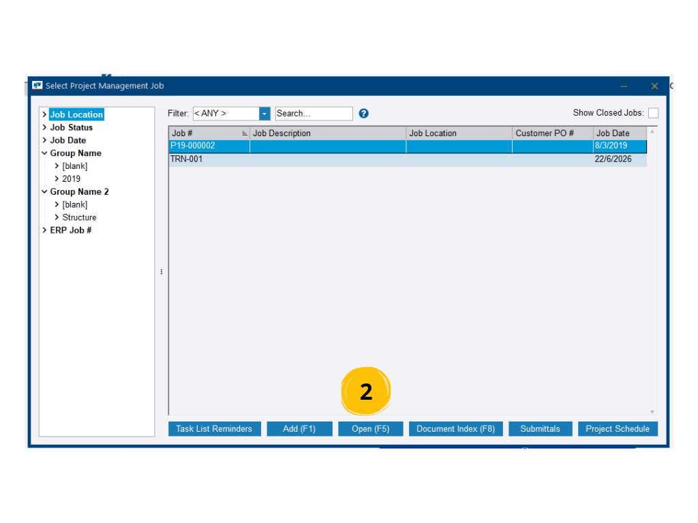
    <figcaption>Figure 1.2. The job list — Add (F1) sits at the bottom left of the window.</figcaption>

3. Enter a **Job #** — use `TRN-001` for this exercise.
4. Complete **Description** and **Location**.
5. Optionally complete **Customer PO #** and **Job Group**.
6. Leave **Job Status** as *Open*.
7. Click **Save**.

    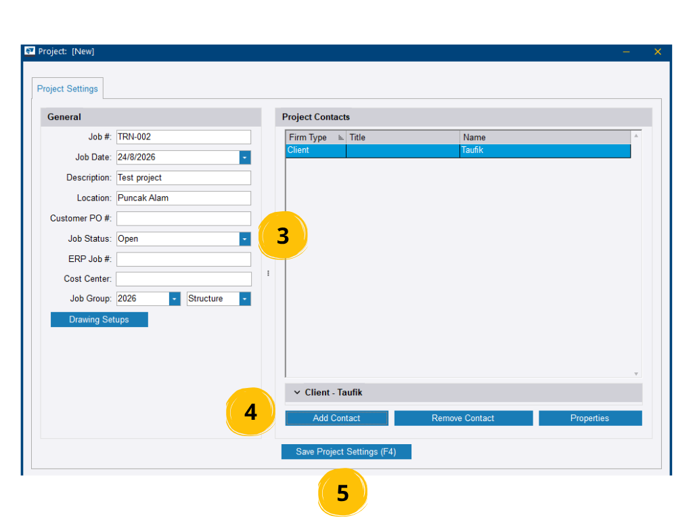
    <figcaption>Figure 1.3. Job details — Job # is the field that matters most, because it cannot be changed later.</figcaption>

**You should now have:** an empty PRJ job that everything else in this exercise will link back to.

!!! danger "The Job # is permanently locked once saved"
    There is no rename. A typo means abandoning the job and creating a replacement, and any work already attached to it goes with it.

    Agree the numbering convention with the customer before training day, not during it.

!!! warning "Do not start with the material import"
    The instinct is to jump straight to Advance Bill or Production Control. Doing so loses the ability to link drawings, RFIs, and schedule status properly — and Tekla PowerFab will force-create a disconnected Project Management job later regardless.

??? question "Frequently asked questions"
    **Can the Job # be changed after saving?**

    No. It is permanently locked. Plan the numbering convention with the client before training day.

    **What is the difference between Job Status *Open* and *Closed*?**

    Open jobs stay visible in the active job list. Closed jobs are hidden from the default view — not deleted — which is useful once a project wraps.

    **Is the ERP Job # field required?**

    Only if the customer exports data to an accounting system such as Trimble Viewpoint. Otherwise leave it blank.

??? note "Field notes — from the live test run"
    Tekla PowerFab 2026, Trimble Malaysia install.

    - Job creation was smooth in testing — no issues encountered.
    - Fill in **Description** and **Location** immediately on a real customer job. An unlabelled job list becomes very hard to search once a company has hundreds of jobs.

---

## Step 2 — Create a project schedule

**Role:** Project Manager · **Module:** Project Management

**Why this matters**

A schedule records when things are supposed to happen, and then updates itself as real work gets done elsewhere in Tekla PowerFab. Drawing approvals, material purchases, fabrication, and shipping all move the progress bars automatically through **Status Links**. Without a schedule, the team is back to editing a spreadsheet by hand every time anything changes.

**How to do it**

### Part A — Build a reusable schedule template

1. Go to **Maintenance > Project Management > Schedule Templates**.
2. Click **New Template (F1)** and name it — `Training-Schedule-Template` for this exercise.
3. Click **New Task** and add tasks one at a time: Detailing, Fabrication, Shipping, Installation.
4. For each task, tick **Sequence** and **Lot #** under *Apply Project Breakdown*.
5. Set a **Status Link** tied to a real tracked event — Detailing to *Drawings Approved* (By Quantity), Fabrication to *Production Completed*, Shipping to *Shipping Completed*.
6. Click **Add (F4)** to save each task, then **Save Template (F4)** once every task is listed.

    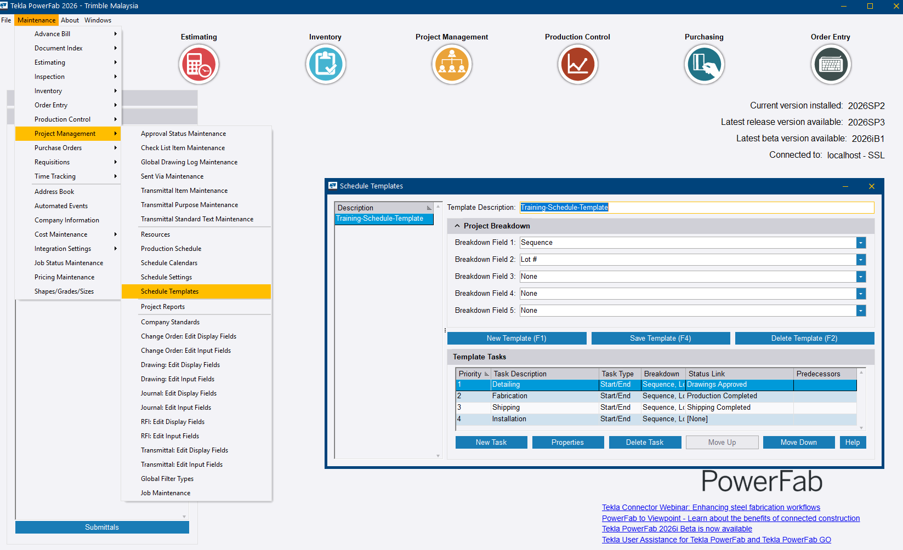
    <figcaption>Figure 2.1. The finished template, with the menu path that reaches it still open on the left. Note Installation's Status Link — it reads [None], because no Installation event exists to link to.</figcaption>

### Part B — Apply the template to the job

1. Open the job and click **Project Schedule**.
2. Go to the **Schedule Tasks** tab and click **Apply Template** — once, and only once. Select the template and click **OK**.

    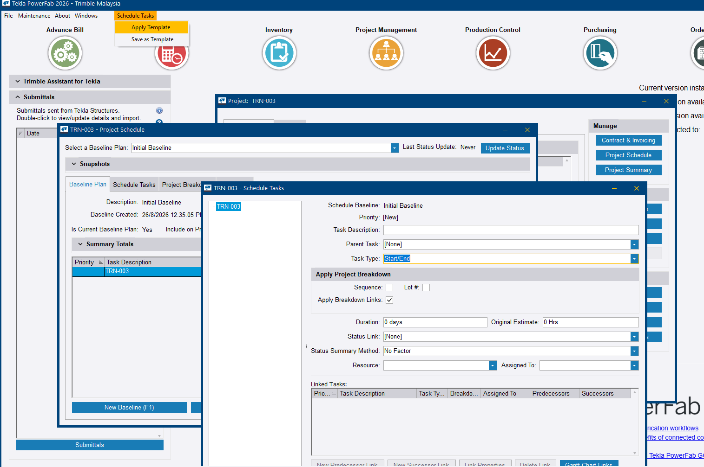
    <figcaption>Figure 2.2. Apply Template sits on the Schedule Tasks menu, above Save as Template.</figcaption>

    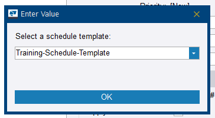
    <figcaption>Figure 2.3. Choose the template, then OK.</figcaption>

3. Confirm exactly the expected number of tasks appears — four, not eight. If they duplicated, select the extra rows and click **Delete (F2)**.

    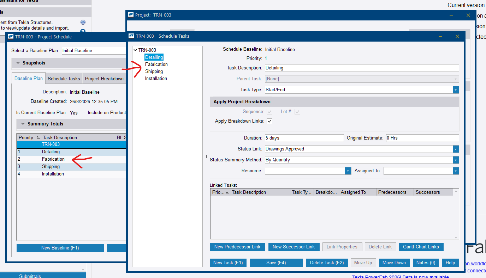
    <figcaption>Figure 2.4. Four tasks, applied once. Eight rows here means Apply Template was clicked twice.</figcaption>

### Part C — Build the project breakdown

1. Go to the **Project Breakdown** tab and click **New**.
2. Enter a **Sequence** number and **Description** — *Area A*, for example.
3. Click the **Apply to Tasks** tab and tick **All**.

    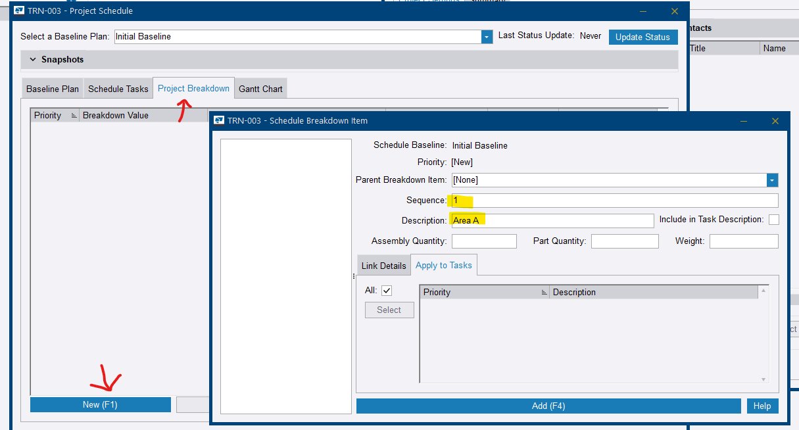
    <figcaption>Figure 2.5. Sequence and Description on the breakdown item, with Apply to Tasks &gt; All ticked.</figcaption>

4. Click **Save (F4)**, or **Add (F4)** for a brand-new item.
5. Click **New (F1)** again and repeat for each additional sequence.

    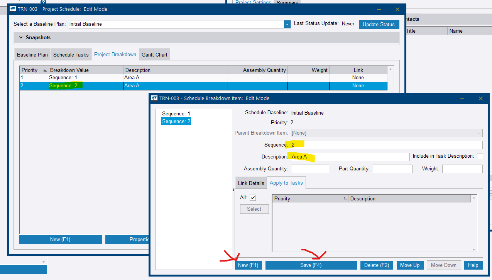
    <figcaption>Figure 2.6. A second sequence added. The Link column reading None is expected — it shows predecessor chaining, not whether Apply to Tasks worked.</figcaption>

### Part D — Adjust dates and set the baseline

1. Go to the **Gantt Chart** tab and confirm **Edit Mode** is active.

    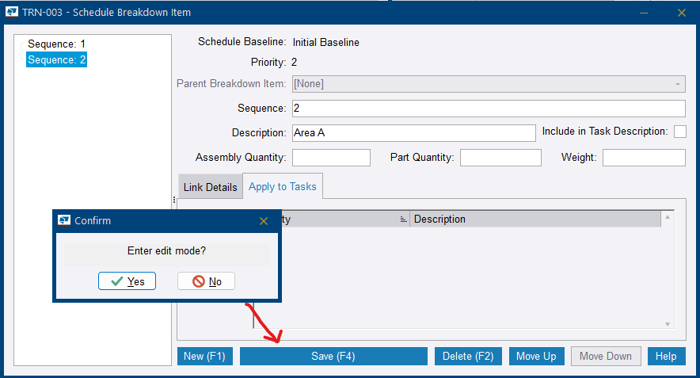
    <figcaption>Figure 2.7. The edit-mode prompt, which appears across the schedule screens. Edit mode drops out again after 180 seconds.</figcaption>

2. Click the date cells, or drag the blue duration bars, to stagger the tasks sequentially.
3. Check the top-level project **Duration** after every change.

    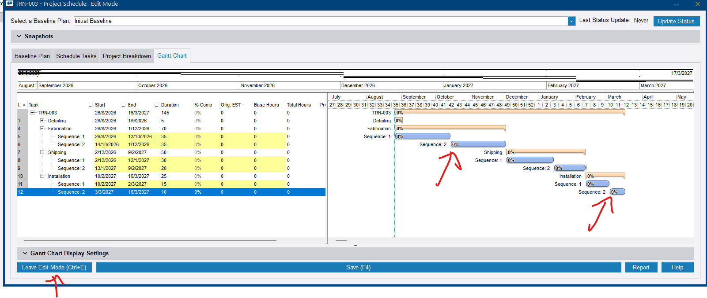
    <figcaption>Figure 2.8. Tasks staggered in Edit Mode. The top row's Duration — 145 days here — is the number to sanity-check after every date edit.</figcaption>

4. Click **Save (F4)**.
5. Go to the **Baseline Plan** tab and click **Set Baseline > Yes**.

    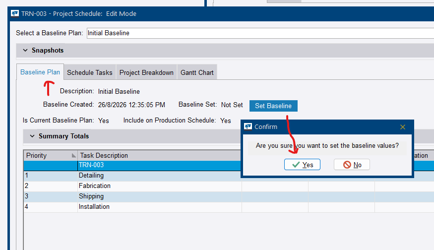
    <figcaption>Figure 2.9. Setting the baseline. Until this is done, planned-versus-actual variance cannot be tracked.</figcaption>

**You should now have:** a baselined programme the rest of the project can be measured against.

!!! info "There is no Installation or Erection Status Link in PowerFab 2026"
    Confirmed against live Trimble documentation. These are the only system Status Links available:

    | Status Link | Typically used for |
    |---|---|
    | Drawings Approved | Detailing |
    | Material Purchased | Procurement |
    | Material Received | Receiving |
    | TFS | Material taken from stock |
    | Production Progress | Fabrication |
    | Production Completed | Fabrication |
    | Station Progress | Fabrication |
    | Shipping Destination Progress | Shipping |
    | Shipping Completed | Shipping |

    For a task with no matching event — Installation is the usual case — set **Status Link = [None]** and **Status Summary Method = No Factor**. Do not force-reuse an unrelated link to make the field look populated.

!!! warning "Three things that catch people out"
    **The Gantt edit mode times out after 180 seconds.** If date cells stop responding, check whether the button now reads *Enter Edit Mode* again — click it to resume.

    **A mistyped date will not be questioned.** One wrong month inflated a test schedule from roughly 20 days to 73 before it was noticed. Sanity-check the top-level Duration after every date change.

    **Clicking Apply Template twice duplicates every task**, silently — eight rows instead of four. Check the row count in Schedule Tasks before moving on.

!!! danger "Sequence and lot names must match Production Control exactly"
    The names entered here — *Area A*, *Area B* — have to be typed identically later in Production Control. If they differ by so much as a space, the link fails silently and progress sits at 0% with no error.

??? question "Frequently asked questions"
    **Can I edit the schedule after applying the template?**

    Yes. The template is only a starting point — every task, date, and link is fully editable per job afterwards.

    **Does the schedule update itself in real time?**

    No. Someone clicks **Update Status** to pull the latest percentage complete from drawing approvals, purchasing, and piece tracking. It is refresh-on-demand, not live.

    **Why is my Fabrication task still stuck at 0%?**

    The Status Link only moves when the tracked event actually fires. For Station Progress, that means someone on the shop floor logging piece tracking entries in PowerFab Office or Go.

    **Can we have different templates for large and small projects?**

    Yes. A simple job might need four tasks; a complex one might split Purchase, Receive, and Process Material into separate line items.

    **What if we do not track sequences and lots at all?**

    Tick the boxes in the template anyway. Breakdown tracking cannot easily be retrofitted onto an existing template later.

??? note "Field notes — from the live test run"
    Tekla PowerFab 2026, Trimble Malaysia install.

    - Ticking **Apply to Tasks > All** is not enough on its own — **Save** (or **Add**) must also be clicked for it to commit.
    - The **Link** column in Project Breakdown shows predecessor and successor links between breakdown items, *not* whether Apply to Tasks succeeded. Seeing *None* there is expected when no predecessor chaining was configured. It is not an error.
    - A single mistyped month inflated the test schedule from roughly 20 days to 73 days before being caught.
    - Clicking **Apply Template** a second time on the same job silently produced eight rows instead of four — Detailing, Fabrication, Shipping, Installation, twice over.

---

## Step 3 — Model in Tekla Structures, assign preliminary marks, and export

**Role:** Steel Detailer / BIM Modeller · **Software:** Tekla Structures

**Why this matters**

Connections are usually not finalised at this stage, but purchasing needs to start ordering long-lead material now rather than in three weeks. Preliminary marks let Tekla PowerFab recognise and group material before final assembly marks exist, so the fabricator can buy steel early. Get this step wrong and everything downstream — Advance Bill, Requisition, Purchasing — either fails to import or imports unreliable data.

**How to do it**

=== "Path A — Tekla PowerFab Connector"

    Recommended where available. Introduced in the 2025 release, so verify it on each customer install.

    1. Link the model directly to the fabricator's Tekla PowerFab project.
    2. The Connector validates against the real material catalogue.
    3. Submit a preliminary list for advance purchasing.

=== "Path B — Manual IFC export"

    Still fully supported, and the safer fallback.

    1. Build the model without finalised connections — main members only.
    2. Select the parts to mark, go to the **Drawings & reports** tab, click **Numbering settings**, and choose **Save preliminary numbers**. Every part to be exported needs one — this is non-negotiable.

        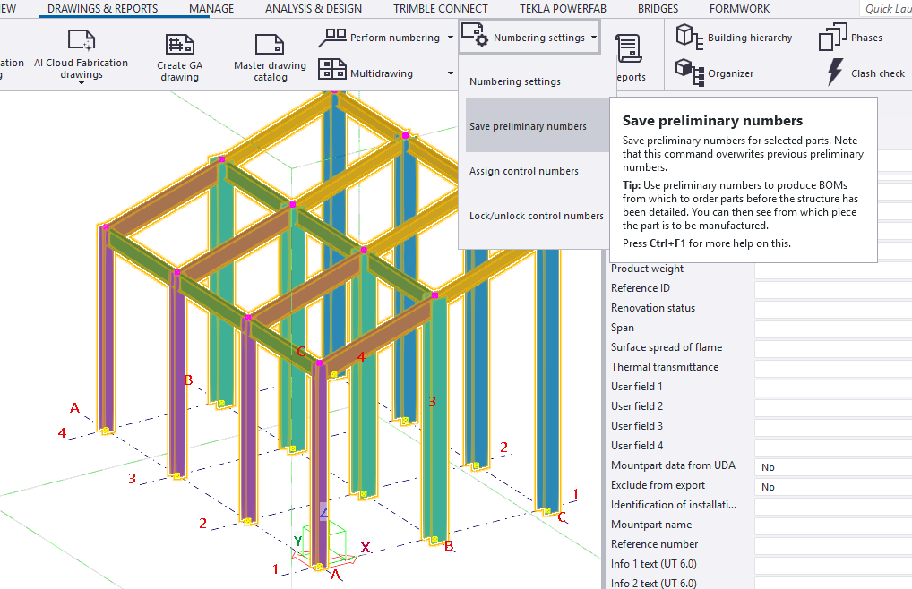
        <figcaption>Figure 3.1. Save preliminary numbers, on the Drawings &amp; reports tab. The tooltip states it overwrites any previously saved preliminary numbers.</figcaption>

    3. Confirm the mark landed: it appears as **Preliminary mark** on the part's **Parameters** tab, among the user-defined attributes.

        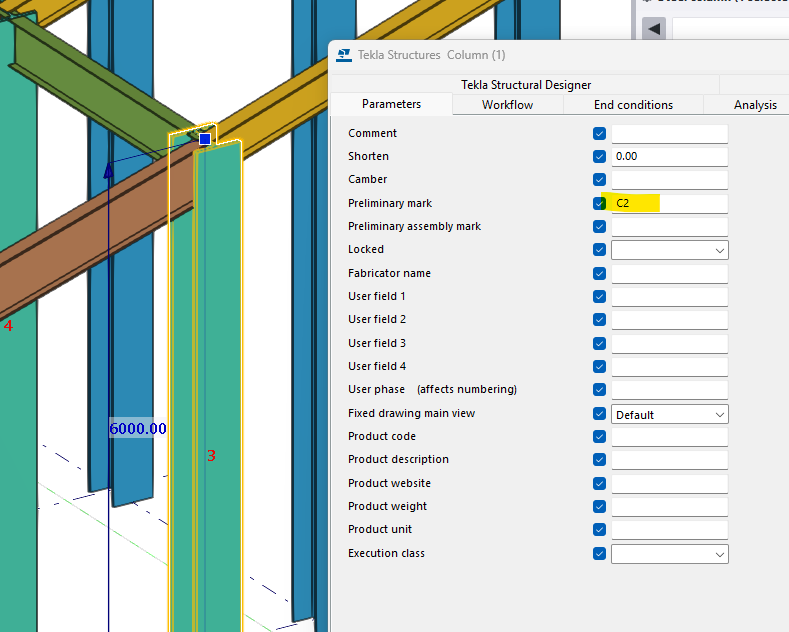
        <figcaption>Figure 3.2. The saved mark on a column — this is the `PRELIM_MARK` UDA that Advance Bill reads on import.</figcaption>

    4. Go to **File > Export > IFC** and export using the **Steel fabrication view** or **2x3 EM11** format.

        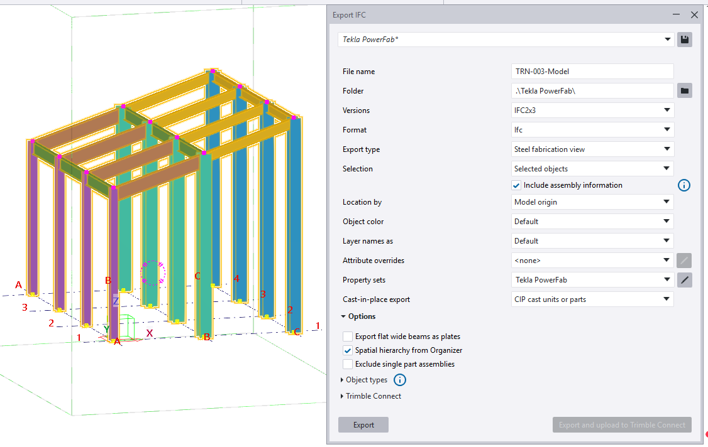
        <figcaption>Figure 3.3. Export type is the field that matters — Steel fabrication view, not Coordination view. Property sets should read Tekla PowerFab.</figcaption>

    5. Later, when importing to Advance Bill, map at least `PRELIM_MARK` to **Reference Number**.

**You should now have:** an IFC file containing main members only, with a preliminary mark on every part.

!!! warning "Two habits to build here"
    **Forgetting `PRELIM_MARK` entirely.** The IFC still imports and nothing appears to fail, but Tekla PowerFab cannot reconcile the list against the real production BOM later.

    **Using the Coordination view out of habit** instead of the Steel fabrication view. It still works — it simply carries less information.

??? question "Frequently asked questions"
    **Do we need a separate Tekla Structures licence?**

    No. A Tekla PowerFab subscription includes one licence of Tekla Structures.

    **Can we re-export after connections are finalised?**

    Yes — that is Steps 9 and 10 later in this workflow. IFC import supports revision detection.

    **What if PowerFab shows an unrecognised shape or grade on import?**

    The *Translate Shapes/Grades* dialog opens. Map the entry carefully — see Step 5's field notes for what happens when this goes wrong.

    **Does preliminary marking affect final assembly marking later?**

    No. Preliminary marks are throwaway identifiers for early procurement only.

??? note "Field notes — from the live test run"
    Tekla PowerFab 2026, Trimble Malaysia install.

    - For experienced Tekla Structures users this step moves quickly. The only new habit is filling in the preliminary mark on every part before exporting.
    - A six-part model — two columns and four beams — exported and imported cleanly: **453 IFC instances, 0 errors, 0 warnings**, once every part had a preliminary mark assigned.
    - A shape or grade mismatch on import will not always throw a visible warning. A British profile can be silently mapped to the wrong US shape. See Step 5.

---

## Step 4 — Import the IFC into the Advance Bill

**Role:** Estimator / Material Planner · **Module:** Advance Bill

**Why this matters**

This is the moment data crosses the bridge from Tekla Structures into the business side of Tekla PowerFab. The Advance Bill turns the model into something a purchasing agent can act on — a real material list, with real shapes and grades, that can be priced and ordered before detailing is finished.

**How to do it**

1. In Tekla PowerFab, go to **File > Import**.
2. Expand **Advance Bill** and select **IFC**.
3. Click **…**, browse to the exported IFC, and click **Open**.
4. Click **Test Import** first. This is optional but worth the thirty seconds.
5. Click **Import**.

    
    <figcaption>Figure 4.1. The import tree. IFC sits under Advance Bill — the Production Control branch below it is Step 10, not this step.</figcaption>

6. Type or select the job, then click **Load Info** to pull the details from the linked Project Management job created in Step 1.

    
    <figcaption>Figure 4.2. Load Info is what links this Advance Bill job to the Project Management job. Skip it and the job sits disconnected.</figcaption>

    
    <figcaption>Figure 4.3. The Trimble Connect prompt after saving. Optional — useful later for model visualisation, but not required for the import.</figcaption>

7. In **Import Field Map**, select the reference row and set **Tekla PowerFab Field** to **Reference Number**, then click **Set Field Mapping**.

    
    <figcaption>Figure 4.4. Choosing the value in the dropdown does nothing on its own. Set Field Mapping is what commits it.</figcaption>

8. Click **OK**.
9. If a **Change Summary** dialog appears — normal on a first import — review it and click **Continue**.

    
    <figcaption>Figure 4.5. Every row Add, every row Critical: Yes. Expected on a first import into an empty job — click Continue, not Cancel Import.</figcaption>

10. Resolve any **Translate Shapes/Grades** prompts carefully. Map to the correct existing shape, or create a new one if nothing matches.
11. Open the Advance Bill module and confirm the material list imported correctly.

    
    <figcaption>Figure 4.6. A clean import saves an Import Change Summary and an Import Change Log to the job's Document Index — a ready-made QA trail.</figcaption>

    
    <figcaption>Figure 4.7. The job now appears in the Advance Bill list, with its item count and total weight.</figcaption>

    
    <figcaption>Figure 4.8. The imported material. Note the link counters at the bottom right — everything reads Not Linked until Step 5 combines it.</figcaption>

**You should now have:** main members listed in the Advance Bill, linked to job `TRN-001`, ready to combine.

!!! danger "Selecting a field in the dropdown does not map it"
    **Set Field Mapping** has to be clicked. Choosing *Reference #* in the dropdown and moving on leaves the field unmapped, and Tekla PowerFab then cannot reconcile this list against the production BOM later.

    The same trap recurs at Step 10.

!!! warning "Read the Translate Shapes/Grades window every single time"
    Tekla PowerFab silently reapplies the last saved shape and grade mapping. Once a translation is saved it applies automatically, without prompting, on every future import of that shape — even if the mapping was wrong.

    The full incident, and how it was diagnosed and fixed, is in Step 5's field notes.

!!! warning "Link the import to the Project Management job"
    Use **Load Info**. An Advance Bill job that was never linked sits disconnected from the schedule, the contacts, and the document index, and nothing prompts you about it.

??? question "Frequently asked questions"
    **What if the IFC import shows zero items?**

    Usually the export did not include preliminary marks, or used the wrong view or format. Re-check the Tekla Structures export settings.

    **Can the same IFC be imported twice?**

    Yes. Revision detection flags changes rather than duplicating data.

    **Does the Advance Bill replace Estimating?**

    No. The Advance Bill is for early procurement off a preliminary model; Estimating is for pricing and bidding before award.

    **What if a customer does not use the Advance Bill at all?**

    Some skip straight to Production Control. That is workable, but they lose the ability to order long-lead material early.

    **Do all fields need to be mapped?**

    Only Reference Number is mandatory. Most others auto-map from standard IFC properties.

??? note "Field notes — from the live test run"
    Tekla PowerFab 2026, Trimble Malaysia install.

    - Tekla PowerFab may prompt to link the job to a Trimble Connect project after saving. Optional, but useful for live model visualisation later.
    - A Change Summary listing every item as *Add* with *Critical: Yes* is normal for a first-time import into a brand-new job. Click **Continue**, not **Cancel Import**.
    - A clean import reports **Successful: X / Unsuccessful: 0** and auto-saves two PDF reports — Import Change Summary and Import Change Log — to the job's Document Index. That is a useful QA trail to show customers.

---

## Step 5 — Combine partially in the Advance Bill

**Role:** Estimator / Material Planner · **Module:** Advance Bill

**Why this matters**

Steel is not bought piece by piece — it arrives in stock lengths or sheets, and a good material planner groups parts onto the fewest stock lengths possible to minimise waste.

*Partially* is the word that matters. On a real project you lock in only the long-lead or critical items now — the columns — and leave the rest for later, once detailing is further along. Combining everything immediately defeats the point of staged procurement.

**How to do it**

1. With the Advance Bill job open, click the **Advance Bill** ribbon tab and then **Combine**.

    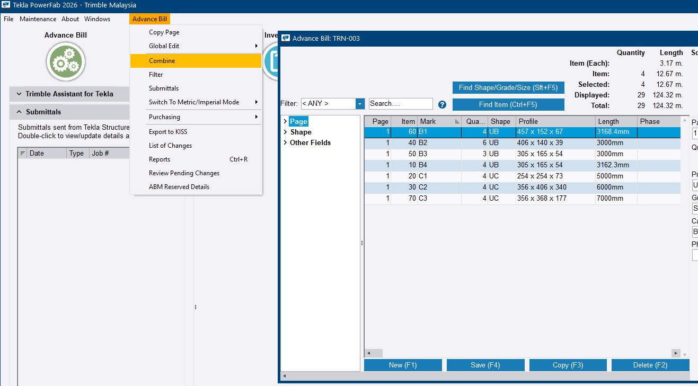
    <figcaption>Figure 5.1. Combine sits on the Advance Bill ribbon, above Filter and Global Edit.</figcaption>

2. The *Select Combining Run* dialog opens. Choose **Mult (F1)** for linear items such as beams, angles, and columns; **Nest (F2)** for plates and gratings; or **Mult & Nest (F3)** for both.

    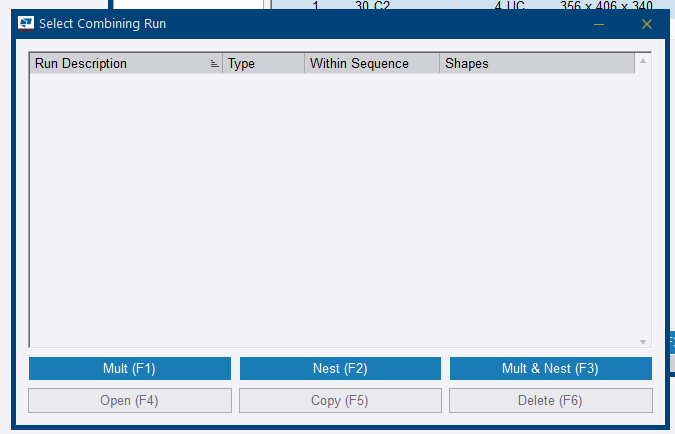
    <figcaption>Figure 5.2. An empty run list is normal on a first combine. The three buttons choose the calculation type.</figcaption>

3. *Combining Run Filters* opens. In the **Type** list — the left-hand column, not the separate *Filter Types* button — click the row for **Reference #**.
4. Click **Select** on the right. The *Filter* dialog opens.

    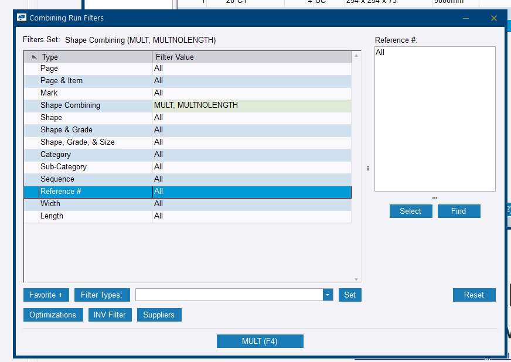
    <figcaption>Figure 5.3. Everything in one frame: the Type list on the left, Select on the right, the Filter Types button that is <em>not</em> the item picker, and MULT (F4) at the bottom. Every row reads All until a filter is applied.</figcaption>

5. Click **`<<`** to clear the Included list, then Ctrl+click the specific items to include — the two columns — in *Not Included*, click **`>`** to move them across, and click **OK**.
6. Confirm the **Reference #** row now shows the chosen items rather than *All*.
7. Click the combine button at the bottom — **MULT (F4)**.
8. *Combining Run Results* opens. Check **% Combined** and **Cost**.

    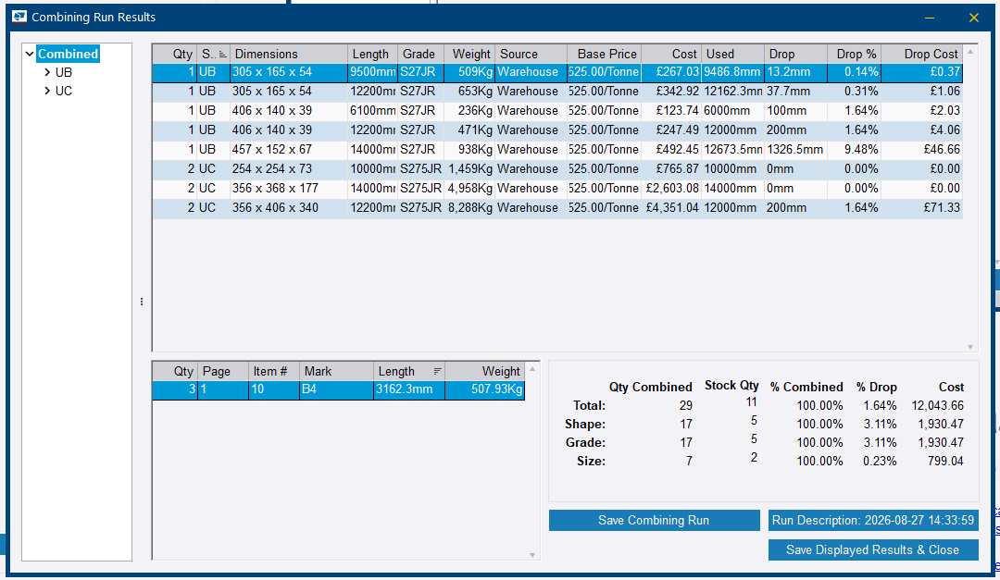
    <figcaption>Figure 5.4. A healthy result: 100% combined, a real drop percentage, and real costs. Zeroes here mean the combine failed — see the warning below.</figcaption>

9. Click **Save Displayed Results & Close**, choose **Requisitions**, add a new one, name it, and save.

    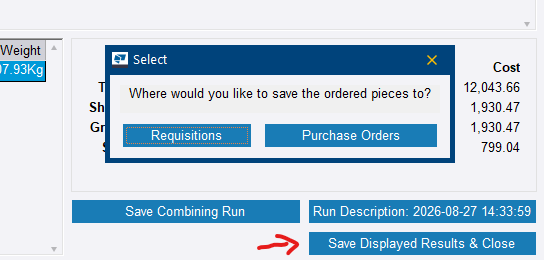
    <figcaption>Figure 5.5. Requisitions sends the material out for pricing; Purchase Orders commits immediately. Step 6 explains why the requisition route usually comes first.</figcaption>

    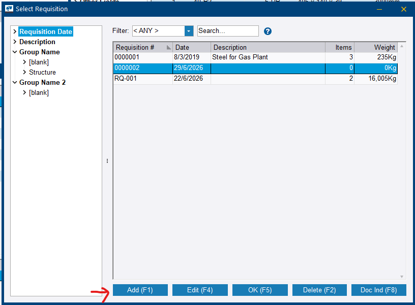
    <figcaption>Figure 5.6. Add creates a new requisition rather than appending to an existing one.</figcaption>

    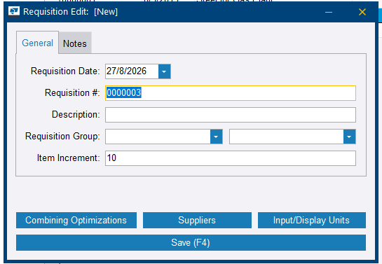
    <figcaption>Figure 5.7. Name the requisition, then Save (F4).</figcaption>

**You should now have:** the columns combined onto stock lengths, with a real percentage combined and a real cost, and a requisition holding the result.

!!! danger "0% Combined and $0.00 is a failure, not a result"
    The dialog closes cleanly either way. A zero result means Tekla PowerFab has no usable stock-length or pricing data for that exact shape, grade, and size combination — the shape may exist, but there is nothing to combine the material into.

    Check **Shape/Grade/Size Maintenance** and **Pricing Maintenance** before assuming the model data or the filter is wrong. Never proceed on the assumption that it worked because no error appeared.

!!! warning "Four ways this step goes wrong"
    **Forgetting the filter and combining everything.** The most common slip on this exact step — Combine with no filter grabs the whole job.

    **Confusing *Filter Types* with *Select*.** Filter Types manages custom filter categories and is usually empty and irrelevant. The actual item picker is reached by clicking a row in the **Type** list, then **Select**.

    **Not reviewing Optimizations and Supplier settings first.** Combining uses whatever default stock lengths and suppliers are configured.

    **Treating a clean-looking dialog as a successful combine.** Read the summary numbers, not just whether the window closed without complaint.

??? question "Frequently asked questions"
    **What is the difference between Mult and Nest?**

    Mult combines linear items such as beams and angles. Nest combines items with area, such as plates or gratings.

    **Can I undo a combine if I made a mistake?**

    Yes. Use **Uncombine** to revert to the original parts, then reoptimise.

    **Does combining automatically create a purchase order?**

    No. You explicitly choose afterwards whether to send the result to a Requisition for price-shopping, or straight to a Purchase Order.

    **What does 0% Combined and $0.00 Cost actually mean?**

    Tekla PowerFab has no usable stock-length or pricing data for that shape, grade, and size. Check Shape/Grade/Size Maintenance and Pricing Maintenance first.

    **Why would an import map a UK profile such as UC to a US shape such as WT?**

    When an imported shape or grade is not recognised, the *Translate Shapes/Grades* dialog lets you map it to something in PowerFab's database. Once saved, that mapping applies silently to every future import of the same shape. It will not prompt again, even if the mapping was wrong.

    **Is there a faster way to load all the standard UC and UB sizes than typing each one?**

    Yes. Check whether a regional database — a UK or SEA dataset — already includes these shapes with full engineering properties and pricing pre-loaded. Restoring the correct regional database is far faster and more reliable than hand-keying dozens of sizes.

??? note "Field notes — the shape and grade incident, in full"
    Tekla PowerFab 2026, Trimble Malaysia install. This was the richest piece of troubleshooting in the whole exercise and is worth walking through with trainees.

    **What happened.** A first combine attempt on two columns returned **0% Combined / $0.00 Cost**, with both items sitting under *Not Combined*. Investigation traced it to two separate problems.

    1. **Missing pricing and stock-length data.** The shape technically existed in the database but had no available length or price set up for that grade and size, so there was nothing to combine the material into.
    2. **A wrong shape and grade translation, saved previously and applied silently.** The model used genuine British profiles — UC356×406×467, grade S275 — but the IFC import resolved them to WT / A36, a completely different US shape and grade, with 0 errors and 0 warnings on import. Someone had previously run *Translate Shapes/Grades* and mapped UC to WT, and that mapping is saved permanently, so it no longer prompts on later imports. The giveaway was a Shape/Grade/Size Maintenance dimension entry with every engineering property — weight, depth, flange width — sitting at zero.

    **The fix path used.** Maintenance > Shapes/Grades/Sizes, located and deleted the wrong dimension entries, then used **Find Abbreviation** to locate and delete the UC-to-WT alias. Browsing by Material Group wasted time here — UC belongs under *Beams*, not *Tubes*. Proper UC and UB shapes were then created via **Shape Maintenance**, a distinct ribbon-menu dialog and not the same as the browse-only Shape/Grade/Size Maintenance window, using **New Shape** based on the closest existing relative (W, Wideflange Beams).

    **The cleanest fix, in the end.** Restoring the correct SEA regional database rather than hand-building shapes. It already contained UC (31 dimensions, 3 grades) and UB (80 dimensions, 3 grades) fully populated with real engineering and pricing data. A re-import after the restore resolved UC / S275 correctly on the first pass, with no manual translation needed.

    **Result after the fix.** 100% Combined, 0% Drop, real cost (£11,007.49) — confirming shape, grade, and pricing were finally aligned.

    **Takeaway for training.** If a combine returns 0% / $0.00, do not assume the model or the filter is wrong. Check Shape/Grade/Size Maintenance and Pricing Maintenance first. And if a shape or grade looks suspicious on import, check whether it has been silently auto-translated before — that will not raise a warning.

---

## Step 6 — Send to requisition and purchasing

**Role:** Material Planner / Purchasing Agent · **Modules:** Advance Bill, Purchasing

**Why this matters**

After combining material into stock-length groups, the requisition is where the material planner sends material out for vendor pricing before committing to a purchase order. This protects against over-committing to one supplier before quotes are compared. The purchase order itself typically comes later, once pricing is back.

**How to do it**

1. Following on from Step 5's **Save Displayed Results & Close**, choose **Requisitions** when prompted.

    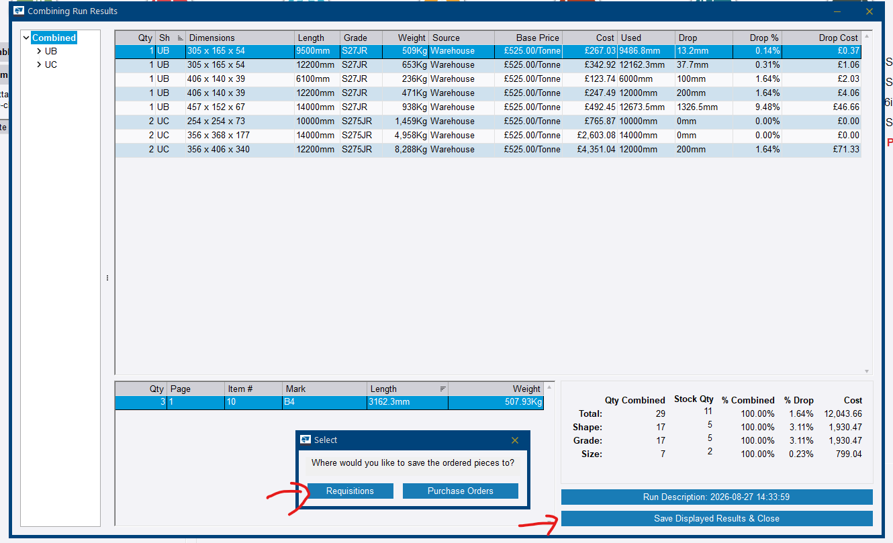
    <figcaption>Figure 6.1. The hand-off point from Step 5. The combined stock lengths on screen are what lands in the requisition.</figcaption>

2. In the *Select Requisition* dialog, click **Add**, enter a **Requisition #** — `RQ-001` — and click **Save**.

    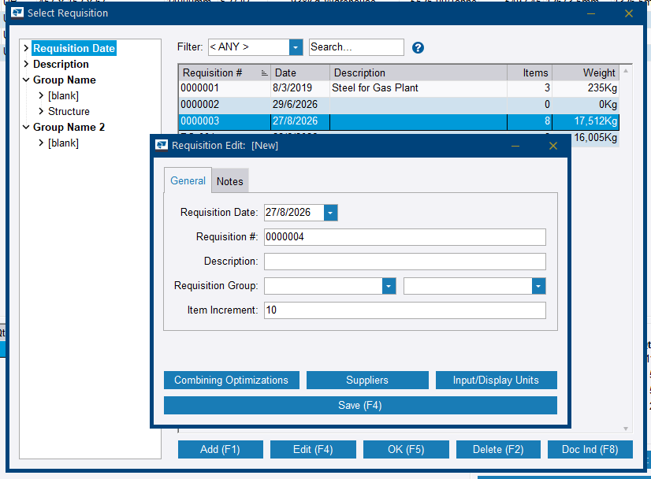
    <figcaption>Figure 6.2. Creating the requisition. Existing requisitions stay listed behind it.</figcaption>

3. The combined material populates into the new requisition automatically.
4. Open the **Purchasing** module, go to the **Requisitions** tab, and open the requisition just created.

    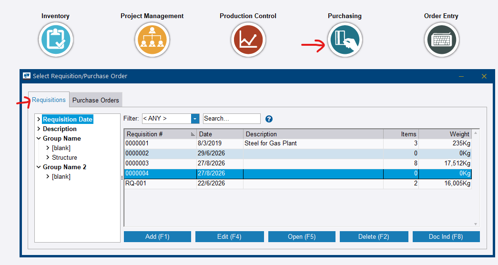
    <figcaption>Figure 6.3. Purchasing opens on two tabs — Requisitions and Purchase Orders. Everything up to Step 6 lives on the first.</figcaption>

5. Confirm each line shows the correct profile, grade, quantity, length, base price, and cost.
6. Check **Linked to ABM** at the bottom of the line item detail. It should show a full ratio — 4/4 — confirming every piece is reconciled back to the original Advance Bill line.

    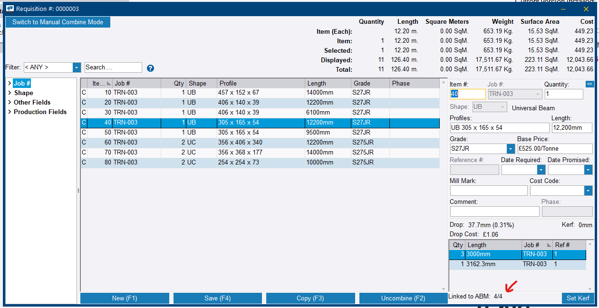
    <figcaption>Figure 6.4. Linked to ABM: 4/4 — check this per line, not once per requisition. Note the toggle top-left reads <em>Switch to Manual Combine Mode</em>; the purchase order screen has a lookalike that reads Receive Mode instead (Step 13).</figcaption>

7. Once vendor pricing is confirmed, and only then, open the requisition itself, go to the **Requisition** ribbon tab, and click **Load Material Into Purchase Order**. Pick or create the PO, then **OK** to formally commit.

    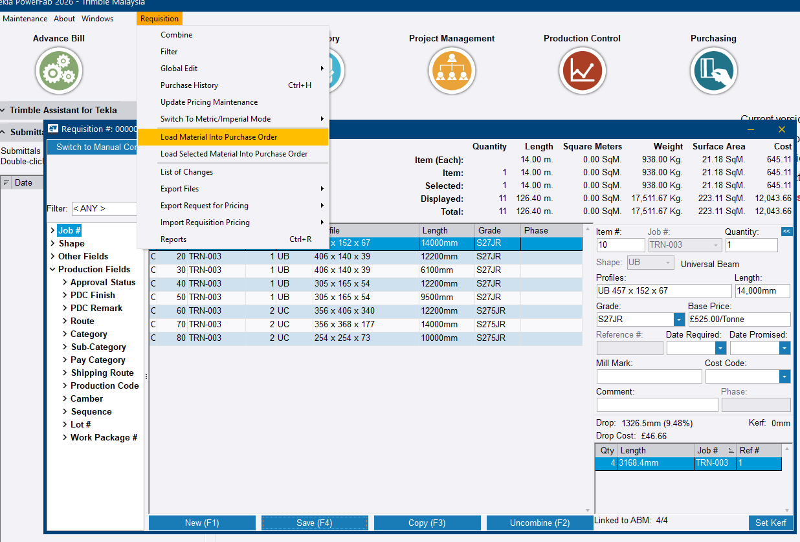
    <figcaption>Figure 6.5. The command lives on this ribbon tab, inside the opened requisition — not on the list screen, where right-clicking offers only Select All and Export to Excel.</figcaption>

    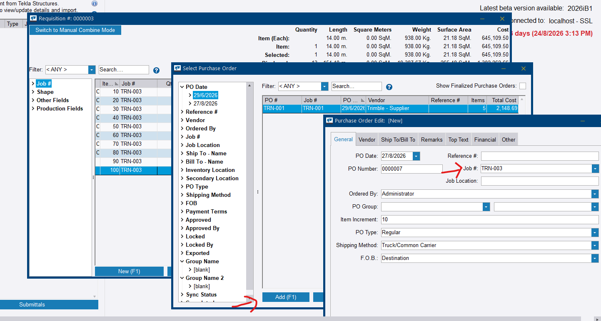
    <figcaption>Figure 6.6. Creating the purchase order the material transfers into.</figcaption>

    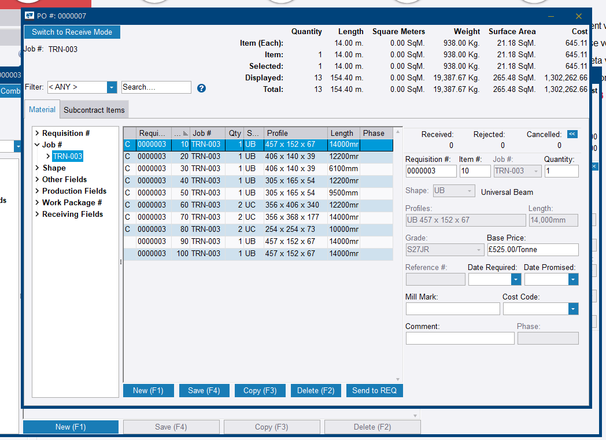
    <figcaption>Figure 6.7. The material has moved across. Received, Rejected and Cancelled all read zero until Step 13 — and this is the screen that offers Receive Mode.</figcaption>

    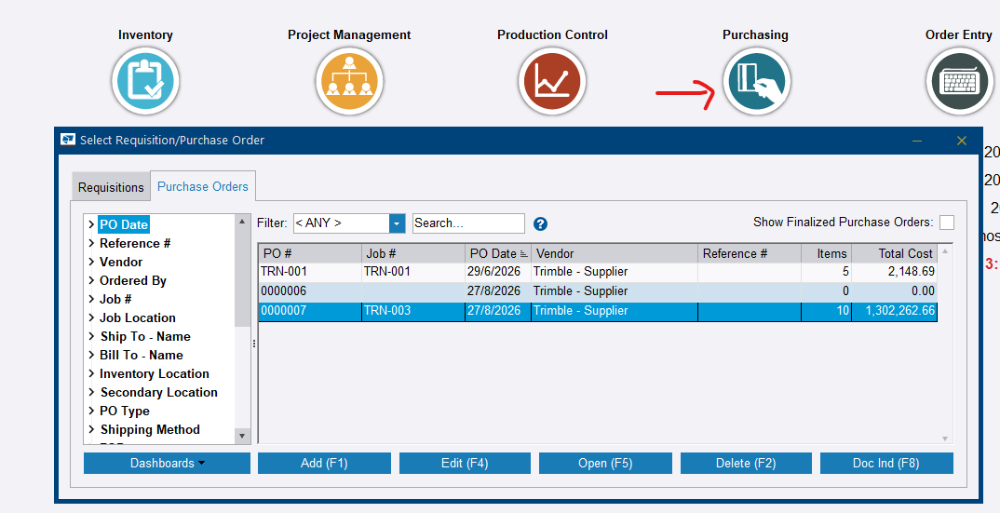
    <figcaption>Figure 6.8. The PO now appears on the Purchase Orders tab, carrying its item count and total cost.</figcaption>

**You should now have:** requisition `RQ-001` holding the combined columns, every line fully linked back to the Advance Bill.

!!! warning "Check the Linked to ABM ratio on every line, not just the first"
    A ratio that is not a full match — 2/4 rather than 4/4 — means part of the order is incomplete even though the requisition appears to exist. Nothing flags this.

    The same applies across material types: if a job has both columns and beams, each filter combination run separately needs its own check. Do not assume combining one Reference # covered the others.

!!! danger "Requisitions that never become purchase orders simply disappear"
    Material sitting on an unconverted requisition will never be ordered, never arrive, and never appear in inventory — and nothing prompts you about it.

    It also silently excludes that material from cut lists at Step 15. This exact gap was traced on requisition `RQ-001` during a live session. Review the open requisition list at the end of every procurement cycle.

??? question "Frequently asked questions"
    **What is the actual difference between a requisition and a purchase order?**

    A requisition is an internal request used to shop pricing across vendors. A purchase order is the formal commitment to buy from a specific vendor at a specific price.

    **Can one requisition span multiple jobs?**

    Yes. The Select Requisition/Purchase Order dialog can list items across different job numbers — requisitions are not strictly limited to a single job.

    **What does *Linked to ABM* mean?**

    It shows how many of the requisition's stock pieces are reconciled back to the original Advance Bill line items. A less-than-full ratio means some pieces were not captured in this requisition.

    **Does the Drop % shown in the requisition matter?**

    Yes. It reflects material waste from the combining run. 0% drop, as in a clean training example, means stock lengths were used perfectly. In real projects some drop is normal and is factored into cost.

    **What happens to the requisition once the PO is created?**

    Materials transfer from the requisition to the purchase order and the requisition's line items clear. This is what prevents double-ordering the same material.

??? note "Field notes — from the live test run"
    Tekla PowerFab 2026, Trimble Malaysia install.

    - After fixing the shape and grade issue from Step 5, both column types — the smaller and the larger UC profile — showed **Requisition: X/X** fully linked when checked individually from the Advance Bill material list. Repeat that check for every line item, not just the first, before assuming the whole job is covered.
    - The Requisition screen displayed the combined stock groups exactly as predicted from the Combining Run Results — same quantities, lengths, grade, price, and total cost. That is a quick way to spot-check that nothing was lost in the hand-off between Combine and Requisition.
    - **Drop: 0 mm (0.00%)** showed on the requisition once the correct UC profile and stock lengths were used. Point out to trainees that this is a genuine material-efficiency metric, not a formality.

---

Continue to [Part 2 — Steps 7 to 13](part-2.md).
