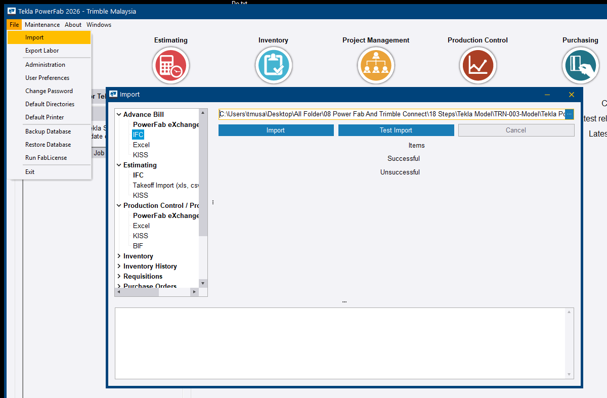
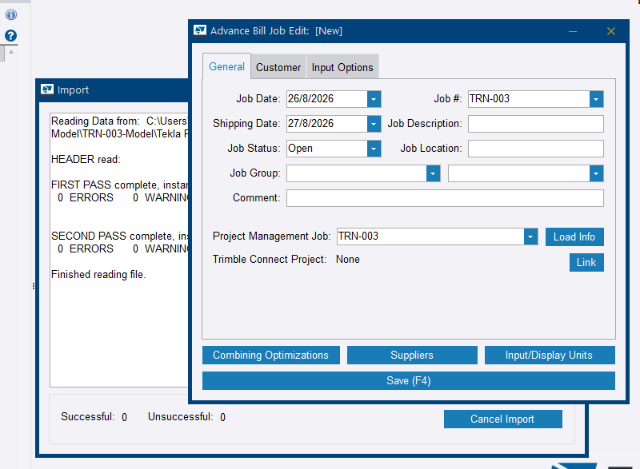
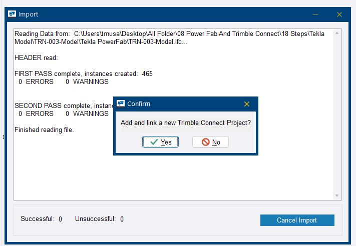
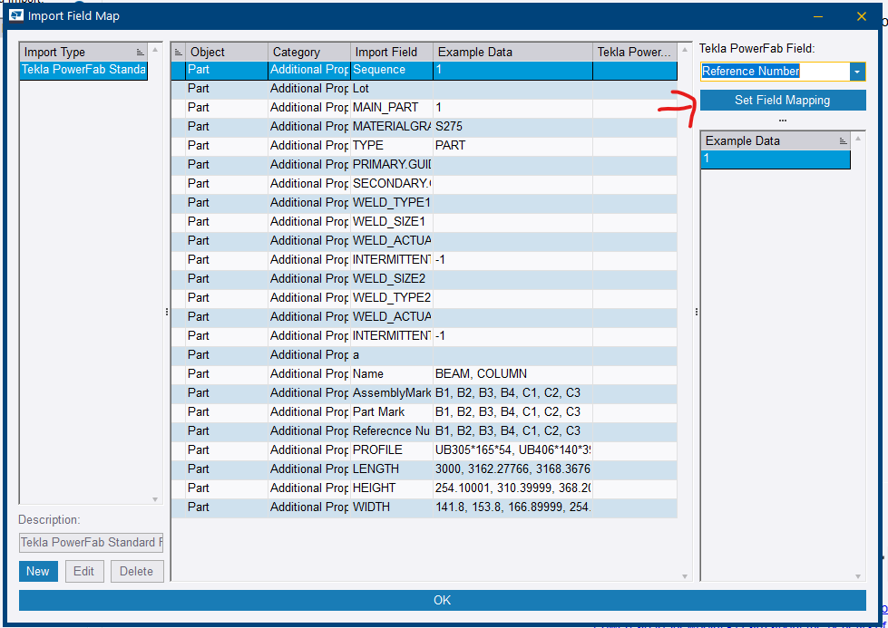
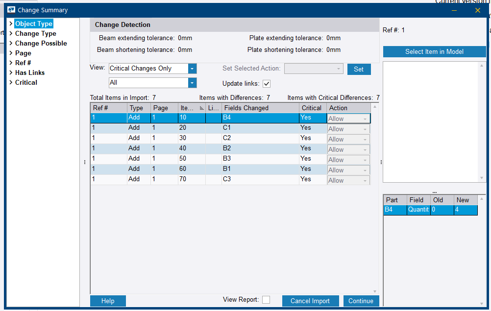
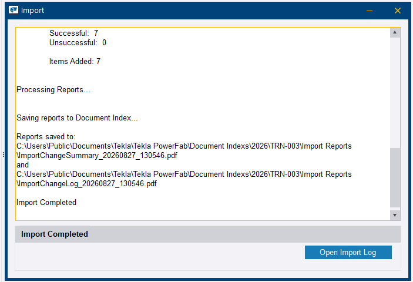
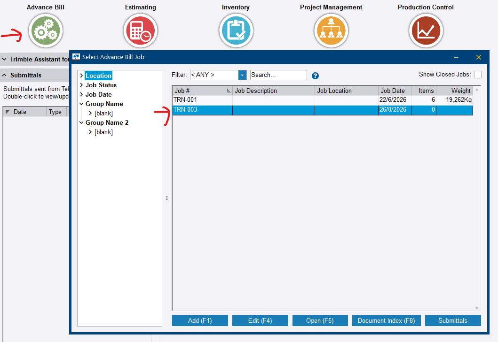
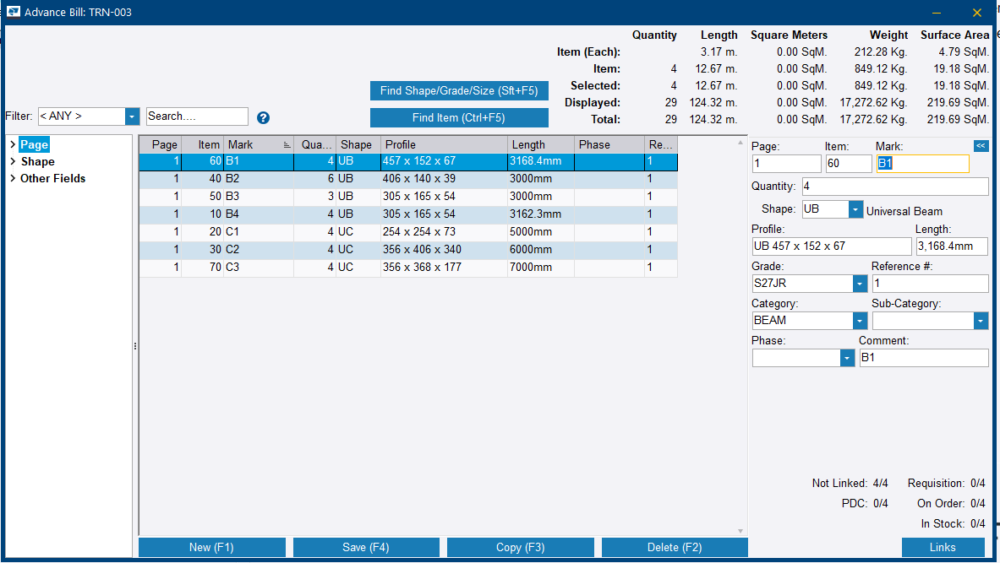

# Step 4 — Import the IFC into the Advance Bill

**Role:** Estimator / Material Planner · **Module:** Advance Bill

**Why this matters**

This is the moment data crosses the bridge from Tekla Structures into the business side of Tekla PowerFab. The Advance Bill turns the model into something a purchasing agent can act on — a real material list, with real shapes and grades, that can be priced and ordered before detailing is finished.

**How to do it**

1. In Tekla PowerFab, go to **File > Import**.
2. Expand **Advance Bill** and select **IFC**.
3. Click **…**, browse to the exported IFC, and click **Open**.
4. Click **Test Import** first. This is optional but worth the thirty seconds.
5. Click **Import**.

    
    <figcaption>Figure 4.1. The import tree. IFC sits under Advance Bill — the Production Control branch below it is Step 10, not this step.</figcaption>

6. Type or select the job, then click **Load Info** to pull the details from the linked Project Management job created in Step 1.

    
    <figcaption>Figure 4.2. Load Info is what links this Advance Bill job to the Project Management job. Skip it and the job sits disconnected.</figcaption>

    
    <figcaption>Figure 4.3. The Trimble Connect prompt after saving. Optional — useful later for model visualisation, but not required for the import.</figcaption>

7. In **Import Field Map**, select the reference row and set **Tekla PowerFab Field** to **Reference Number**, then click **Set Field Mapping**.

    
    <figcaption>Figure 4.4. Choosing the value in the dropdown does nothing on its own. Set Field Mapping is what commits it.</figcaption>

8. Click **OK**.
9. If a **Change Summary** dialog appears — normal on a first import — review it and click **Continue**.

    
    <figcaption>Figure 4.5. Every row Add, every row Critical: Yes. Expected on a first import into an empty job — click Continue, not Cancel Import.</figcaption>

10. Resolve any **Translate Shapes/Grades** prompts carefully. Map to the correct existing shape, or create a new one if nothing matches.
11. Open the Advance Bill module and confirm the material list imported correctly.

    
    <figcaption>Figure 4.6. A clean import saves an Import Change Summary and an Import Change Log to the job's Document Index — a ready-made QA trail.</figcaption>

    
    <figcaption>Figure 4.7. The job now appears in the Advance Bill list, with its item count and total weight.</figcaption>

    
    <figcaption>Figure 4.8. The imported material. Note the link counters at the bottom right — everything reads Not Linked until Step 5 combines it.</figcaption>

**You should now have:** main members listed in the Advance Bill, linked to job `TRN-001`, ready to combine.

!!! danger "Selecting a field in the dropdown does not map it"
    **Set Field Mapping** has to be clicked. Choosing *Reference #* in the dropdown and moving on leaves the field unmapped, and Tekla PowerFab then cannot reconcile this list against the production BOM later.

    The same trap recurs at Step 10.

!!! warning "Read the Translate Shapes/Grades window every single time"
    Tekla PowerFab silently reapplies the last saved shape and grade mapping. Once a translation is saved it applies automatically, without prompting, on every future import of that shape — even if the mapping was wrong.

    The full incident, and how it was diagnosed and fixed, is in Step 5's field notes.

!!! warning "Link the import to the Project Management job"
    Use **Load Info**. An Advance Bill job that was never linked sits disconnected from the schedule, the contacts, and the document index, and nothing prompts you about it.

??? question "Frequently asked questions"
    **What if the IFC import shows zero items?**

    Usually the export did not include preliminary marks, or used the wrong view or format. Re-check the Tekla Structures export settings.

    **Can the same IFC be imported twice?**

    Yes. Revision detection flags changes rather than duplicating data.

    **Does the Advance Bill replace Estimating?**

    No. The Advance Bill is for early procurement off a preliminary model; Estimating is for pricing and bidding before award.

    **What if a customer does not use the Advance Bill at all?**

    Some skip straight to Production Control. That is workable, but they lose the ability to order long-lead material early.

    **Do all fields need to be mapped?**

    Only Reference Number is mandatory. Most others auto-map from standard IFC properties.

??? note "Field notes — from the live test run"
    Tekla PowerFab 2026, Trimble Malaysia install.

    - Tekla PowerFab may prompt to link the job to a Trimble Connect project after saving. Optional, but useful for live model visualisation later.
    - A Change Summary listing every item as *Add* with *Critical: Yes* is normal for a first-time import into a brand-new job. Click **Continue**, not **Cancel Import**.
    - A clean import reports **Successful: X / Unsuccessful: 0** and auto-saves two PDF reports — Import Change Summary and Import Change Log — to the job's Document Index. That is a useful QA trail to show customers.

---

Next: [Step 5 — Combine partially in the Advance Bill](step-05.md)
