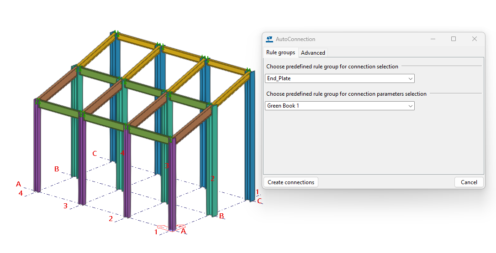
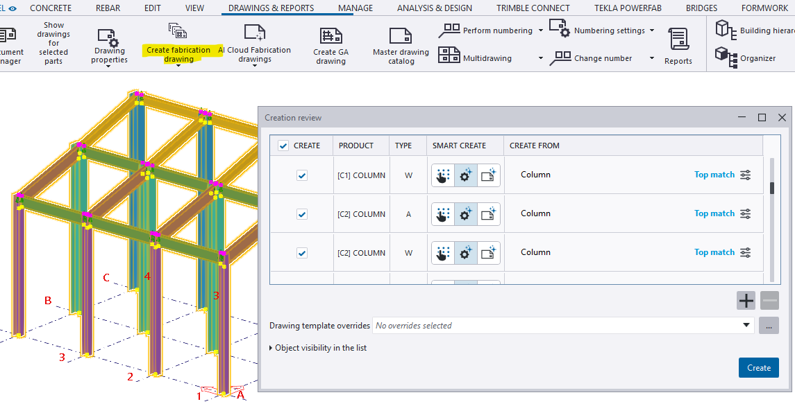
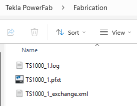
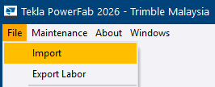
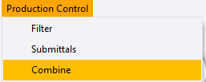
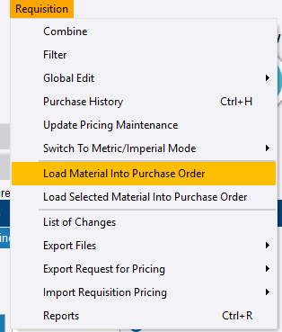
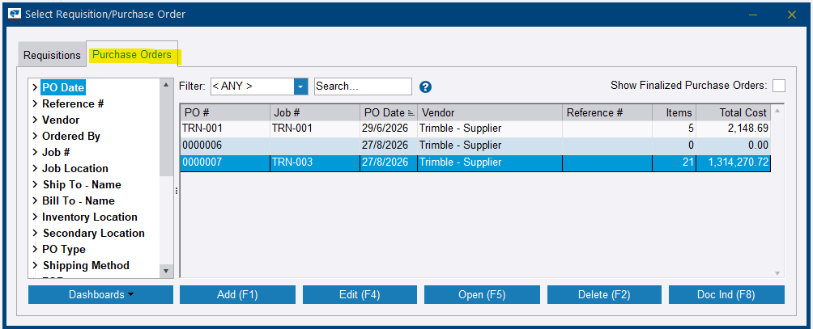

# Part 2 — Steps 7 to 13

Part 2 finishes the engineering, packages it for the shop, and closes the procurement loop on everything detailing added.

Complete [Part 1](part-1.md) before starting.

---

## Step 7 — Complete the connections in Tekla Structures

**Role:** Steel Detailer / BIM Modeller · **Software:** Tekla Structures

**Why this matters**

Material has at least been requisitioned off the preliminary model, so the detailer now has a window to finish the real engineering — bolts, plates, welds — and move from preliminary marks to final assembly marks. This is deliberate parallel working: two long-duration activities running at the same time instead of one after the other. It is also the point where the model shifts from advance procurement data to production-ready data.

**How to do it**

1. Open the Tekla Structures model.
2. Add connections to the members. Auto-connections such as fin plates are fine for a practice run.
3. Reassign final assembly marks where needed, replacing the preliminary marks used in Step 3.
4. Check for case-colliding part marks before going any further — see the warning below.
5. Run a clash check and resolve any conflicts, particularly bolt clashes.
6. Save and update the model.

<!-- SCREENSHOTS — Step 7
     Drop files into docs/assets/images/implementation/ named:
       impl-step07-01.png, impl-step07-02.png, ...
     Then delete this comment wrapper and indent each block 4 spaces
     under the numbered step it belongs to.

    
    <figcaption>Figure 7.1. Caption text.</figcaption>
-->

**You should now have:** a fully detailed model carrying final assembly marks, ready for drawing production.

!!! danger "Check for case-only mark collisions now, not later"
    An auto-generated clip plate marked `m1` sitting alongside an existing `M1` looks harmless in the model. It causes a real, invisible problem two steps later: Windows filenames are not case-sensitive, so both marks write to the same `.nc1` filename and one silently overwrites the other.

    Build the habit of checking for case-only collisions right after adding connections, rather than discovering it via a cryptic import warning at Step 10.

!!! warning "Review the joint types, do not just blanket-apply"
    Auto-connections everywhere is fine for a training exercise. A real project needs the right connection type per joint, not a default applied across the board.

??? question "Frequently asked questions"
    **Why wait until now to add connections — why not from the start?**

    Advance procurement, Steps 3 to 6, needs material data before detailing is fully finished. Locking in connections too early risks re-detailing work if quantities or specifications change after the initial order review.

    **Does adding connections change my existing Advance Bill data?**

    No. The Advance Bill is already locked in from Steps 4 to 6. New connection material — clips, bolts — is captured fresh during the Production Control import at Step 10, since it was not part of the original advance list.

    **What if I used auto-connections but need to customise a joint later?**

    That is fine. Auto-connections can be individually edited or overridden afterwards; nothing is locked in.

??? note "Field notes — from the live test run"
    Tekla PowerFab 2026, Trimble Malaysia install.

    - Adding auto-connections (fin plates) went smoothly at this stage — no errors during modelling itself.
    - The real complication from this step did not surface until Step 10's import: a case-colliding part mark (`M1` versus `m1`) created here caused one NC file to silently overwrite the other on disk.

---

## Step 8 — Create drawings and export NC files

**Role:** Steel Detailer · **Software:** Tekla Structures

**Why this matters**

A welder at a workbench cannot use a 3D model — they need a 2D drawing. A saw or drill line needs machine-readable instructions, not geometry. This step packages both so they can be exported together in Step 9.

**How to do it**

1. Create assembly drawings and single part drawings for the finalised model, using the standard Tekla Structures drawing workflow.
2. Print the drawings first: right-click in **Document Manager** and choose **Print Drawings** — assembly drawings first, then single parts.
3. If the model has changed since the drawings were created, run **Update Drawings** before proceeding.
4. Go to **File > Export > Tekla PowerFab** settings, confirm **Generate CNC files** is ticked, and click **Save** on that settings panel.

<!-- SCREENSHOTS — Step 8
     Drop files into docs/assets/images/implementation/ named:
       impl-step08-01.png, impl-step08-02.png, ...
     Then delete this comment wrapper and indent each block 4 spaces
     under the numbered step it belongs to.

    
    <figcaption>Figure 8.1. Caption text.</figcaption>
-->

**You should now have:** assembly drawings, single-part drawings, printed PDFs, and the CNC setting saved ready for export.

!!! danger "Ticked is not saved"
    This is a real, repeatable trap. The **Generate CNC files** checkbox can appear correctly set, but if **Save** is not clicked on that settings panel, the next export silently produces zero NC files with no upfront warning.

    Tick it, save it, then export.

!!! warning "Print the drawings before exporting"
    In the classic export plugin path, Tekla PowerFab sources the PDF files from wherever they were printed or saved — not directly from the live drawing inside Tekla Structures. Drawings that were never printed produce a *No files loaded* warning at Step 10.

    Two settings govern this and they are separate: the **Include drawing files** toggle in the export settings, and the **Drawing Default Directory** path matching where the files were actually printed.

!!! warning "Create both drawing types"
    It is easy to produce assembly drawings, move on, and forget the single-part drawings — or the reverse. Both are needed.

??? question "Frequently asked questions"
    **Do drawings need to be 100% final before this step?**

    Ideally yes, but they can be revised later. Steps 9 and 10 support revision detection on re-import.

    **What is the actual difference between an assembly drawing and a single part drawing?**

    An assembly drawing shows the whole built-up piece with all its parts and welds. A single part drawing is for an individual unattached plate or member that needs its own shop drawing for cutting and drilling.

    **Why print drawings before exporting, instead of exporting directly from the live drawing?**

    In the classic export plugin path, Tekla PowerFab sources the PDF files from wherever they were printed or saved — not from the live drawing inside Structures.

??? note "Field notes — from the live test run"
    Tekla PowerFab 2026, Trimble Malaysia install.

    - Documented incident from the original enablement session: an export returned *no CNC files* with zero NC data, traced back to the **Generate CNC files** checkbox showing ticked but never actually saved on the settings panel. Re-checking, saving, then re-exporting fixed it.
    - A second, related incident on this practice run: a later export reported *No files loaded for 6 drawings* even though drawings had been printed. Most likely cause is the separate **Include drawing files** toggle — distinct from CNC generation — being unchecked, or the **Drawing Default Directory** path not matching where the files were actually printed. Confirmed as an open item to fix in a follow-up revision import.

---

## Step 9 — Export to PowerFab as `.pfxt`

**Role:** Steel Detailer · **Software:** Tekla Structures

**Why this matters**

This step packages drawings, NC files, and BOM data into the official hand-off to the production team — the moment a model is genuinely *issued for fabrication*. One transfer, rather than separate files that have to be reconciled by hand.

**How to do it**

=== "Path A — Tekla PowerFab Connector"

    Newer and cloud-linked. The recommended path when properly linked end to end.

    1. Open **Submit to Tekla PowerFab**.
    2. Set **Project** — it must already be linked, not *None*.
    3. Choose **Submittal type: Fabrication**.
    4. Confirm **Selection** — *All objects* or *Selected objects*.
    5. Click **Validate Tekla PowerFab submittal**.
    6. If validation is clean, **Export and submit**.

=== "Path B — Classic manual export"

    Fully reliable, and the safer fallback if Connector sync does not pull through.

    1. Go to **File > Export > Tekla PowerFab**.
    2. Set **Select from: Drawing list**.
    3. Choose the bolts and parts inclusion options.
    4. Confirm **Generate CNC files** is ticked.
    5. Set the file type to `.pfxt`.
    6. Click **Export** and save the file somewhere you can find it again.

<!-- SCREENSHOTS — Step 9
     Drop files into docs/assets/images/implementation/ named:
       impl-step09-01.png, impl-step09-02.png, ...
     Then delete this comment wrapper and indent each block 4 spaces
     under the numbered step it belongs to.

    
    <figcaption>Figure 9.1. Caption text.</figcaption>
-->

**You should now have:** a single `.pfxt` package containing the complete detailed job, or a submitted Connector package confirmed as received on the PowerFab side.

!!! danger "Uploaded is not the same as received"
    A Connector submission showing *Uploaded* with a green checkmark means the package reached the server. It does not mean a Production Control job now exists in Tekla PowerFab — someone still has to sync or import it on the PowerFab side.

    Always verify on the receiving end before treating a submission as complete.

!!! warning "Do not keep clicking submit"
    Each click can create a new numbered package — `TS1000_1`, `TS1000_2` — rather than retrying the same one. That produces confusion about which package is real, and it does not fix the underlying problem.

    Check whether Tekla Structures and the PowerFab desktop are signed into the **same Trimble Identity / Trimble Connect account**. A mismatch causes the sync to correctly report *nothing to sync* — not because anything is broken, but because it is looking in the wrong place.

??? question "Frequently asked questions"
    **Which path should I use — Connector or classic manual export?**

    The Connector is the newer recommended path when properly linked end to end. The classic manual `.pfxt` export remains fully reliable and is the safer fallback if Connector sync does not pull through.

    **What does *Fabricator is not selected* mean on the Connector Validate screen?**

    It means the submittal is not routed to a specific fabricator profile. It does not necessarily block the submission, but it should be set up properly before relying on this path for a real customer.

    **Can I just keep clicking submit until it works?**

    No. Repeated submissions create new numbered packages each time without fixing an underlying sync or account issue. Diagnose the actual cause first.

??? note "Field notes — from the live test run"
    Tekla PowerFab 2026, Trimble Malaysia install.

    - A Connector submission showed *Uploaded* with a green checkmark in Submittal History on the Structures side — but PowerFab's own **Sync Submittals** repeatedly reported *No remaining projects/estimates/production control jobs to sync*. The data never reached this PowerFab install despite a successful-looking upload.
    - Rather than chase the cloud-sync and account issue mid-session, the session switched to the classic **File > Export > Tekla PowerFab** path, which worked reliably — the same approach already proven for the Advance Bill import at Step 4.
    - Takeaway for training: *Uploaded* is not *Received*. Always verify on the receiving end — does the Production Control job actually exist? — before treating a submission as complete.

---

## Step 10 — Import the `.pfxt` into Production Control

**Role:** Production Control / Steel Detailer · **Module:** Production Control

**Why this matters**

This is the formal handover from engineering to production. The issued-for-fabrication package becomes a real, trackable job in the shop's system, converting drawings, NC data, and the BOM into something the shop floor can actually work from.

**How to do it**

1. Go to **File > Import**, expand **Production Control**, and select the file type matching `.pfxt`. Browse to the file, click **Open**, then **Import**.
2. If no Production Control job with this job number exists yet, confirm **Yes** to auto-create and link one. This ties it back to the Project Management job from Step 1.
3. In **Import Field Map**, select the `PRELIM_MARK` row — or the equivalent reference — set **Tekla PowerFab Field: Reference #**, and click **Set Field Mapping**.
4. Resolve any **Translate Shapes/Grades** prompts carefully. Confirm the New Shape/Grade genuinely matches the Old Shape/Grade before clicking **Set Shape/Grade**, rather than accepting whatever default appears.
5. Review the **Change Summary** dialog. Scroll through the full list to confirm it is consistently *Add*, which is expected on a first import. Anything showing *Delete* or *Modify* unexpectedly is worth investigating before clicking **Continue**.
6. Read the full import log, not just the final Successful/Unsuccessful count.
7. Confirm the job now appears under **Production Control > Select Production Control Job**.

<!-- SCREENSHOTS — Step 10
     Drop files into docs/assets/images/implementation/ named:
       impl-step10-01.png, impl-step10-02.png, ...
     Then delete this comment wrapper and indent each block 4 spaces
     under the numbered step it belongs to.

    
    <figcaption>Figure 10.1. Caption text.</figcaption>
-->

**You should now have:** a live production job carrying drawings, machine files, and the final material list.

!!! danger "Successful does not mean clean — read the whole log"
    Real issues sit inside imports that technically succeeded. One live import reported **Successful: 79 / Unsuccessful: 0** while the log carried three genuine failures: missing drawing PDFs, an invalid grade in five NC files, and four NC files silently overwritten.

    Warnings and failure are not the same thing in this dialog. Read the log every time.

!!! warning "Set Field Mapping — again"
    The same trap as Step 4's Advance Bill import. Selecting a value in the dropdown does not commit it; **Set Field Mapping** has to be clicked.

!!! info "Not every shape or grade prompt is the UC/WT incident repeating"
    If the New Shape/Grade genuinely matches the Old one, the prompt is registering a combination for the first time, not silently substituting something wrong. Read it, then decide — do not reflexively treat every prompt as a problem, and do not reflexively click through either.

??? question "Frequently asked questions"
    **Why are there more part marks now than in my original Advance Bill — C1 to C6 instead of just C1 to C2?**

    Step 7's added connections create new parts — clips, plates, bolts — that pick up additional marks in the same numbering series. This is expected once detailing is more complete.

    **What does *No files loaded for X drawings* mean if the import still reports Successful?**

    The drawing records still get created, but the underlying PDF content did not attach. This needs a separate fix and will not block other progress, but those specific drawings cannot be opened until it is resolved.

    **What does an *Invalid grade* error inside a specific NC1 file mean?**

    The grade value encoded inside that one CNC file is not accepted by PowerFab's reader, even if the same grade works fine elsewhere in the same import. It usually points to a malformed Material/Grade property on that specific part in Tekla Structures.

    **Why would two very similar part marks — M1 and m1 — cause one to vanish?**

    Windows file systems are case-insensitive. Tekla Structures treats `M1` and `m1` as different marks, but writes both as `.nc1` files with the same filename on disk. The second write overwrites the first before Tekla PowerFab ever tries to read it.

??? note "Field notes — three failures inside one successful import"
    Tekla PowerFab 2026, Trimble Malaysia install.

    A single import log surfaced three separate genuine issues at once:

    1. *No files loaded for 6 drawings: C1–C6* — the drawing PDFs were missing.
    2. *Error reading F1–F5.nc1: Invalid grade (S275)* on five connection-plate NC files.
    3. *No CNC files loaded for m1–m4* — despite those exact files, as `M1–M4`, appearing successfully read earlier in the same log.

    The third was diagnosed with confidence as a Windows filename case-collision, created back at Step 7.

    Despite all three warnings, the import completed successfully — **Successful: 79, Unsuccessful: 0** — and the Production Control job was created correctly. That is proof that *warnings* and *failure* are not the same thing here.

    **Fix paths identified.** Drawings: recheck the *Include drawing files* export setting and the Drawing Default Directory match. NC grade error: check the Material/Grade property directly on the affected parts in Structures. Case-collision: rename one of the colliding mark series in Structures' numbering setup so they no longer collide once case is stripped.

---

## Step 11 — Combine the balance material in Production Control

**Role:** Estimator / Material Planner · **Module:** Production Control

**Why this matters**

Same combining logic as Step 5, but now run against whatever was not already locked into the Advance Bill — the beams, since only the columns were combined earlier. This closes the procurement loop for the rest of the structure, now that final connections and marks exist.

**How to do it**

1. Open the Production Control job, click the **Production Control** ribbon tab, and then **Combine**.
2. In *Select Combining Run*, choose **Mult** — the beams are linear shapes.
3. In *Combining Run Filters*, click the **Main Mark** or **Reference #** row in the Type list, click **Select**, click **`<<`** to clear, Ctrl+click the items to include, click **`>`**, and click **OK**.
4. Click the combine button — **MULT (F4)**.
5. Review *Combining Run Results* and confirm a real **% Combined** and **Cost** for the steel sections.
6. Click **Save Displayed Results & Close**, choose **Requisitions**, add to a new or existing requisition, and save.

<!-- SCREENSHOTS — Step 11
     Drop files into docs/assets/images/implementation/ named:
       impl-step11-01.png, impl-step11-02.png, ...
     Then delete this comment wrapper and indent each block 4 spaces
     under the numbered step it belongs to.

    
    <figcaption>Figure 11.1. Caption text.</figcaption>
-->

**You should now have:** the balance steel combined onto stock lengths and sitting on a requisition, with the hardware correctly left uncombined.

!!! info "Hardware under *Not Combined* is correct, not a failure"
    Bolts, nuts, and washers are not run through stock-length optimisation the way steel sections are — they are counted and ordered as discrete pieces. Seeing `BOLTM`, `NUTM`, and `WASHERM` in the Not Combined branch is expected behaviour.

    Telling this apart from the genuine 0% / $0.00 failure at Step 5 is the point of this step. There is nothing to fix here.

??? question "Frequently asked questions"
    **Why do bolts, nuts, and washers show as Not Combined — is something wrong?**

    No. Hardware is not run through stock-length combining like steel sections are. It is simply counted and ordered as discrete pieces.

    **Can combining beams here reuse the same requisition as the earlier column combine from Step 5?**

    Yes. You can add to the existing requisition number, or keep them separate. Both are valid organisational choices.

    **Does combining here affect the columns already combined back in Step 5?**

    No. That combine is already complete and untouched. This step is purely additive, covering only the previously uncombined material.

??? note "Field notes — from the live test run"
    Tekla PowerFab 2026, Trimble Malaysia install.

    - The beams (UB shapes, grade S27JR — the UC columns carry S275JR; both grades genuinely exist in the SEA database) combined cleanly on the first attempt — 5 stock bars, real per-bar costs, genuine drop percentages, total £2,148.69. That confirmed the SEA database fix from Step 5 held for beam shapes too, not just columns.
    - The *Not Combined* branch in this run legitimately listed `BOLTM`, `NUTM`, and `WASHERM`. It is a good moment to teach the distinction between a genuine combining failure — the UC zero-cost incident at Step 5 — and expected, normal hardware behaviour.

---

## Step 12 — Send balance material to requisition and purchasing

**Role:** Material Planner / Purchasing Agent · **Modules:** Production Control, Purchasing

**Why this matters**

Same logic as Step 6: getting material priced and committed via a vendor before it can be received and used in production. This step is also where the practical mechanics of converting a requisition into a real purchase order get exercised for the first time.

**How to do it**

1. From Step 11's **Save Displayed Results & Close**, choose **Requisitions**, select an existing one or **Add** a new one, and click **Save**.
2. Open **Purchasing > Requisitions** tab and confirm material landed correctly, with a full **Linked to PDC** ratio per item.
3. To convert to a real purchase order, open the requisition itself — double-click into the detail screen, do not just select it in the list.
4. On that detail screen, find the **Requisition** ribbon tab and click **Load Material Into Purchase Order**.
5. Pick an existing PO or create a new one, click **OK**, and work through the **Purchasing Import Filters** dialog — skip filtering to include everything, or filter selectively.
6. Confirm. Items transfer to the PO and disappear from the Requisition view.
7. Open **Purchasing > Purchase Orders** tab, open the PO, and confirm items and cost are populated correctly.

<!-- SCREENSHOTS — Step 12
     Drop files into docs/assets/images/implementation/ named:
       impl-step12-01.png, impl-step12-02.png, ...
     Then delete this comment wrapper and indent each block 4 spaces
     under the numbered step it belongs to.

    
    <figcaption>Figure 12.1. Caption text.</figcaption>
-->

**You should now have:** a purchase order covering the beams and connection hardware, with the items cleared from the requisition view.

!!! warning "Load Material Into Purchase Order is not on the list screen"
    Right-clicking on the *Select Requisition/Purchase Order* list gives only generic grid and export options — Select All, Export to Excel, and so on. The actual command lives on a ribbon tab **inside the opened requisition**, not on the list screen.

    This cost real time during the live session. Open the requisition first.

!!! info "Items disappearing from the requisition is expected"
    Once loaded into a PO, the transferred items clear from the Requisition view because they have moved across. The requisition record itself remains for history and reference. This is not an error.

!!! warning "Check Linked to PDC per item"
    Same principle as *Linked to ABM* at Step 6 — do not assume the whole requisition is complete without checking the ratio on each line.

??? question "Frequently asked questions"
    **Where exactly is the option to convert a requisition into a PO?**

    Open the requisition itself, not just select it in the list, then use the **Requisition** ribbon tab and **Load Material Into Purchase Order**.

    **What is the difference between *Linked to PDC* and *Linked to ABM*?**

    Same concept, different source module. ABM means reconciled back to the Advance Bill; PDC means reconciled back to Production Control. Check whichever matches where the combine actually ran.

    **Can I load only some items from a requisition into a PO, not all?**

    Yes. There is a separate **Load Selected Material Into Purchase Order** command, and the Purchasing Import Filters dialog lets you filter which items go across.

    **Does the requisition disappear once everything is loaded into a PO?**

    The transferred items disappear from the Requisition view since they have moved across, but the requisition record itself typically remains for history and reference.

??? note "Field notes — from the live test run"
    Tekla PowerFab 2026, Trimble Malaysia install.

    - Meaningful time was spent hunting for **Load Material Into Purchase Order** in the wrong place — the *Select Requisition/Purchase Order* list's right-click menu, which only offers generic grid and export options. Official documentation confirmed the command is a ribbon-tab action inside the opened Requisition detail screen.
    - Once found, the conversion worked cleanly. Items transferred into an existing, already-named PO — `TRN-001`, apparently auto-created via an earlier Connector submission attempt — correctly populating it with 5 items and £2,148.69 total cost.

---

## Step 13 — Receive the material

**Role:** Purchasing Agent / Yard Foreman · **Modules:** Purchasing, Inventory

**Why this matters**

Receiving is the literal gatekeeper before material can be cut on a cut list at Step 15. When a truck arrives, someone has to unload it, check it against the packing slip, and record what actually turned up. It is worth demonstrating on both PowerFab Office and Go, since shop floor staff may use either.

=== "In PowerFab Office"

    1. Open the purchase order — `TRN-001` — in the **Purchasing** module.
    2. Click **Switch to Receive Mode** at the top of the PO detail window.
    3. Select the line item or items.
    4. Enter the **Received** quantity per line. Match the ordered quantity for a clean practice run, or enter a partial quantity to simulate a short shipment.
    5. Optionally complete the **Receiving Fields** — heat number, country of origin, bill of lading — via the left-hand filter tree category.
    6. Click **Save (F4)**.
    7. Repeat per line, or select multiple lines at once.

=== "In PowerFab Go (tablet)"

    1. Sign in to PowerFab Go.
    2. Go to **Inventory > Receive**.
    3. Select the job.
    4. Batch edit, or mark items individually received.
    5. Sync.

<!-- SCREENSHOTS — Step 13
     Drop files into docs/assets/images/implementation/ named:
       impl-step13-01.png, impl-step13-02.png, ...
     Then delete this comment wrapper and indent each block 4 spaces
     under the numbered step it belongs to.

    
    <figcaption>Figure 13.1. Caption text.</figcaption>
-->

**You should now have:** material in inventory, tagged with heat numbers, and eligible for a cut list.

!!! warning "Receive Mode exists only at purchase order level"
    The Requisition screen has a visually similar toggle in the same position, but it reads **Switch to Manual Combine Mode**. Only the purchase order offers Receive Mode.

    The two screens look close enough that it is easy to assume they work interchangeably. They do not.

!!! danger "Unreceived material silently blocks cut lists"
    Material that has not been received cannot go onto a cut list at Step 15 — and Tekla PowerFab does not throw an error when it happens. It simply excludes the rows, which looks like a bug if you are not expecting it.

!!! tip "Attach heat documents at the point of receipt"
    **Check Heat Documents** can find missing certification later, but chasing a supplier for paperwork six weeks after delivery is a different job to asking the driver for it at the gate. Capture it while the delivery is happening.

??? question "Frequently asked questions"
    **Why can I not find a Receive button on my requisition?**

    Because receiving happens at the purchase order level, not the requisition level. Convert to a PO first — Step 12.

    **What happens if only part of an order is received?**

    The Received quantity simply reflects what actually arrived. **Rejected** and **Cancelled** are separate fields for tracking discrepancies such as damaged goods or cancelled lines, so quantities can legitimately differ from what was ordered.

    **Do I need to receive in both PowerFab Office and Go, or is one enough?**

    Functionally, one is enough — both write to the same shared database. Testing both is a trainer exercise to confirm parity between platforms, not a requirement for every real receiving event.

    **What is the practical impact of skipping heat number and country of origin?**

    No functional blocker for most workflows, but it matters for material traceability and certification on structural steel projects. It is a good habit to build with customers in regulated industries.

??? note "Field notes — from the live test run"
    Tekla PowerFab 2026, Trimble Malaysia install.

    - **Switch to Receive Mode** sits at the top left of the open Purchase Order detail screen — visually in the same spot and style as the Requisition's *Switch to Manual Combine Mode* toggle. Easy to assume the two screens work interchangeably since they look so similar, but each toggle is specific to its own module.
    - Receiving completed cleanly for all 5 beam items against PO `TRN-001` once the correct screen was found.

---

Continue to [Part 3 — Steps 14 to 18](part-3.md).
