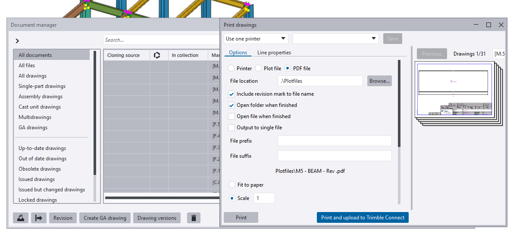
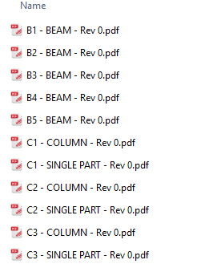
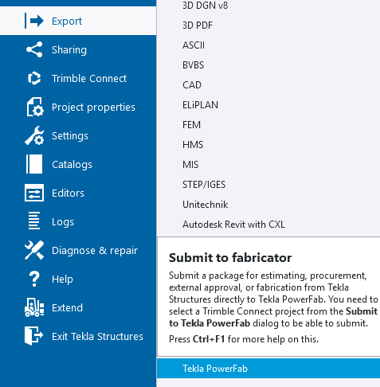
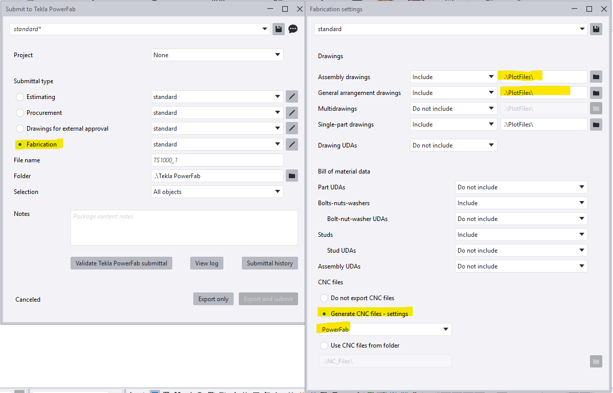
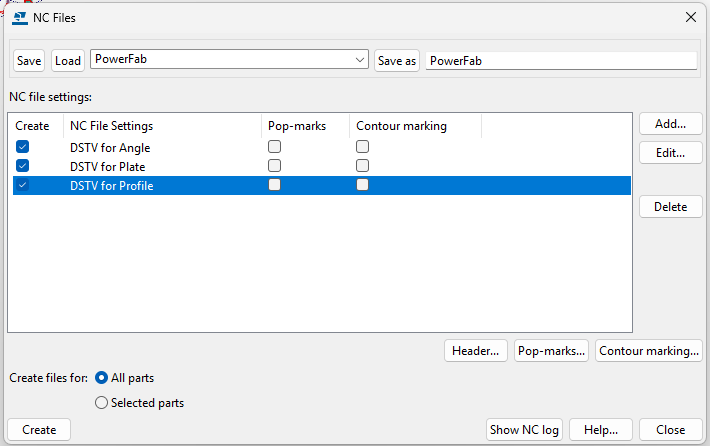

# Step 8 — Create drawings and export NC files

**Role:** Steel Detailer · **Software:** Tekla Structures

**Why this matters**

A welder at a workbench cannot use a 3D model — they need a 2D drawing. A saw or drill line needs machine-readable instructions, not geometry. This step packages both so they can be exported together in Step 9.

**How to do it**

1. On the **Drawings & reports** tab, click **Create fabrication drawing**.

    
    <figcaption>Figure 8.1. <strong>Creation review</strong> lists what is about to be drawn, one row per product, with <strong>Create From</strong> resolved to <em>Top match</em>. Read the list before clicking <strong>Create</strong> — this is the last cheap moment to notice a member that was never selected.</figcaption>

2. Confirm the rows in **Creation review**, then click **Create**. Produce both assembly drawings and single-part drawings.
3. If the model has changed since the drawings were created, run **Update Drawings** before printing.
4. Open **Document manager**, select the drawings, and choose **Print drawings**. Set the output to **PDF file**, set **File location** to `.\Plotfiles`, and tick **Include revision mark to file name**. Print assembly drawings first, then single parts.

    
    <figcaption>Figure 8.2. The <strong>File location</strong> set here is not a local preference — the export settings two instructions below have to name the same folder, or the drawings never reach PowerFab. Note the counter reading <em>Drawings 1/31</em>: print the whole set, not the one on screen.</figcaption>

5. Open the output folder and confirm one PDF per mark, for both drawing types.

    
    <figcaption>Figure 8.3. Files are named <code>&lt;mark&gt; - &lt;type&gt; - Rev &lt;n&gt;.pdf</code>. Both types must be present — <em>COLUMN</em> and <em>BEAM</em> are the assembly drawings, <em>SINGLE PART</em> the single parts. A folder with only one type is the failure this step is checking for.</figcaption>

6. Go to **File > Export > Tekla PowerFab**.

    
    <figcaption>Figure 8.4. <strong>Tekla PowerFab</strong> sits under <em>Submit to fabricator</em>, below the plain format exporters — it is a submittal package, not another file format.</figcaption>

7. In **Submit to Tekla PowerFab**, set **Submittal type** to **Fabrication**, then open its settings with the edit button beside the preset. In **Fabrication settings**, set **Assembly drawings**, **General arrangement drawings**, and **Single-part drawings** to **Include**, each pointing at the same folder used in step 4. Under **CNC files**, select **Generate CNC files - settings** and choose the **PowerFab** setting.

    
    <figcaption>Figure 8.5. Four highlighted controls, and every one of them has to be right: the submittal type, the drawing paths, the CNC radio, and the named CNC setting it points at. <strong>Multidrawings</strong> defaults to <em>Do not include</em>.</figcaption>

8. Open the **PowerFab** NC setting and confirm **DSTV for Angle**, **DSTV for Plate**, and **DSTV for Profile** are all ticked under **Create**, with **Create files for** set to **All parts**. Click **Save**.

    
    <figcaption>Figure 8.6. The <strong>Save</strong> and <strong>Save as</strong> at the top belong to the named setting — <code>PowerFab</code> — not to the dialog. This is the control the trap below is about.</figcaption>

**You should now have:** assembly drawings, single-part drawings, printed PDFs in a known folder, and a saved **PowerFab** CNC setting the export is pointed at.

!!! danger "Ticked is not saved"
    This is a real, repeatable trap. The three DSTV rows in the **NC Files** dialog can appear correctly ticked, but they belong to a *named* setting — `PowerFab` in Figure 8.6. Ticking them and closing the dialog does not persist them. The next export then produces zero NC files with no upfront warning.

    Tick the rows, click **Save** on the named setting, then export.

!!! warning "Three drawing paths, and each must match where you printed"
    Tekla PowerFab sources the PDF files from the folder named in **Fabrication settings** — not from the live drawing inside Tekla Structures. Drawings that were never printed produce a *No files loaded* warning at Step 10.

    Three separate dropdowns govern this, one per drawing type: **Assembly drawings**, **General arrangement drawings**, and **Single-part drawings**. Each carries its own **Include / Do not include** and its own path. Any one of them left on *Do not include*, or pointing somewhere other than the **File location** used in **Print drawings**, drops that whole drawing type from the package without an error.

    **Multidrawings** ships set to *Do not include*. On a job that uses them, that default loses them silently.

!!! warning "Create both drawing types"
    It is easy to produce assembly drawings, move on, and forget the single-part drawings — or the reverse. Both are needed.

??? question "Frequently asked questions"
    **Do drawings need to be 100% final before this step?**

    Ideally yes, but they can be revised later. Steps 9 and 10 support revision detection on re-import.

    **What is the actual difference between an assembly drawing and a single part drawing?**

    An assembly drawing shows the whole built-up piece with all its parts and welds. A single part drawing is for an individual unattached plate or member that needs its own shop drawing for cutting and drilling.

    **Why print drawings before exporting, instead of exporting directly from the live drawing?**

    Tekla PowerFab sources the PDF files from the folder named in **Fabrication settings** — not from the live drawing inside Structures. Printing is what puts the files where the export will look for them.

??? note "Field notes — from the live test run"
    Tekla PowerFab 2026, Trimble Malaysia install.

    - Documented incident from the original enablement session: an export returned *no CNC files* with zero NC data, traced back to the CNC setting appearing correctly configured but never actually saved. Re-checking, saving, then re-exporting fixed it.
    - A second, related incident on this practice run: a later export reported *No files loaded for 6 drawings* even though drawings had been printed. The controls involved are the ones now shown in Figure 8.5 — the per-type **Include / Do not include** dropdowns and their folder paths, which have to match the **File location** used when printing. Confirmed as an open item to fix in a follow-up revision import.

---

Next: [Step 9 — Export to PowerFab as `.pfxt`](step-09.md)
