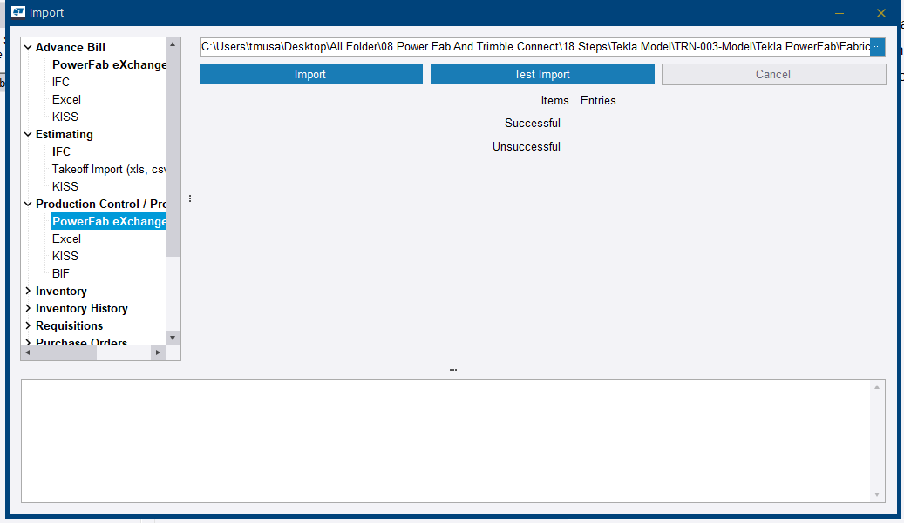
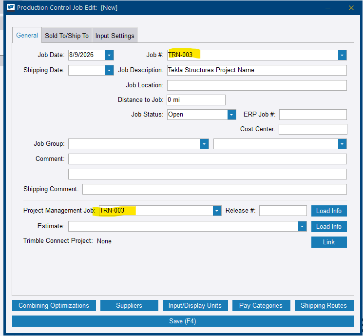
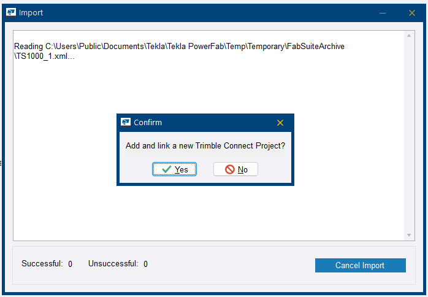
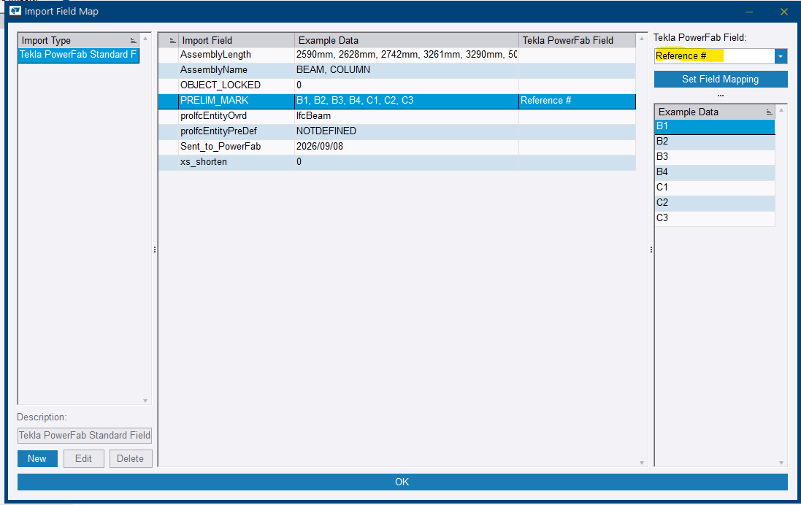
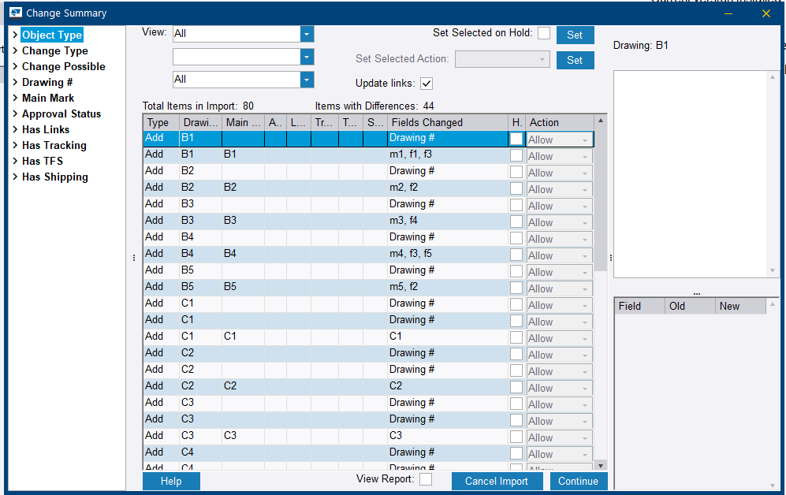
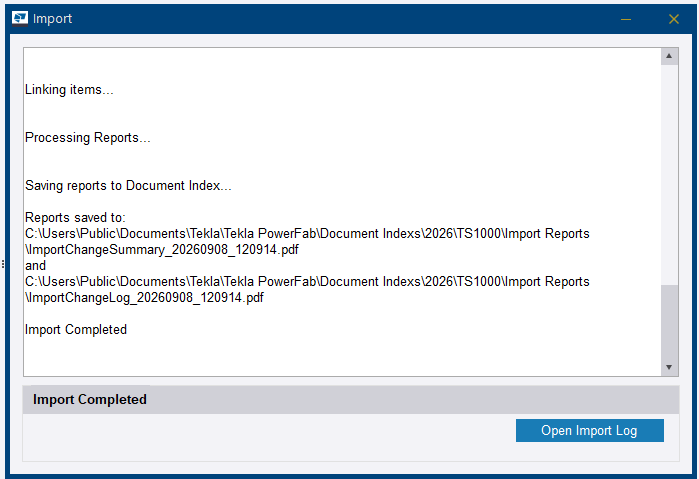
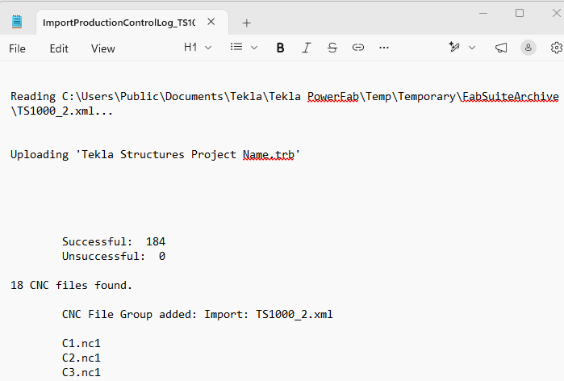
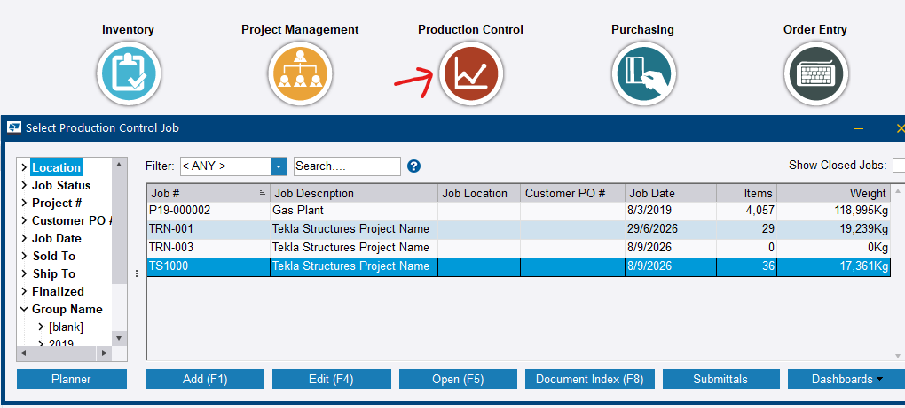
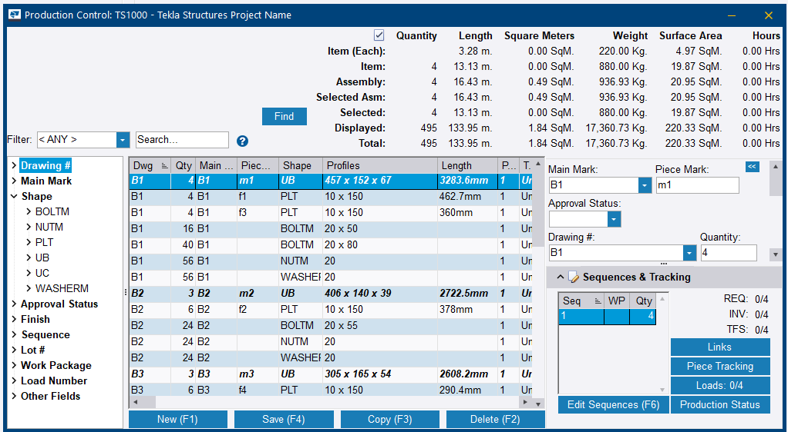

# Step 10 — Import the `.pfxt` into Production Control

**Role:** Production Control / Steel Detailer · **Module:** Production Control

**Why this matters**

This is the formal handover from engineering to production. The issued-for-fabrication package becomes a real, trackable job in the shop's system, converting drawings, NC data, and the BOM into something the shop floor can actually work from.

**How to do it**

1. Go to **File > Import**.

    
    <figcaption>Figure 10.1. The whole step starts from one menu item. <strong>Export Labor</strong> sits directly beneath it — not what you want here.</figcaption>

2. Expand **Production Control** and select **PowerFab eXchange**. Browse to the `.pfxt` file.

    
    <figcaption>Figure 10.2. <strong>PowerFab eXchange</strong> appears under <em>Advance Bill</em> as well as under <em>Production Control</em>. Picking the wrong branch imports the same file to the wrong place. The counters below the buttons stay blank until the run starts.</figcaption>

3. Click **Test Import** first. It reports the same *Items / Entries / Successful / Unsuccessful* counts without writing anything, so a bad mapping costs nothing to discover.
4. Click **Import**.
5. If no Production Control job with this job number exists yet, confirm **Yes** to auto-create one. Check the **Project Management Job** field on the job that opens — it is what ties the production job back to the Project Management job from Step 1.

    
    <figcaption>Figure 10.3. Two separate fields carry the job number here: <strong>Job #</strong> for this production job, and <strong>Project Management Job</strong> for the link back to Step 1. The second one is the link — leave it empty and the job still saves, just orphaned.</figcaption>

6. A separate prompt asks whether to **Add and link a new Trimble Connect Project**. This is not the job link from the previous instruction, and the import completes either way.

    
    <figcaption>Figure 10.4. Answering <strong>Yes</strong> leads on to project user selection. The practice run declined it — Figure 10.3 shows <em>Trimble Connect Project: None</em> — and the job still imported in full.</figcaption>

7. In **Import Field Map**, select the `PRELIM_MARK` row — or the equivalent reference — set **Tekla PowerFab Field: Reference #**, and click **Set Field Mapping**.

    
    <figcaption>Figure 10.5. The <strong>Example Data</strong> column is the check that the right row was selected — <code>PRELIM_MARK</code> shows the marks saved back at Step 3, not lengths or profile names. Choosing the field in the dropdown is not the same as mapping it.</figcaption>

8. Resolve any **Translate Shapes/Grades** prompts carefully. Confirm the New Shape/Grade genuinely matches the Old Shape/Grade before clicking **Set Shape/Grade**, rather than accepting whatever default appears.
9. Review the **Change Summary** dialog. Scroll through the full list to confirm it is consistently *Add*, which is expected on a first import. Anything showing *Delete* or *Modify* unexpectedly is worth investigating before clicking **Continue**.

    
    <figcaption>Figure 10.6. <strong>Items with Differences: 44</strong> out of 80 is not a warning — on a first import every item is a difference against an empty job. The left tree filters the list by <em>Change Type</em>, which is faster than scrolling when the count runs to hundreds.</figcaption>

10. Read the full import log, not just the final Successful/Unsuccessful count. The run saves a change summary and a change log as timestamped PDFs into the **Document Index**, and offers **Open Import Log** on the way out.

    
    <figcaption>Figure 10.7. Both reports are written to disk automatically under <code>Document Indexes\&lt;year&gt;\&lt;job&gt;\Import Reports</code>, timestamped. Closing this dialog without reading the log does not lose it — it is retrievable from the job's <strong>Document Index (F8)</strong>.</figcaption>

    
    <figcaption>Figure 10.8. What to read for: the <strong>CNC files found</strong> count against the number of parts expecting one, and the file names listed under it. This is where a case-collision from Step 7 shows up as a missing name rather than as an error.</figcaption>

11. Confirm the job now appears under **Production Control > Select Production Control Job** — and that it carries items, not just a name.

    
    <figcaption>Figure 10.9. The <strong>Items</strong> and <strong>Weight</strong> columns are the real check. A job in this list showing <em>0</em> items and <em>0Kg</em> exists but received nothing — which is a different problem from an import that failed outright, and it looks identical from the job name alone.</figcaption>

12. Open the job and confirm the material list reads as expected.

    
    <figcaption>Figure 10.10. Bolts, nuts and washers now appear alongside the members — those came from the connections added at Step 7, which is why the mark count is higher than the Advance Bill's. The <strong>REQ</strong>, <strong>INV</strong> and <strong>TFS</strong> counters reading <em>0/4</em> are what Steps 11 to 13 fill in.</figcaption>

**You should now have:** a live production job carrying drawings, machine files, and the final material list.

!!! danger "Successful does not mean clean — read the whole log"
    Real issues sit inside imports that technically succeeded. One live import reported **Successful: 79 / Unsuccessful: 0** while the log carried three genuine failures: missing drawing PDFs, an invalid grade in five NC files, and four NC files silently overwritten.

    Warnings and failure are not the same thing in this dialog. Read the log every time — and if the dialog is already closed, the log is not gone: both reports are saved as timestamped PDFs under the job's **Document Index (F8)**.

!!! warning "Set Field Mapping — again"
    The same trap as Step 4's Advance Bill import. Selecting a value in the dropdown does not commit it; **Set Field Mapping** has to be clicked.

!!! tip "Test Import before Import"
    The **Test Import** button runs the same read and reports the same counts without committing anything. On an unfamiliar package it costs one click to find out whether the field mapping and the shape and grade translations are going to be a problem, while backing out is still free.

!!! info "Not every shape or grade prompt is the UC/WT incident repeating"
    If the New Shape/Grade genuinely matches the Old one, the prompt is registering a combination for the first time, not silently substituting something wrong. Read it, then decide — do not reflexively treat every prompt as a problem, and do not reflexively click through either.

??? question "Frequently asked questions"
    **Why are there more part marks now than in my original Advance Bill — C1 to C6 instead of just C1 to C2?**

    Step 7's added connections create new parts — clips, plates, bolts — that pick up additional marks in the same numbering series. This is expected once detailing is more complete.

    **What does *No files loaded for X drawings* mean if the import still reports Successful?**

    The drawing records still get created, but the underlying PDF content did not attach. This needs a separate fix and will not block other progress, but those specific drawings cannot be opened until it is resolved.

    **What does an *Invalid grade* error inside a specific NC1 file mean?**

    The grade value encoded inside that one CNC file is not accepted by PowerFab's reader, even if the same grade works fine elsewhere in the same import. It usually points to a malformed Material/Grade property on that specific part in Tekla Structures.

    **Why would two very similar part marks — M1 and m1 — cause one to vanish?**

    Windows file systems are case-insensitive. Tekla Structures treats `M1` and `m1` as different marks, but writes both as `.nc1` files with the same filename on disk. The second write overwrites the first before Tekla PowerFab ever tries to read it.

??? note "Field notes — three failures inside one successful import"
    Tekla PowerFab 2026, Trimble Malaysia install.

    A single import log surfaced three separate genuine issues at once:

    1. *No files loaded for 6 drawings: C1–C6* — the drawing PDFs were missing.
    2. *Error reading F1–F5.nc1: Invalid grade (S275)* on five connection-plate NC files.
    3. *No CNC files loaded for m1–m4* — despite those exact files, as `M1–M4`, appearing successfully read earlier in the same log.

    The third was diagnosed with confidence as a Windows filename case-collision, created back at Step 7.

    Despite all three warnings, the import completed successfully — **Successful: 79, Unsuccessful: 0** — and the Production Control job was created correctly. That is proof that *warnings* and *failure* are not the same thing here.

    **Fix paths identified.** Drawings: recheck the *Include drawing files* export setting and the Drawing Default Directory match. NC grade error: check the Material/Grade property directly on the affected parts in Structures. Case-collision: rename one of the colliding mark series in Structures' numbering setup so they no longer collide once case is stripped.

---

Next: [Step 11 — Combine the balance material in Production Control](step-11.md)
