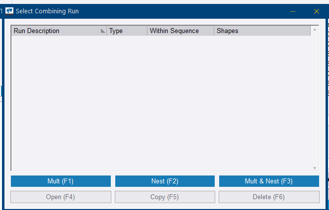
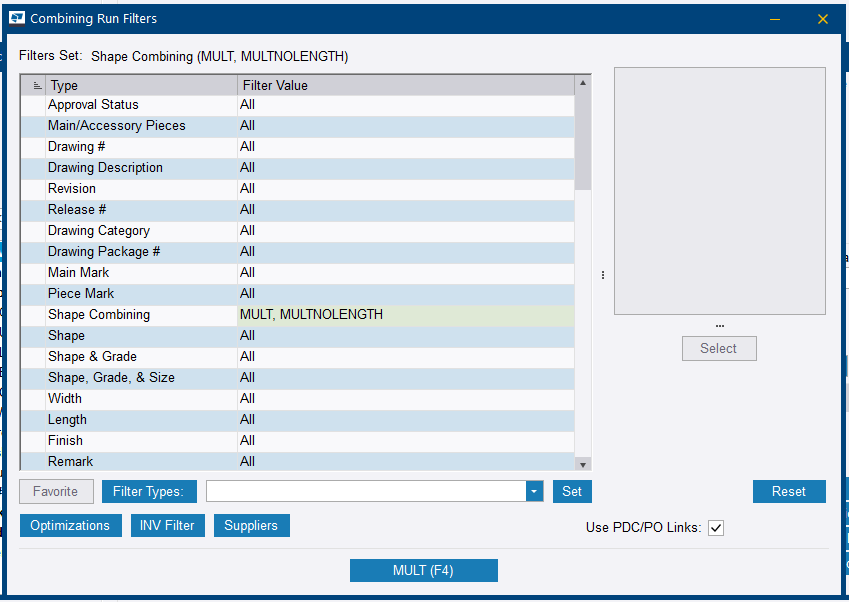
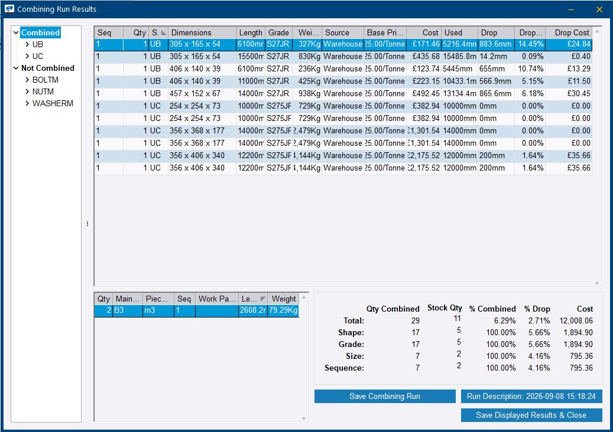
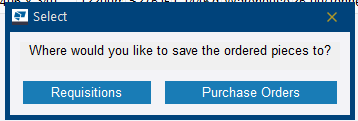
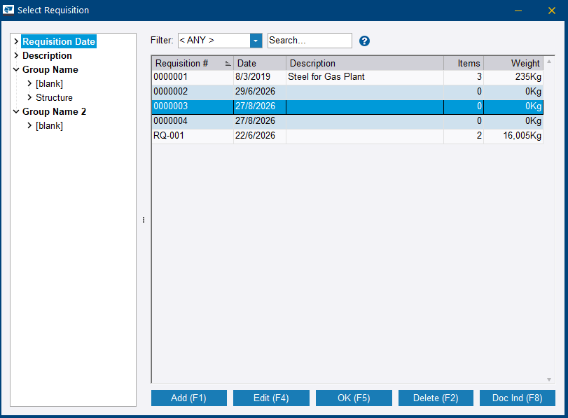
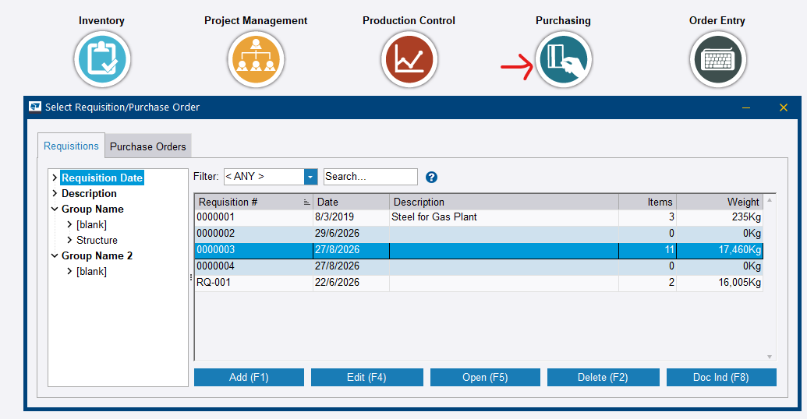
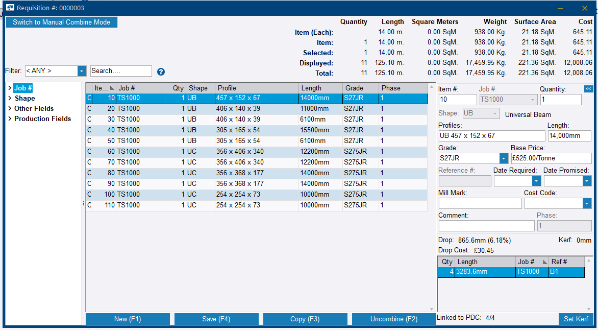

# Step 11 — Combine the balance material in Production Control

**Role:** Estimator / Material Planner · **Module:** Production Control

**Why this matters**

Same combining logic as Step 5, but now run against whatever was not already locked into the Advance Bill — the beams, since only the columns were combined earlier. This closes the procurement loop for the rest of the structure, now that final connections and marks exist.

**How to do it**

1. Open the Production Control job, click the **Production Control** ribbon tab, and then **Combine**.

    
    <figcaption>Figure 11.1. Three entries on this menu. <strong>Filter</strong> narrows what the job screen displays and changes nothing — it is not a way of choosing what to combine.</figcaption>

2. In **Select Combining Run**, click **Mult (F1)** — the beams are linear shapes.

    
    <figcaption>Figure 11.2. The list is empty on a first run. It fills with saved runs, which can then be reopened or copied from here — that is what <strong>Save Combining Run</strong> in Figure 11.4 puts there.</figcaption>

3. Set the filters in **Combining Run Filters**. To combine the whole balance, leave the rows on *All*. To combine only part of it, click the row to filter on — **Main Mark** or **Reference #** — click **Select**, click **`<<`** to clear, pick the items to include, click **`>`**, and click **OK**.

    
    <figcaption>Figure 11.3. The run captured here filtered on nothing — every row reads <em>All</em> except <strong>Shape Combining</strong>, which the <strong>Mult</strong> choice set for you. The header line, <em>Filters Set</em>, is the quick read on whether a filter is actually active.</figcaption>

4. Click **MULT (F4)**.
5. Review **Combining Run Results**. Confirm real **% Combined**, **Drop** and **Cost** figures for the steel sections, and expect the hardware to sit under *Not Combined*.

    
    <figcaption>Figure 11.4. The left tree does the sorting for you: <strong>Combined</strong> holds <code>UB</code> and <code>UC</code>, <strong>Not Combined</strong> holds <code>BOLTM</code>, <code>NUTM</code> and <code>WASHERM</code>. Every combined row carries a real cost and a real drop — that, not the headline percentage, is what says the run worked.</figcaption>

6. Click **Save Displayed Results & Close**, then choose **Requisitions**.

    
    <figcaption>Figure 11.5. Ordering straight onto a purchase order skips the requisition, and with it the review that Step 12 is built around. Choose <strong>Requisitions</strong> unless the material is already priced and approved.</figcaption>

7. Pick an existing requisition or **Add (F1)** a new one, then **OK (F5)**.

    
    <figcaption>Figure 11.6. Note the selected requisition reads <strong>0</strong> items and <strong>0Kg</strong> before the save — the same list, after, is Figure 11.7.</figcaption>

8. Confirm the requisition actually picked up the material.

    
    <figcaption>Figure 11.7. Same requisition number, now <strong>11</strong> items and a real weight. Empty in, populated out — if the count has not moved, the results were not saved onto it.</figcaption>

9. Open the requisition and check the lines carry the right profiles, grades and prices.

    
    <figcaption>Figure 11.8. <strong>Linked to PDC: 4/4</strong> at the bottom right is the traceability check — a partial ratio means some pieces lost their link back to the production job. The <strong>Uncombine (F2)</strong> button is the way back if the run was wrong.</figcaption>

**You should now have:** the balance steel combined onto stock lengths and sitting on a requisition that now shows a real item count and weight, with the hardware correctly left uncombined.

!!! warning "Read the per-row Cost and Drop, not the headline percentage"
    The summary panel reports several rows, and the **Total** line can read a few percent while **Shape**, **Grade**, **Size** and **Sequence** all read 100% — as in Figure 11.4. That is not the Step 5 failure repeating.

    The Step 5 failure looked different: **0% Combined** *and* **$0.00 Cost**, with nothing priced. Here every combined row carries a real cost, a real drop length, and a real drop percentage. Judge the run on those, and on the material actually landing on the requisition at step 8.

!!! tip "Two different Save buttons"
    **Save Combining Run** stores the run itself, so it reappears in the *Select Combining Run* list of Figure 11.2 and can be reopened or copied. **Save Displayed Results & Close** is the one that sends the pieces onward to a requisition or purchase order. Only the second one advances the workflow.

!!! info "Hardware under *Not Combined* is correct, not a failure"
    Bolts, nuts, and washers are not run through stock-length optimisation the way steel sections are — they are counted and ordered as discrete pieces. Seeing `BOLTM`, `NUTM`, and `WASHERM` in the Not Combined branch is expected behaviour, and there is nothing to fix.

??? question "Frequently asked questions"
    **Why do bolts, nuts, and washers show as Not Combined — is something wrong?**

    No. Hardware is not run through stock-length combining like steel sections are. It is simply counted and ordered as discrete pieces.

    **Can combining beams here reuse the same requisition as the earlier column combine from Step 5?**

    Yes. You can add to the existing requisition number, or keep them separate. Both are valid organisational choices.

    **Does combining here affect the columns already combined back in Step 5?**

    No. That combine is already complete and untouched. This step is purely additive, covering only the previously uncombined material.

??? note "Field notes — from the live test run"
    Tekla PowerFab 2026, Trimble Malaysia install.

    - The beams (UB shapes, grade S27JR — the UC columns carry S275JR; both grades genuinely exist in the SEA database) combined cleanly on the first attempt — 5 stock bars, real per-bar costs, genuine drop percentages, total £2,148.69. That confirmed the SEA database fix from Step 5 held for beam shapes too, not just columns.
    - The *Not Combined* branch in this run legitimately listed `BOLTM`, `NUTM`, and `WASHERM`. It is a good moment to teach the distinction between a genuine combining failure — the UC zero-cost incident at Step 5 — and expected, normal hardware behaviour.

---

Next: [Step 12 — Send balance material to requisition and purchasing](step-12.md)
