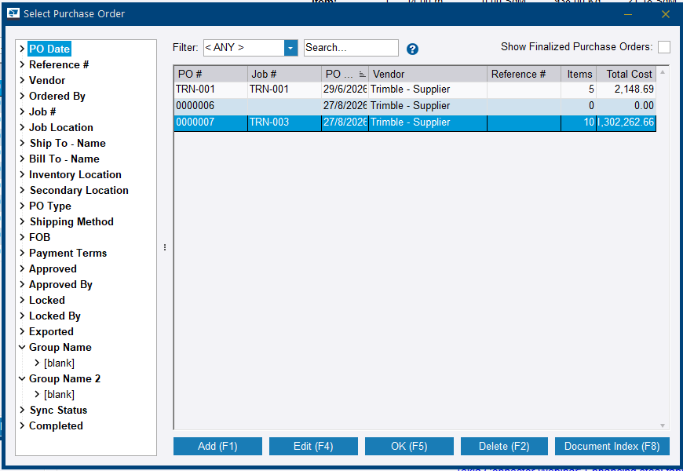
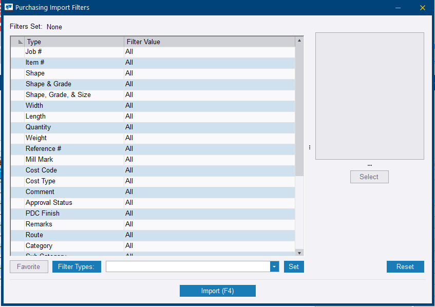
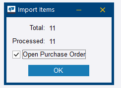
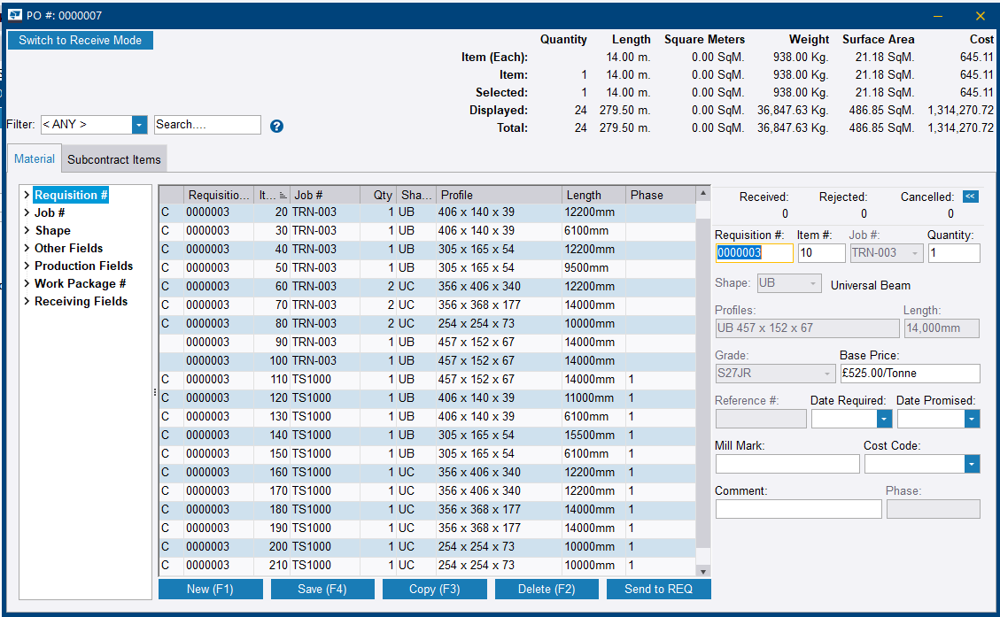

# Step 12 — Send balance material to requisition and purchasing

**Role:** Material Planner / Purchasing Agent · **Modules:** Production Control, Purchasing

**Why this matters**

Same logic as Step 6: getting material priced and committed via a vendor before it can be received and used in production. This step is also where the practical mechanics of converting a requisition into a real purchase order get exercised for the first time.

**How to do it**

1. From Step 11's **Save Displayed Results & Close**, choose **Requisitions**, select an existing one or **Add** a new one, and click **Save**. Those two dialogs are Figures 11.5 and 11.6 on the [previous step](step-11.md).
2. Open **Purchasing > Requisitions** tab and confirm material landed correctly, with a full **Linked to PDC** ratio per item — the check shown in Figure 11.8.
3. To convert to a real purchase order, open the requisition itself — double-click into the detail screen, do not just select it in the list.
4. On that detail screen, find the **Requisition** ribbon tab and click **Load Material Into Purchase Order**.

    
    <figcaption>Figure 12.1. This menu exists only inside an opened requisition. Note the entry directly beneath the highlighted one — <strong>Load Selected Material Into Purchase Order</strong> takes just the lines you have selected, which is the option to reach for when a requisition is being split across vendors.</figcaption>

5. Pick an existing PO or **Add (F1)** a new one, then **OK (F5)**.

    
    <figcaption>Figure 12.2. The <strong>Items</strong> and <strong>Total Cost</strong> columns read the same way as the requisition list did at Step 11 — a PO sitting at 0 items has been created but never loaded. <strong>Show Finalized Purchase Orders</strong> is unticked by default, so a finalised PO will not appear in this list at all.</figcaption>

6. Work through the **Purchasing Import Filters** dialog — leave every row on *All* to include everything, or filter selectively — then click **Import (F4)**.

    
    <figcaption>Figure 12.3. Same shape as the Combining Run Filters at Step 11, and the same quick read: the <strong>Filters Set</strong> header says <em>None</em>, so nothing is being held back. If that header names a filter you did not intend, material is about to be left behind on the requisition.</figcaption>

7. Confirm the transfer. Check that **Processed** equals **Total** before clicking **OK**.

    
    <figcaption>Figure 12.4. <strong>Processed</strong> short of <strong>Total</strong> means a filter caught something. Leaving <strong>Open Purchase Order</strong> ticked takes you straight into the next instruction.</figcaption>

8. Confirm the PO carries the items and cost. The transferred items also clear from the Requisition view.

    
    <figcaption>Figure 12.5. One purchase order can carry lines from more than one job — the <strong>Job #</strong> column here shows two. The <strong>Received</strong>, <strong>Rejected</strong> and <strong>Cancelled</strong> counters sitting at zero are what Step 13 fills in, and <strong>Send to REQ</strong> is the way back if material was loaded in error.</figcaption>

**You should now have:** a purchase order covering the beams and connection hardware, with the items cleared from the requisition view.

!!! warning "Load Material Into Purchase Order is not on the list screen"
    Right-clicking on the *Select Requisition/Purchase Order* list gives only generic grid and export options — Select All, Export to Excel, and so on. The actual command lives on the **Requisition** ribbon tab **inside the opened requisition**, as in Figure 12.1.

    This cost real time during the live session. Open the requisition first.

!!! tip "Two lookalike mode buttons, on two different screens"
    The requisition detail screen carries **Switch to Manual Combine Mode** in its top-left corner. The purchase order screen carries **Switch to Receive Mode** in exactly the same spot, as in Figure 12.5.

    Only the second one is the receiving toggle Step 13 needs. Reaching for it on the requisition finds the other button instead.

!!! info "Items disappearing from the requisition is expected"
    Once loaded into a PO, the transferred items clear from the Requisition view because they have moved across. The requisition record itself remains for history and reference. This is not an error.

!!! warning "Check Linked to PDC per item"
    Same principle as *Linked to ABM* at Step 6 — do not assume the whole requisition is complete without checking the ratio on each line.

??? question "Frequently asked questions"
    **Where exactly is the option to convert a requisition into a PO?**

    Open the requisition itself, not just select it in the list, then use the **Requisition** ribbon tab and **Load Material Into Purchase Order**.

    **What is the difference between *Linked to PDC* and *Linked to ABM*?**

    Same concept, different source module. ABM means reconciled back to the Advance Bill; PDC means reconciled back to Production Control. Check whichever matches where the combine actually ran.

    **Can I load only some items from a requisition into a PO, not all?**

    Yes. There is a separate **Load Selected Material Into Purchase Order** command, and the Purchasing Import Filters dialog lets you filter which items go across.

    **Does the requisition disappear once everything is loaded into a PO?**

    The transferred items disappear from the Requisition view since they have moved across, but the requisition record itself typically remains for history and reference.

??? note "Field notes — from the live test run"
    Tekla PowerFab 2026, Trimble Malaysia install.

    - Meaningful time was spent hunting for **Load Material Into Purchase Order** in the wrong place — the *Select Requisition/Purchase Order* list's right-click menu, which only offers generic grid and export options. Official documentation confirmed the command is a ribbon-tab action inside the opened Requisition detail screen.
    - Once found, the conversion worked cleanly. Items transferred into an existing, already-named PO — `TRN-001`, apparently auto-created via an earlier Connector submission attempt — correctly populating it with 5 items and £2,148.69 total cost. That PO is still visible carrying exactly those figures in Figure 12.2.

---

Next: [Step 13 — Receive the material](step-13.md)
