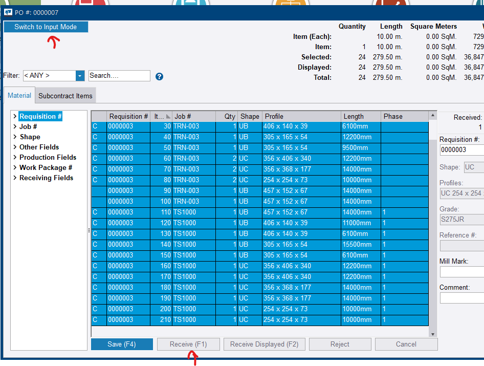
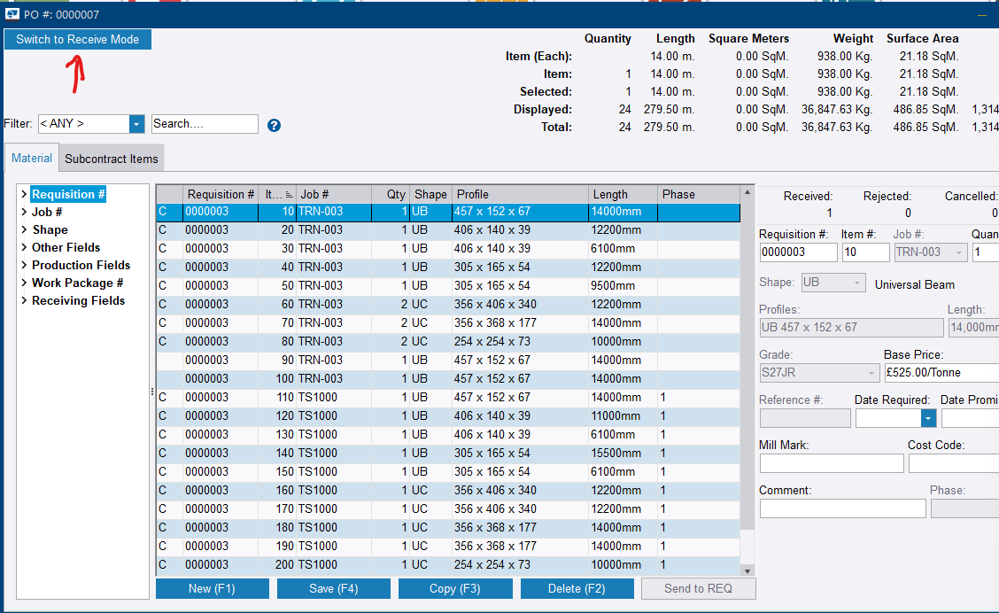

# Step 13 — Receive the material

**Role:** Purchasing Agent / Yard Foreman · **Modules:** Purchasing, Inventory

**Why this matters**

Receiving is the literal gatekeeper before material can be cut on a cut list at Step 15. When a truck arrives, someone has to unload it, check it against the packing slip, and record what actually turned up. It is worth demonstrating on both PowerFab Office and Go, since shop floor staff may use either.

=== "In PowerFab Office"

    1. In the **Purchasing** module, switch to the **Purchase Orders** tab, select the purchase order, and click **Open (F5)**.

        
        <figcaption>Figure 13.1. This picker opens on the <strong>Requisitions</strong> tab. Receiving needs the second tab — a requisition has nothing to receive against, which is the same trap the warning below describes, met one screen earlier.</figcaption>

    2. Click **Switch to Receive Mode** at the top left of the PO detail window.
    3. Confirm the mode actually changed. The toggle itself now reads **Switch to Input Mode**, and the button row along the bottom changes to **Receive (F1)**, **Receive Displayed (F2)**, **Reject** and **Cancel**.

        
        <figcaption>Figure 13.2. The toggle always names the mode you would move <em>to</em>, never the one you are in — so the button reading <strong>Switch to Input Mode</strong> is what tells you receiving is live. The changed button row is the second confirmation.</figcaption>

    4. Select the line item or items.
    5. Either enter the **Received** quantity per line, or use the buttons: **Receive (F1)** takes the current selection, **Receive Displayed (F2)** takes everything currently listed. Match the ordered quantity for a clean practice run, or enter a partial quantity to simulate a short shipment. **Reject** and **Cancel** record the other two outcomes.
    6. Optionally complete the **Receiving Fields** — heat number, country of origin, bill of lading — via the left-hand filter tree category.
    7. Click **Save (F4)**.
    8. Switch back with **Switch to Input Mode** and confirm the **Received** counter has moved off zero.

        
        <figcaption>Figure 13.3. <strong>Received</strong>, <strong>Rejected</strong> and <strong>Cancelled</strong> sit together at the top right and are visible from Input Mode. They are the record that this step happened — the counters Figure 12.5 showed sitting at zero.</figcaption>

=== "In PowerFab Go (tablet)"

    1. Sign in to PowerFab Go.
    2. Go to **Inventory > Receive**.
    3. Select the job.
    4. Batch edit, or mark items individually received.
    5. Sync.

    !!! info "No captures for this path yet"
        The screenshots on this page are all from PowerFab Office. The Go steps are documented from the trainer handout, not from a captured run.

**You should now have:** material in inventory, tagged with heat numbers, and eligible for a cut list.

!!! warning "Receive Mode exists only at purchase order level"
    The Requisition screen has a visually similar toggle in the same position, but it reads **Switch to Manual Combine Mode**. Only the purchase order offers Receive Mode. Compare Figure 11.8 against Figure 13.3 — same corner, same styling, different command.

    The two screens look close enough that it is easy to assume they work interchangeably. They do not.

!!! danger "Unreceived material silently blocks cut lists"
    Material that has not been received cannot go onto a cut list at Step 15 — and Tekla PowerFab does not throw an error when it happens. It simply excludes the rows, which looks like a bug if you are not expecting it.

!!! tip "Attach heat documents at the point of receipt"
    **Check Heat Documents** can find missing certification later, but chasing a supplier for paperwork six weeks after delivery is a different job to asking the driver for it at the gate. Capture it while the delivery is happening.

??? question "Frequently asked questions"
    **Why can I not find a Receive button on my requisition?**

    Because receiving happens at the purchase order level, not the requisition level. Convert to a PO first — Step 12.

    **What happens if only part of an order is received?**

    The Received quantity simply reflects what actually arrived. **Rejected** and **Cancelled** are separate fields for tracking discrepancies such as damaged goods or cancelled lines, so quantities can legitimately differ from what was ordered.

    **What is the difference between Receive (F1) and Receive Displayed (F2)?**

    **Receive (F1)** acts on the lines currently selected. **Receive Displayed (F2)** acts on every line the filter is currently showing. On a full delivery the second is one click; on a part delivery, filter or select first, because *displayed* means whatever the filter left on screen, not whatever arrived.

    **Do I need to receive in both PowerFab Office and Go, or is one enough?**

    Functionally, one is enough — both write to the same shared database. Testing both is a trainer exercise to confirm parity between platforms, not a requirement for every real receiving event.

    **What is the practical impact of skipping heat number and country of origin?**

    No functional blocker for most workflows, but it matters for material traceability and certification on structural steel projects. It is a good habit to build with customers in regulated industries.

??? note "Field notes — from the live test run"
    Tekla PowerFab 2026, Trimble Malaysia install.

    - **Switch to Receive Mode** sits at the top left of the open Purchase Order detail screen — visually in the same spot and style as the Requisition's *Switch to Manual Combine Mode* toggle. Easy to assume the two screens work interchangeably since they look so similar, but each toggle is specific to its own module.
    - Receiving completed cleanly for all 5 beam items against PO `TRN-001` once the correct screen was found.
    - A second run against a larger purchase order confirmed the mode is legible without guessing: in Receive Mode the toggle flips to *Switch to Input Mode* and the bottom button row swaps New / Copy / Delete / Send to REQ for **Receive**, **Receive Displayed**, **Reject** and **Cancel**.

---

Next: [Step 14 — Apply the fabrication route](../part-3/step-14.md)
