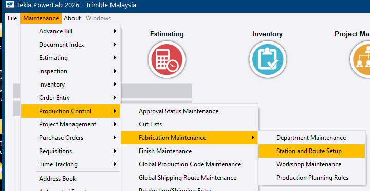
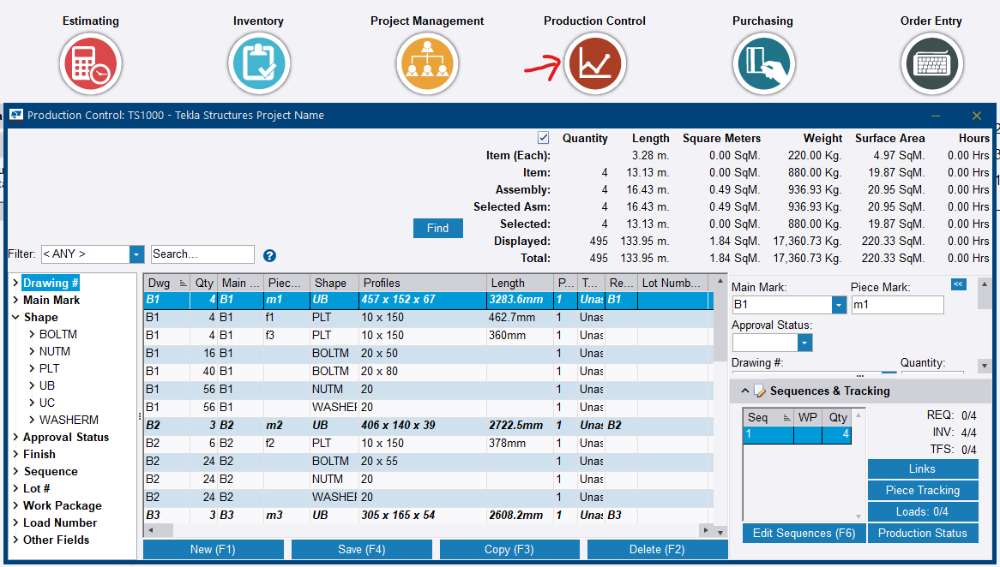
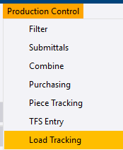

# Part 3 — Steps 14 to 18

Part 3 is the fabrication-floor half of the workflow: assigning a route, building and processing a cut list, recording production progress, and shipping the finished load.

Complete [Part 2](part-2.md) before starting. Steps 1 to 13 must all be done — Project Management job, Tekla Structures export, Advance Bill, combining, purchasing, and receiving.

---

## Step 14 — Apply the fabrication route

**Role:** Production Control Coordinator / Shop Planner · **Module:** Production Control

**Why this matters**

A route is the ordered list of stations — Cut/Saw, Layout/Weld, Quality Control, Paint, Erection — that a piece is expected to travel through in the shop. Until a route is assigned to an item, Tekla PowerFab has no station list to track progress against. Piece Tracking will have nothing to show, even after material has been cut.

This normally happens once Purchasing has received material against the job's purchase orders.

**How to do it**

### Part A — Verify the route is configured correctly

1. Go to **Maintenance** ribbon tab **> Production Control > Fabrication Maintenance > Station and Route Setup**.
2. In the *Stations* dialog, click **Route Maintenance** to open *Routes*.
3. Select the route you intend to use and verify three settings before relying on it:
    - **TFS Station** — must be the *first* station in the sequence, usually Cut/Saw.
    - **Route Type** — Assembly, Part, or Assembly & Part.
    - **In Route** list — every station you need, in the correct order.
4. Click **Save (F4)**, then close the *Routes* and *Stations* dialogs.

### Part B — Apply the route to the job items

1. Back in the Production Control job, select the items to be routed.
2. Go to **Production Control** ribbon tab **> Modify Data > Global Edit Selected** for manually highlighted rows, or **Global Edit** for a filter-based selection such as by Finish or Category.
3. Tick the **Route** field checkbox and choose the route from the dropdown.
4. Click **Update**, then **Yes** to confirm.

<!-- SCREENSHOTS — Step 14
     Drop files into docs/assets/images/implementation/ named:
       impl-step14-01.png, impl-step14-02.png, ...
     Then delete this comment wrapper and indent each block 4 spaces
     under the numbered step it belongs to.

    
    <figcaption>Figure 14.1. Caption text.</figcaption>
-->

**You should now have:** every main assembly carrying a defined fabrication route, with a verified TFS Station.

!!! info "Menu change in PowerFab 2026"
    **Station and Route Setup** moved from directly under *Maintenance > Production Control* into a new **Fabrication Maintenance** submenu in Tekla PowerFab 2026. Older reference material points at the previous location — update it accordingly.

!!! danger "Routes must be applied before Step 15 — this cannot be fixed later"
    Confirmed live during a technical enablement session: if the cut list is built and processed before routes are assigned, applying routes afterwards does **not** back-fill completion credit for the Cut/Saw station.

    The Station Summary stays blank despite the cuts having genuinely been processed, and the only remedy is manually adding completed entries piece by piece. This is why Step 14 sits where it does in the sequence.

!!! warning "Verify the TFS Station on the route"
    Routes can default their **TFS Station** to the last station in the sequence rather than the first. On the sample SP route this appeared as *Sample - Erection* instead of *Sample - Cut/Saw*. Material taken from stock is then credited at entirely the wrong point. Check this field before processing anything.

!!! warning "Fixing a route does not apply it"
    Correcting a route's settings in Route Maintenance changes the route. It does not attach the route to anything. Part B — Global Edit — is a separate and mandatory step.

    Opening **Production Status** instead of Fabrication Maintenance is the other common wrong turn here. Production Status is read-only progress reporting.

??? question "Frequently asked questions"
    **My Station Summary is completely empty even though I already cut material via TFS — why?**

    The cut list and TFS process works independently of routing. If the item never had a route assigned via Global Edit, there is no station list for Piece Tracking to display, regardless of how much material has already been cut.

    **I assigned the route after I already processed TFS — why did Cut/Saw not show as complete automatically?**

    The automatic TFS-station credit only fires at the moment of cutting. Assigning a route retroactively does not back-fill that completion. It has to be logged manually using **Add Completed** at Step 17.

    **What does Route Type control?**

    Whether the route applies to assemblies, to individual parts, or to both. Set it to match what is actually being routed.

??? note "Field notes — from the live test run"
    Tekla PowerFab 2026, Trimble Malaysia install.

    - The out-of-the-box **SP** sample route had **TFS Station** set to *Sample - Erection*, the last station, instead of *Sample - Cut/Saw*. Always check TFS Station before relying on a copied or sample route.
    - Global Edit is a separate, mandatory step. On `TRN-001`, items were cut via TFS before Global Edit was ever run, leaving Station Summary completely blank until the route was retroactively assigned.
    - After assigning the route post-cut, Cut/Saw still showed 0 Completed Qty. The completion had to be entered manually via **Add Completed**.

---

## Step 15 — Create a cut list

**Role:** Production Control Coordinator, working with the workshop cutting team · **Module:** Production Control

**Why this matters**

A cut list tells the shop exactly how each bar or sheet of received material should be cut to produce the parts on the job — the bridge between *we have steel in stock* and *we are cutting specific pieces today*. A saw operator cannot work from a full project BOM.

**How to do it**

1. Go to **Production Control** ribbon tab **> Review > Cut Lists**.
2. Click **New Cut List**.
3. In the *Purchasing Report Filters* dialog, leave the filters at the default (All) for a first cut list, or narrow by Shape or Category for separate cut lists per material type.
4. Click **Make Report**.
5. In *Report Selection*, choose a cutting list report — *PC/PO Cutting List*, for example — and click **View** to preview it.
6. Confirm the items, lengths, and quantities look correct, then close the preview.
7. Click **Save Cut List**.
8. Enter a **Cut List Description** and **Date Required**, and tick **Share Cut List** and **Lock Cut List** as appropriate.
9. Click **Save To Cut List**, then **OK** to confirm.

<!-- SCREENSHOTS — Step 15
     Drop files into docs/assets/images/implementation/ named:
       impl-step15-01.png, impl-step15-02.png, ...
     Then delete this comment wrapper and indent each block 4 spaces
     under the numbered step it belongs to.

    
    <figcaption>Figure 15.1. Caption text.</figcaption>
-->

**You should now have:** a named, saved cut list ready to be processed.

!!! danger "Requisitioned material is silently excluded"
    A cut list can only be built from material that is on a **purchase order** or **already in stock**. Material still sitting on a requisition is not eligible.

    Tekla PowerFab does not throw an error. It simply leaves those rows out, which looks like a bug if you are not expecting it. This is the payoff for Steps 6, 12, and 13 — anything left unconverted or unreceived quietly fails to appear here.

!!! warning "Two menus both say Cut List"
    **Dashboards > Cut List Management** launches the PowerFab Go shop-floor dashboard — a different product surface entirely.

    **Production Control > Review > Cut Lists** is the desktop authoring screen used above. It is easy to click the wrong one.

??? question "Frequently asked questions"
    **Why can I not create a cut list for items I already combined and sent to a requisition?**

    A cut list can only be built from material linked to a purchase order or already in stock. Requisitioned-only material has not yet been purchased or received, so it is outside the cut list's eligible scope by design.

    **Should I build one cut list or several?**

    Either works. Leave the filters at All for a first pass, or narrow by Shape or Category to produce separate cut lists per material type — which is usually what a shop with multiple machines wants.

    **What do Share Cut List and Lock Cut List do?**

    Share makes the list visible beyond its creator; Lock prevents further edits. Set them according to how the shop wants the list controlled.

??? note "Field notes — from the live test run"
    Tekla PowerFab 2026, Trimble Malaysia install.

    - `TRN-001`'s UC columns, sitting on requisition `RQ-001`, never appeared in the cut list because they had not yet been converted to a purchase order and received. No error was shown — just missing rows.
    - Both *Cut List* menu entries were clicked during the session before the right one was found. Worth calling out explicitly to trainees.

---

## Step 16 — Process the cut list

**Role:** Workshop / Cutting operator, or the Production Control Coordinator for demonstration · **Module:** Production Control

**Why this matters**

This is the step where material physically leaves stock and becomes a cut piece. **TFS** stands for *Take From Stock*: once a cut is confirmed, Tekla PowerFab deducts the material from inventory, timestamps the cut, and — if the route's TFS Station is configured correctly — automatically marks the first production station as complete.

Cutting the steel and telling the system it has been cut are two different events. This is the second one.

**How to do it**

1. In the *Cut Lists* dialog, select the cut list saved in Step 15 and click **Details**.
2. Select a cutting detail line and click **Cut**.
3. In the *Cut* dialog, select a **Heat #** from the dropdown — this links the cut piece back to its mill certificate — and complete any other available fields such as PO # and Location.
4. Review the **Drop** (remnant) length Tekla PowerFab calculates automatically.
5. Click **TFS (F4)** to commit the cut. The line turns green and **Status** shows *Complete*.
6. Repeat for every remaining cutting detail in the list.

<!-- SCREENSHOTS — Step 16
     Drop files into docs/assets/images/implementation/ named:
       impl-step16-01.png, impl-step16-02.png, ...
     Then delete this comment wrapper and indent each block 4 spaces
     under the numbered step it belongs to.

    
    <figcaption>Figure 16.1. Caption text.</figcaption>
-->

**You should now have:** raw stock consumed, project parts created, drops calculated, and — if the route was set up correctly at Step 14 — the first station credited automatically.

!!! tip "Heat # is a real traceability field, even in a sandbox"
    The Heat # dropdown at TFS time is meant to link back to an actual mill certificate. It is what allows a full chain-of-custody report — **Mill → PO → Cut → Assembly → Shipment** — to be pulled later.

    This is a strong talking point for customers in regulated industries, and worth explaining rather than skipping past in training.

!!! warning "Record the drop location"
    A remnant recorded with a **Location** returns to inventory as usable stock and can be consumed by a later job. One committed without a location is effectively scrapped on paper, regardless of what is physically sitting in the rack.

!!! info "The automatic station credit depends on Step 14"
    TFS marks the first production station complete only if the route's **TFS Station** is set to that first station. If it was left pointing at the last station, the credit lands in the wrong place — and if no route was assigned at all, nothing is credited anywhere.

??? question "Frequently asked questions"
    **What does TFS actually do to inventory?**

    It deducts the material from stock, timestamps the cut, and records the consumption against the job. This is what makes the JOBSUM report meaningful.

    **Do I have to process cuts one line at a time?**

    Each cutting detail line is committed individually with TFS (F4). Work through the list until every line shows *Complete*.

    **Can this be done from PowerFab Go instead?**

    Shop floor cut processing is available in Go, but the walkthrough here is the desktop Office path, which is what a trainer should demonstrate and what the coordinator will use.

??? note "Field notes — from the live test run"
    Tekla PowerFab 2026, Trimble Malaysia install.

    - Items were cut via TFS on `TRN-001` **before** Global Edit had ever been run, so no route was assigned at the moment of cutting. The automatic first-station credit therefore never fired, and Station Summary stayed blank at Step 17 until the completion was added manually.
    - The order matters: Step 14 before Step 16, always.

---

## Step 17 — Production tracking

**Role:** Shop floor supervisor via PowerFab Go, or Production Control Coordinator via Office · **Module:** Production Control

**Why this matters**

Once a piece has a route, every station it passes through needs to be logged so the business knows — in real time — how far along the job actually is. This feeds production dashboards, customer status updates, the Trimble Connect model colouring, and, in PowerFab Go, shipping eligibility.

=== "In PowerFab Office"

    1. Go to **Production Control** ribbon tab **> Piece Tracking**. This opens *Station Summary*, listing every station with assigned work and its **Total Qty**, **Completed Qty**, and **Remaining Qty**.
    2. Select a station and click **Add Completed**.
    3. In the *Station - Add Completed* dialog, pick the station from the **Station** dropdown if it is not already selected. Items only populate the *Not Included* list once a station is chosen.
    4. Move the items that finished that station from *Not Included* to *Included* using the arrow buttons.
    5. Set **Completed By** and **Date**, and optionally **Hours** and **Minutes**.
    6. Click **Add Material** to save.
    7. Repeat for each station as work progresses.

=== "In PowerFab Go (shop floor)"

    1. Sign in to PowerFab Go and open the job.
    2. Navigate to **Production Tracking**, or the Production dashboard.
    3. Filter or scan to find the item at its current station.
    4. Confirm the quantity complete. This syncs back to Office in real time.

<!-- SCREENSHOTS — Step 17
     Drop files into docs/assets/images/implementation/ named:
       impl-step17-01.png, impl-step17-02.png, ...
     Then delete this comment wrapper and indent each block 4 spaces
     under the numbered step it belongs to.

    
    <figcaption>Figure 17.1. Caption text.</figcaption>
-->

**You should now have:** live progress visible in **Production Status** and reflected in the Trimble Connect model.

!!! warning "A blank Station Summary points back to Step 14"
    If tracking appears to work but the Station Summary stays empty, the material has no route assigned. Fix the routing rather than troubleshooting the tracking screen — the tracking is behaving correctly, it simply has no stations to report against.

    And if the route was assigned *after* TFS, the Cut/Saw credit was never back-filled. Enter it manually via **Add Completed**.

!!! info "Complete Previous Station First"
    If a route's **Complete Previous Station First** checkbox is left unticked, stations can be logged out of order. That is genuinely useful when shop work happens out of sequence — but it should be a deliberate choice confirmed with the customer, not something discovered later.

??? question "Frequently asked questions"
    **Why does one station show a higher Total Qty than every other station on the same route?**

    Total Qty reflects every item eligible to be tracked at that station — which includes items on the route, plus any item with a standalone **Inspection** requirement pointing at that station, even if that item has no route, no stock, and no TFS activity at all. See the [Day 4 afternoon session](../day-4/afternoon.md) for the worked example.

    **Why do items not appear in the Not Included list?**

    A station has to be chosen in the **Station** dropdown first. The list only populates once it is selected.

    **Do I need to log in both Office and Go?**

    No. Both write to the same database. Go is for the shop floor in real time; Office is what a coordinator uses, and what this walkthrough demonstrates.

??? note "Field notes — from the live test run"
    Tekla PowerFab 2026, Trimble Malaysia install.

    - On `TRN-001`, UC column main mark `C1` — Route blank, REQ 2/2, INV 0/2, TFS 0/2 — still inflated Quality Control's **Total Qty** by 2 pieces and 729.40 kg compared with every other station. It was traced to a standalone Inspection requirement on that mark, entirely independent of routing.
    - Station Summary was completely blank until the route was retroactively assigned, and Cut/Saw still read 0 Completed Qty afterwards. Late route assignment does not back-fill TFS credit.

---

## Step 18 — Create a load and ship

**Role:** Shipping / Logistics Coordinator · **Module:** Production Control (Load Tracking)

**Why this matters**

Load Tracking manages what physically goes on a truck, to where, and when. It generates the paperwork the driver needs — shipping ticket, bill of lading — and keeps an accurate record of what has left the shop versus what is still on site.

**How to do it**

1. Go to **Production Control** ribbon tab **> Load Tracking**. The *Loads* dialog opens.
2. Click **New Load**.
3. In *Load Properties*, set **From** (Shop), **Destination Group** (Jobsite), **Load #**, **Trailer #**, **Haulage Company**, and **Capacity / Max Length** if relevant.
4. Click **Save**.
5. In *Load Properties - Not Shipped*, click **Add Material**.
6. Move the items for this load into the *Included* list, adjust quantities if needed, and click **Add Material** to confirm.
7. When ready to physically ship, click **Ship** and set **Date Shipped** — and **Date Received** once delivered.
8. Click **Shipping Ticket** to generate the driver's paperwork. Choose a report — *Shipping Ticket - Delivery Copy*, for example — click **View** to confirm, then **Print** or **Export** as needed.
9. Save and close.

<!-- SCREENSHOTS — Step 18
     Drop files into docs/assets/images/implementation/ named:
       impl-step18-01.png, impl-step18-02.png, ...
     Then delete this comment wrapper and indent each block 4 spaces
     under the numbered step it belongs to.

    
    <figcaption>Figure 18.1. Caption text.</figcaption>
-->

**You should now have:** a shipped load, a printed shipping ticket or bill of lading for the driver, and a complete delivery record against the job.

!!! warning "Office will not stop an incomplete load from shipping"
    Tekla PowerFab 2026 blocks loading an item in **PowerFab Go** until every station on its assigned route shows complete. Desktop **Office** Load Tracking does not currently enforce the same gate.

    Confirmed during this session by shipping a load from Office with several stations still incomplete and no warning shown. An office user can therefore ship steel the shop has not finished. Where this matters, the control has to come from process discipline or from routing shipping through Go — Office will not prevent it.

??? question "Frequently asked questions"
    **Can I ship an item that has not completed every station on its route?**

    In PowerFab Go (2026), no — all stations must be complete first. In PowerFab Office, the desktop Load Tracking dialog currently allows it with no warning, so this is a behaviour gap worth confirming against each customer's process.

    **What is the difference between the shipping ticket and the bill of lading?**

    Both are produced from the **Shipping Ticket** button by choosing a different report. The shipping ticket is the delivery record; the bill of lading is the carrier document that travels with the driver.

    **What does Destination Group do?**

    It groups destinations — jobsite, galvaniser, third-party processor — so loads can be routed and reported by where they are going, not just by individual address.

??? note "Field notes — from the live test run"
    Tekla PowerFab 2026, Trimble Malaysia install.

    - A load was shipped from PowerFab Office on `TRN-001` with Cut/Saw, Layout/Weld, and Quality Control all showing incomplete stations, with no warning from the desktop client. The 2026 Go shipping gate does not apply to Office.

---

## Exercise complete

The job has travelled from a preliminary 3D model, through early procurement, detailing, fabrication, quality control, and out of the door on a truck — with full material traceability from mill certificate to delivered piece.

Once the concepts are understood, use the [Practice Checklist](practice-checklist.md) for a second hands-on run: the same eighteen steps, click-path only, without the explanations.
