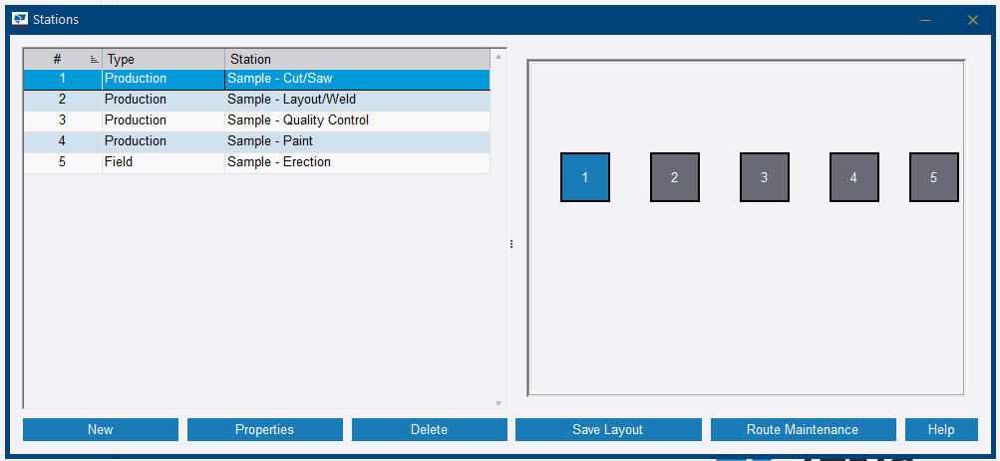
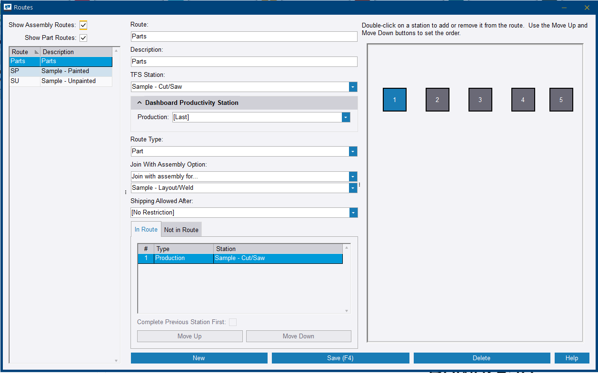
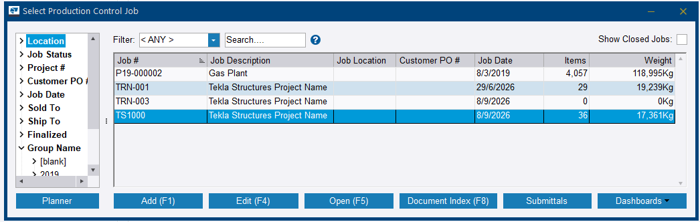
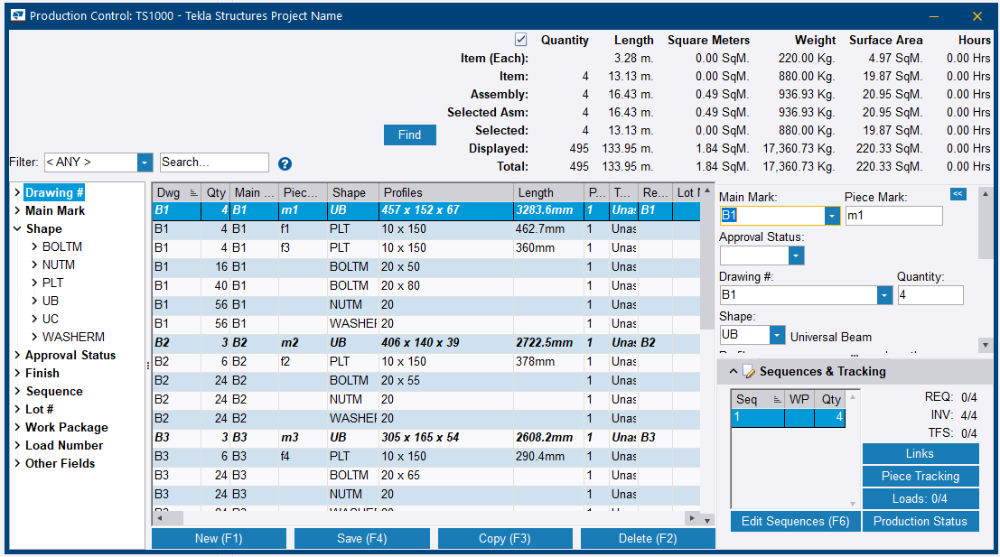
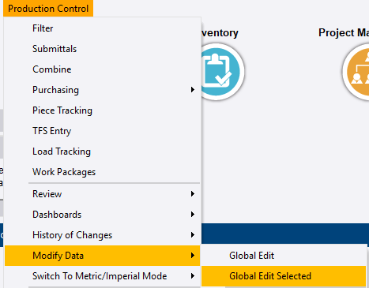
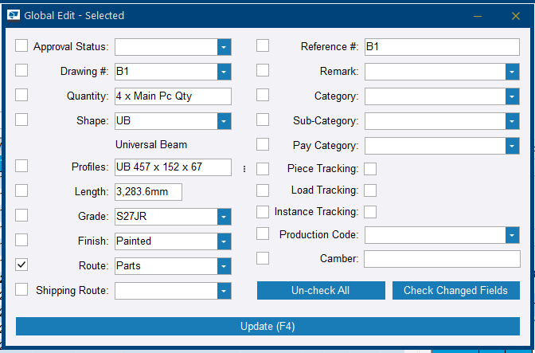

# Step 14 — Apply the fabrication route

**Role:** Production Control Coordinator / Shop Planner · **Module:** Production Control

**Why this matters**

A route is the ordered list of stations — Cut/Saw, Layout/Weld, Quality Control, Paint, Erection — that a piece is expected to travel through in the shop. Until a route is assigned to an item, Tekla PowerFab has no station list to track progress against. Piece Tracking will have nothing to show, even after material has been cut.

This normally happens once Purchasing has received material against the job's purchase orders.

**How to do it**

## Part A — Verify the route is configured correctly

1. Go to **Maintenance** ribbon tab **> Production Control > Fabrication Maintenance > Station and Route Setup**.

    
    <figcaption>Figure 14.1. Four levels deep. <strong>Fabrication Maintenance</strong> is the level that did not exist before 2026 — see the version note below. Note <strong>Cut Lists</strong> sitting in the same Production Control submenu; that is Step 15's entry point, not this one.</figcaption>

2. In the *Stations* dialog, click **Route Maintenance** to open *Routes*.

    
    <figcaption>Figure 14.2. Stations come first, routes second — a route can only order stations that already exist here. The <strong>Type</strong> column separates <em>Production</em> stations from <em>Field</em> ones, which is why erection can sit in the list without being a shop station.</figcaption>

3. Select the route you intend to use and verify three settings before relying on it:
    - **TFS Station** — must be the *first* station in the sequence, usually Cut/Saw.
    - **Route Type** — Assembly, Part, or Assembly & Part.
    - **In Route** list — every station you need, in the correct order. Double-click a station in the layout on the right to add or remove it, and use **Move Up** / **Move Down** to set the order.

    
    <figcaption>Figure 14.3. <strong>In Route</strong> and <strong>Not in Route</strong> are tabs, so a station missing from the route is not missing from the screen — check the second tab before concluding a station does not exist. <strong>Shipping Allowed After</strong> is a gate on Step 18: left at <em>[No Restriction]</em>, nothing stops a piece shipping before it is finished.</figcaption>

4. Click **Save (F4)**, then close the *Routes* and *Stations* dialogs.

## Part B — Apply the route to the job items

1. Open the Production Control job.

    
    <figcaption>Figure 14.4. Same picker as Step 10. Routing is applied per job, so this is where a route assigned to the wrong job starts.</figcaption>

2. Select the items to be routed. Before applying anything, look at the route column — on an unrouted job every row reads *Unassigned*.

    
    <figcaption>Figure 14.5. <em>Unassigned</em> on every row is the state this step exists to change, and re-reading this column afterwards is how you confirm it worked. Nothing warns you that a job is unrouted — the column simply reads this way.</figcaption>

3. Go to **Production Control** ribbon tab **> Modify Data > Global Edit Selected** for manually highlighted rows, or **Global Edit** for a filter-based selection such as by Finish or Category.

    
    <figcaption>Figure 14.6. Two entries, one word apart. <strong>Global Edit</strong> acts on the filtered set; <strong>Global Edit Selected</strong> acts on the rows you highlighted. Picking the first when you meant the second edits far more than you were looking at.</figcaption>

4. Tick the **Route** field checkbox and choose the route from the dropdown. Leave every other checkbox clear — **Un-check All** resets them if you are unsure.

    
    <figcaption>Figure 14.7. Every field arrives pre-filled from the selected item and every one has its own checkbox. Only the ticked fields are written — which is the whole safety mechanism, and the whole risk.</figcaption>

5. Click **Update (F4)**, then **Yes** to confirm.
6. Re-read the route column on the job screen. It should now name the route instead of reading *Unassigned*.

**You should now have:** every main assembly carrying a defined fabrication route, with a verified TFS Station.

!!! info "Menu change in PowerFab 2026"
    **Station and Route Setup** moved from directly under *Maintenance > Production Control* into a new **Fabrication Maintenance** submenu in Tekla PowerFab 2026, as in Figure 14.1. Older reference material points at the previous location — update it accordingly.

!!! danger "Routes must be applied before Step 15 — this cannot be fixed later"
    Confirmed live during a technical enablement session: if the cut list is built and processed before routes are assigned, applying routes afterwards does **not** back-fill completion credit for the Cut/Saw station.

    The Station Summary stays blank despite the cuts having genuinely been processed, and the only remedy is manually adding completed entries piece by piece. This is why Step 14 sits where it does in the sequence.

!!! danger "Only the ticked fields are written — and every field is pre-filled"
    **Global Edit** opens with every field already carrying the selected item's values: profile, length, grade, finish, quantity. A checkbox next to each one decides whether it is written back. Tick **Route** alone and only the route changes.

    Tick a second box by accident and that one value is applied to *every* item in the selection — one length, one grade, one finish, across the lot. There is no per-item confirmation and no warning. Use **Un-check All** before you start, then tick exactly one box.

!!! warning "Verify the TFS Station on the route"
    Routes can default their **TFS Station** to the last station in the sequence rather than the first. On the sample SP route this appeared as *Sample - Erection* instead of *Sample - Cut/Saw*. Material taken from stock is then credited at entirely the wrong point. Check this field before processing anything.

!!! warning "Fixing a route does not apply it"
    Correcting a route's settings in Route Maintenance changes the route. It does not attach the route to anything. Part B — Global Edit — is a separate and mandatory step.

    Opening **Production Status** instead of Fabrication Maintenance is the other common wrong turn here. Production Status is read-only progress reporting.

??? question "Frequently asked questions"
    **My Station Summary is completely empty even though I already cut material via TFS — why?**

    The cut list and TFS process works independently of routing. If the item never had a route assigned via Global Edit, there is no station list for Piece Tracking to display, regardless of how much material has already been cut.

    **I assigned the route after I already processed TFS — why did Cut/Saw not show as complete automatically?**

    The automatic TFS-station credit only fires at the moment of cutting. Assigning a route retroactively does not back-fill that completion. It has to be logged manually using **Add Completed** at Step 17.

    **What does Route Type control?**

    Whether the route applies to assemblies, to individual parts, or to both. Set it to match what is actually being routed. The *Routes* dialog also has **Show Assembly Routes** and **Show Part Routes** tickboxes at the top left — a route you cannot find may simply be filtered out of the list.

    **A station I need is not in the route list. Do I have to create it?**

    Check the **Not in Route** tab first. The *Routes* dialog splits stations across two tabs, so a station that exists but is not yet part of this route is on the second one. Double-click it in the layout on the right to add it.

??? note "Field notes — from the live test run"
    Tekla PowerFab 2026, Trimble Malaysia install.

    - The out-of-the-box **SP** sample route had **TFS Station** set to *Sample - Erection*, the last station, instead of *Sample - Cut/Saw*. Always check TFS Station before relying on a copied or sample route.
    - Global Edit is a separate, mandatory step. On `TRN-001`, items were cut via TFS before Global Edit was ever run, leaving Station Summary completely blank until the route was retroactively assigned.
    - After assigning the route post-cut, Cut/Saw still showed 0 Completed Qty. The completion had to be entered manually via **Add Completed**.

---

Next: [Step 15 — Create a cut list](step-15.md)
