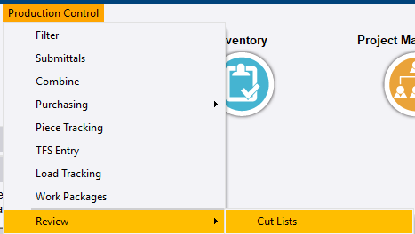
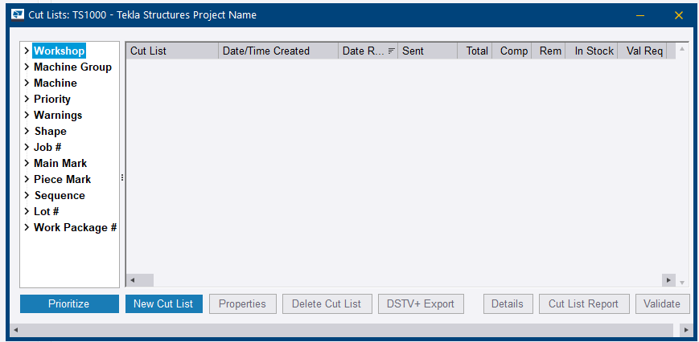
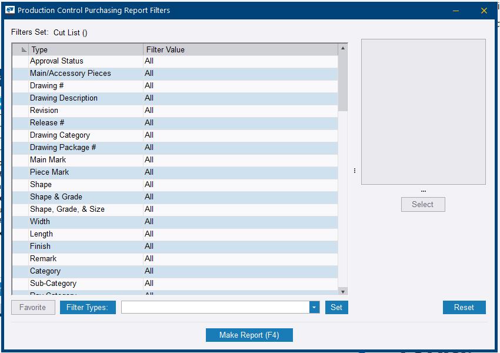
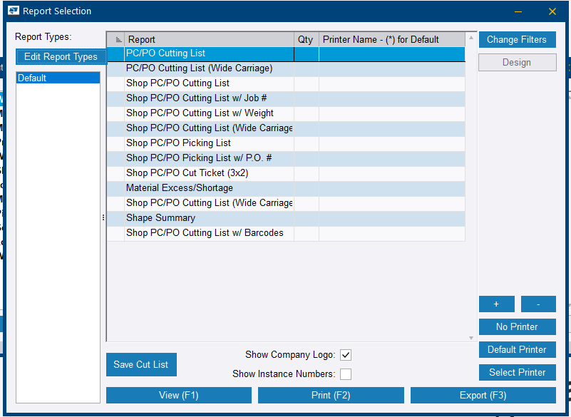
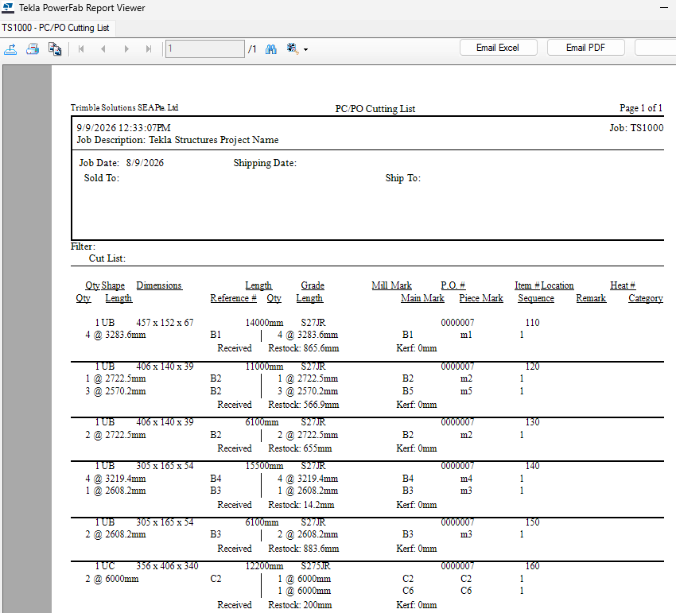
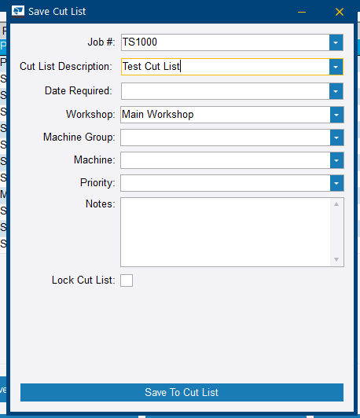
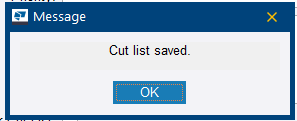

# Step 15 — Create a cut list

**Role:** Production Control Coordinator, working with the workshop cutting team · **Module:** Production Control

**Why this matters**

A cut list tells the shop exactly how each bar or sheet of received material should be cut to produce the parts on the job — the bridge between *we have steel in stock* and *we are cutting specific pieces today*. A saw operator cannot work from a full project BOM.

**How to do it**

1. Open the job in the **Production Control** module.

    
    <figcaption>Figure 15.1. In this capture the route column still reads <em>Unassigned</em> — Step 14's danger applies, so assign routes before the list is processed at Step 16, not after.</figcaption>

2. Go to **Production Control** ribbon tab **> Review > Cut Lists**.

    
    <figcaption>Figure 15.2. This is the authoring screen. The warning below covers the other menu entry that also says <em>Cut List</em> and goes somewhere else entirely.</figcaption>

3. Click **New Cut List**.

    
    <figcaption>Figure 15.3. Saved lists land here, grouped by <strong>Workshop</strong>, <strong>Machine</strong>, <strong>Priority</strong> — and by <strong>Warnings</strong>. There is a <strong>Validate</strong> button too: an explicit check you run, not one that runs itself.</figcaption>

4. In the *Production Control Purchasing Report Filters* dialog, leave the filters at the default (All) for a first cut list, or narrow by Shape or Category for separate cut lists per material type.

    
    <figcaption>Figure 15.4. The third filter dialog in this workflow with the same shape and the same tell — read the <strong>Filters Set</strong> header before running. A filter left over from an earlier list is how a cut list comes out short for a reason that has nothing to do with purchasing.</figcaption>

5. Click **Make Report (F4)**.
6. In *Report Selection*, choose a cutting list report — *PC/PO Cutting List*, for example — and click **View (F1)** to preview it.

    
    <figcaption>Figure 15.5. More than a dozen report variants: shop versions, wide-carriage versions, barcodes, cut tickets. <strong>Material Excess/Shortage</strong> in the same list is the one to reach for when the cut list looks shorter than expected.</figcaption>

7. Confirm the items, lengths, and quantities look correct, then close the preview.

    
    <figcaption>Figure 15.6. Every row carries a <strong>P.O. #</strong>. That column is the danger below made visible — material with no purchase order behind it has no row here at all. Note too that bolts, nuts and washers are absent: hardware is not cut.</figcaption>

8. Click **Save Cut List** — the button sits on the *Report Selection* dialog, not in the preview.
9. Enter a **Cut List Description**, and set **Date Required**, **Workshop**, **Machine Group**, **Machine** and **Priority** as the shop needs them. Tick **Lock Cut List** if the list should not be edited afterwards.

    
    <figcaption>Figure 15.7. <strong>Workshop</strong>, <strong>Machine Group</strong> and <strong>Machine</strong> are what send a list to specific equipment, and they are the same fields the Cut Lists screen groups by in Figure 15.3. Left blank, the list is simply ungrouped.</figcaption>

10. Click **Save To Cut List**, then **OK** to confirm.

    
    <figcaption>Figure 15.8. The whole confirmation. It says the list was saved — it does not say the list is complete, which is the distinction the danger below turns on.</figcaption>

**You should now have:** a named, saved cut list ready to be processed — and a preview you have actually read, rather than a saved-confirmation you clicked past.

!!! danger "Requisitioned material is silently excluded"
    A cut list can only be built from material that is on a **purchase order** or **already in stock**. Material still sitting on a requisition is not eligible.

    Tekla PowerFab does not throw an error. It simply leaves those rows out, which looks like a bug if you are not expecting it. This is the payoff for Steps 6, 12, and 13 — anything left unconverted or unreceived quietly fails to appear here.

    Two things do help once you know to look: every row on the report carries a **P.O. #**, so a missing mark is a mark with no purchase order behind it; and the Cut Lists screen has a **Validate** button and a **Warnings** grouping. Neither runs on its own.

!!! warning "Two menus both say Cut List"
    **Dashboards > Cut List Management** launches the PowerFab Go shop-floor dashboard — a different product surface entirely.

    **Production Control > Review > Cut Lists** is the desktop authoring screen used above. It is easy to click the wrong one.

??? question "Frequently asked questions"
    **Why can I not create a cut list for items I already combined and sent to a requisition?**

    A cut list can only be built from material linked to a purchase order or already in stock. Requisitioned-only material has not yet been purchased or received, so it is outside the cut list's eligible scope by design.

    **Should I build one cut list or several?**

    Either works. Leave the filters at All for a first pass, or narrow by Shape or Category to produce separate cut lists per material type — which is usually what a shop with multiple machines wants.

    **What does Lock Cut List do?**

    It prevents further edits to the saved list. Set it according to how the shop wants the list controlled — locked once it has been issued to the floor, unlocked while it is still being assembled.

    **What are Workshop, Machine Group and Machine for?**

    They route the list to specific equipment, and they are the fields the Cut Lists screen groups saved lists by. Filling them is what lets a shop with several saws see only its own work; leaving them blank produces a list that is valid but ungrouped.

??? note "Field notes — from the live test run"
    Tekla PowerFab 2026, Trimble Malaysia install.

    - `TRN-001`'s UC columns, sitting on requisition `RQ-001`, never appeared in the cut list because they had not yet been converted to a purchase order and received. No error was shown — just missing rows.
    - Both *Cut List* menu entries were clicked during the session before the right one was found. Worth calling out explicitly to trainees.

---

Next: [Step 16 — Process the cut list](step-16.md)
