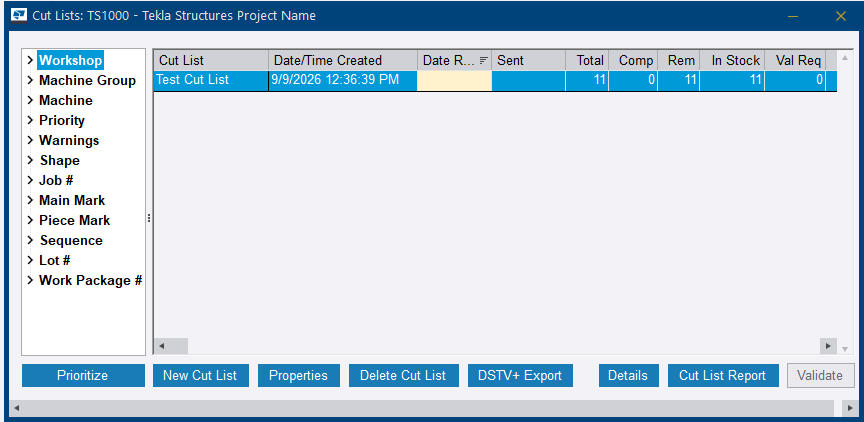

# Step 16 — Process the cut list

**Role:** Workshop / Cutting operator, or the Production Control Coordinator for demonstration · **Module:** Production Control

**Why this matters**

This is the step where material physically leaves stock and becomes a cut piece. **TFS** stands for *Take From Stock*: once a cut is confirmed, Tekla PowerFab deducts the material from inventory, timestamps the cut, and — if the route's TFS Station is configured correctly — automatically marks the first production station as complete.

Cutting the steel and telling the system it has been cut are two different events. This is the second one.

**How to do it**

1. In the *Cut Lists* dialog, select the cut list saved in Step 15 and click **Details**.
2. Select a cutting detail line and click **Cut**.
3. In the *Cut* dialog, select a **Heat #** from the dropdown — this links the cut piece back to its mill certificate — and complete any other available fields such as PO # and Location.
4. Review the **Drop** (remnant) length Tekla PowerFab calculates automatically.
5. Click **TFS (F4)** to commit the cut. The line turns green and **Status** shows *Complete*.
6. Repeat for every remaining cutting detail in the list.

<!-- SCREENSHOTS — Step 16
     Drop files into docs/assets/images/implementation/ named:
       impl-step16-01.png, impl-step16-02.png, ...
     Then delete this comment wrapper and indent each block 4 spaces
     under the numbered step it belongs to.

    
    <figcaption>Figure 16.1. Caption text.</figcaption>
-->

**You should now have:** raw stock consumed, project parts created, drops calculated, and — if the route was set up correctly at Step 14 — the first station credited automatically.

!!! tip "Heat # is a real traceability field, even in a sandbox"
    The Heat # dropdown at TFS time is meant to link back to an actual mill certificate. It is what allows a full chain-of-custody report — **Mill → PO → Cut → Assembly → Shipment** — to be pulled later.

    This is a strong talking point for customers in regulated industries, and worth explaining rather than skipping past in training.

!!! warning "Record the drop location"
    A remnant recorded with a **Location** returns to inventory as usable stock and can be consumed by a later job. One committed without a location is effectively scrapped on paper, regardless of what is physically sitting in the rack.

!!! info "The automatic station credit depends on Step 14"
    TFS marks the first production station complete only if the route's **TFS Station** is set to that first station. If it was left pointing at the last station, the credit lands in the wrong place — and if no route was assigned at all, nothing is credited anywhere.

??? question "Frequently asked questions"
    **What does TFS actually do to inventory?**

    It deducts the material from stock, timestamps the cut, and records the consumption against the job. This is what makes the JOBSUM report meaningful.

    **Do I have to process cuts one line at a time?**

    Each cutting detail line is committed individually with TFS (F4). Work through the list until every line shows *Complete*.

    **Can this be done from PowerFab Go instead?**

    Shop floor cut processing is available in Go, but the walkthrough here is the desktop Office path, which is what a trainer should demonstrate and what the coordinator will use.

??? note "Field notes — from the live test run"
    Tekla PowerFab 2026, Trimble Malaysia install.

    - Items were cut via TFS on `TRN-001` **before** Global Edit had ever been run, so no route was assigned at the moment of cutting. The automatic first-station credit therefore never fired, and Station Summary stayed blank at Step 17 until the completion was added manually.
    - The order matters: Step 14 before Step 16, always.

---

Next: [Step 17 — Production tracking](step-17.md)
