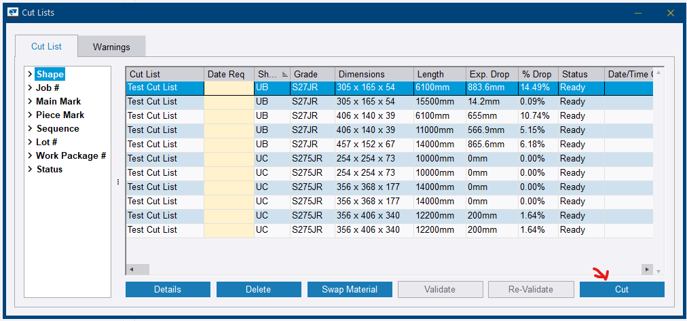
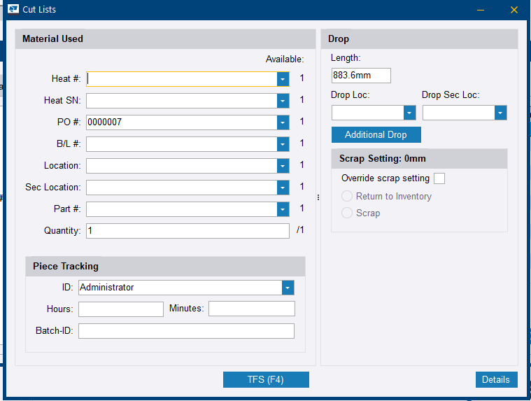
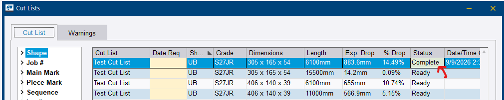

# Step 16 — Process the cut list

**Role:** Workshop / Cutting operator, or the Production Control Coordinator for demonstration · **Module:** Production Control

**Why this matters**

This is the step where material physically leaves stock and becomes a cut piece. **TFS** stands for *Take From Stock*: once a cut is confirmed, Tekla PowerFab deducts the material from inventory, timestamps the cut, and — if the route's TFS Station is configured correctly — automatically marks the first production station as complete.

Cutting the steel and telling the system it has been cut are two different events. This is the second one.

**How to do it**

1. In the *Cut Lists* dialog, select the cut list saved in Step 15 and click **Details**.

    
    <figcaption>Figure 16.1. <strong>Total</strong>, <strong>Comp</strong> and <strong>Rem</strong> are this step's progress bar: 11 total, 0 complete, 11 remaining before any cutting. Come back to this row at the end and <strong>Rem</strong> should read 0.</figcaption>

2. Select a cutting detail line and click **Cut**.

    
    <figcaption>Figure 16.2. Every row already carries <strong>Exp. Drop</strong> and <strong>% Drop</strong> — the offcut is calculated before you cut, not after. A row at 14.49% drop is worth a second look at the stock length before committing, and <strong>Swap Material</strong> is how you change your mind.</figcaption>

3. In the *Cut* dialog, select a **Heat #** from the dropdown — this links the cut piece back to its mill certificate — and complete any other available fields: **Heat SN**, **PO #**, **B/L #**, **Location**, **Part #** and **Quantity**.
4. Set the **Drop Loc** so the remnant returns to a known place, and review the **Length** Tekla PowerFab has calculated. Use **Additional Drop** if the cut leaves more than one usable offcut.

    
    <figcaption>Figure 16.3. Three panels, three different jobs. <strong>Material Used</strong> is traceability, <strong>Piece Tracking</strong> captures the operator and the time actually spent, and <strong>Drop</strong> decides what happens to the offcut — including an <strong>Override scrap setting</strong> that forces <em>Return to Inventory</em> or <em>Scrap</em> against the shop's threshold.</figcaption>

5. Click **TFS (F4)** to commit the cut. **Status** changes from *Ready* to *Complete* and a **Date/Time** is stamped on the row.

    
    <figcaption>Figure 16.4. One row done, the rest still <em>Ready</em>. The timestamp is the part worth trusting — it is what the JOBSUM report and the station credit are built from.</figcaption>

6. Repeat for every remaining cutting detail in the list, then re-check the **Rem** count on the Cut Lists screen.

**You should now have:** raw stock consumed, project parts created, drops recorded to a location, every line reading *Complete*, and — if the route was set up correctly at Step 14 — the first station credited automatically.

!!! tip "Heat # is a real traceability field, even in a sandbox"
    The Heat # dropdown at TFS time is meant to link back to an actual mill certificate. It is what allows a full chain-of-custody report — **Mill → PO → Cut → Assembly → Shipment** — to be pulled later.

    This is a strong talking point for customers in regulated industries, and worth explaining rather than skipping past in training.

!!! warning "Record the drop location"
    A remnant recorded with a **Drop Loc** returns to inventory as usable stock and can be consumed by a later job. One committed without a location is effectively scrapped on paper, regardless of what is physically sitting in the rack.

    The Drop panel also shows a **Scrap Setting** threshold, with an **Override scrap setting** tickbox that enables an explicit **Return to Inventory** or **Scrap** choice for this cut. Use it when a particular offcut should not follow the shop default.

!!! info "The automatic station credit depends on Step 14"
    TFS marks the first production station complete only if the route's **TFS Station** is set to that first station. If it was left pointing at the last station, the credit lands in the wrong place — and if no route was assigned at all, nothing is credited anywhere.

??? question "Frequently asked questions"
    **What does TFS actually do to inventory?**

    It deducts the material from stock, timestamps the cut, and records the consumption against the job. This is what makes the JOBSUM report meaningful.

    **Do I have to process cuts one line at a time?**

    Each cutting detail line is committed individually with TFS (F4). Work through the list until every line shows *Complete* and the **Rem** count on the Cut Lists screen reaches 0.

    **What are the Piece Tracking fields on the Cut dialog for?**

    They capture who made the cut and how long it took — **ID**, **Hours**, **Minutes** and a **Batch-ID**. Filled in, they are what turns the Hours columns elsewhere in Production Control into something other than 0.00.

    **Can this be done from PowerFab Go instead?**

    Shop floor cut processing is available in Go, but the walkthrough here is the desktop Office path, which is what a trainer should demonstrate and what the coordinator will use.

??? note "Field notes — from the live test run"
    Tekla PowerFab 2026, Trimble Malaysia install.

    - Items were cut via TFS on `TRN-001` **before** Global Edit had ever been run, so no route was assigned at the moment of cutting. The automatic first-station credit therefore never fired, and Station Summary stayed blank at Step 17 until the completion was added manually.
    - The order matters: Step 14 before Step 16, always.

---

Next: [Step 17 — Production tracking](step-17.md)
