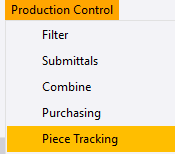

# Step 17 — Production tracking

**Role:** Shop floor supervisor via PowerFab Go, or Production Control Coordinator via Office · **Module:** Production Control

**Why this matters**

Once a piece has a route, every station it passes through needs to be logged so the business knows — in real time — how far along the job actually is. This feeds production dashboards, customer status updates, the Trimble Connect model colouring, and, in PowerFab Go, shipping eligibility.

=== "In PowerFab Office"

    1. Go to **Production Control** ribbon tab **> Piece Tracking**. This opens *Station Summary*, listing every station with assigned work and its **Total Qty**, **Completed Qty**, and **Remaining Qty**.
    2. Select a station and click **Add Completed**.
    3. In the *Station - Add Completed* dialog, pick the station from the **Station** dropdown if it is not already selected. Items only populate the *Not Included* list once a station is chosen.
    4. Move the items that finished that station from *Not Included* to *Included* using the arrow buttons.
    5. Set **Completed By** and **Date**, and optionally **Hours** and **Minutes**.
    6. Click **Add Material** to save.
    7. Repeat for each station as work progresses.

=== "In PowerFab Go (shop floor)"

    1. Sign in to PowerFab Go and open the job.
    2. Navigate to **Production Tracking**, or the Production dashboard.
    3. Filter or scan to find the item at its current station.
    4. Confirm the quantity complete. This syncs back to Office in real time.

<!-- SCREENSHOTS — Step 17
     Drop files into docs/assets/images/implementation/ named:
       impl-step17-01.png, impl-step17-02.png, ...
     Then delete this comment wrapper and indent each block 4 spaces
     under the numbered step it belongs to.

    
    <figcaption>Figure 17.1. Caption text.</figcaption>
-->

**You should now have:** live progress visible in **Production Status** and reflected in the Trimble Connect model.

!!! warning "A blank Station Summary points back to Step 14"
    If tracking appears to work but the Station Summary stays empty, the material has no route assigned. Fix the routing rather than troubleshooting the tracking screen — the tracking is behaving correctly, it simply has no stations to report against.

    And if the route was assigned *after* TFS, the Cut/Saw credit was never back-filled. Enter it manually via **Add Completed**.

!!! info "Complete Previous Station First"
    If a route's **Complete Previous Station First** checkbox is left unticked, stations can be logged out of order. That is genuinely useful when shop work happens out of sequence — but it should be a deliberate choice confirmed with the customer, not something discovered later.

??? question "Frequently asked questions"
    **Why does one station show a higher Total Qty than every other station on the same route?**

    Total Qty reflects every item eligible to be tracked at that station — which includes items on the route, plus any item with a standalone **Inspection** requirement pointing at that station, even if that item has no route, no stock, and no TFS activity at all. See the [Day 4 afternoon session](../../day-4/afternoon.md) for the worked example.

    **Why do items not appear in the Not Included list?**

    A station has to be chosen in the **Station** dropdown first. The list only populates once it is selected.

    **Do I need to log in both Office and Go?**

    No. Both write to the same database. Go is for the shop floor in real time; Office is what a coordinator uses, and what this walkthrough demonstrates.

??? note "Field notes — from the live test run"
    Tekla PowerFab 2026, Trimble Malaysia install.

    - On `TRN-001`, UC column main mark `C1` — Route blank, REQ 2/2, INV 0/2, TFS 0/2 — still inflated Quality Control's **Total Qty** by 2 pieces and 729.40 kg compared with every other station. It was traced to a standalone Inspection requirement on that mark, entirely independent of routing.
    - Station Summary was completely blank until the route was retroactively assigned, and Cut/Saw still read 0 Completed Qty afterwards. Late route assignment does not back-fill TFS credit.

---

Next: [Step 18 — Create a load and ship](step-18.md)
