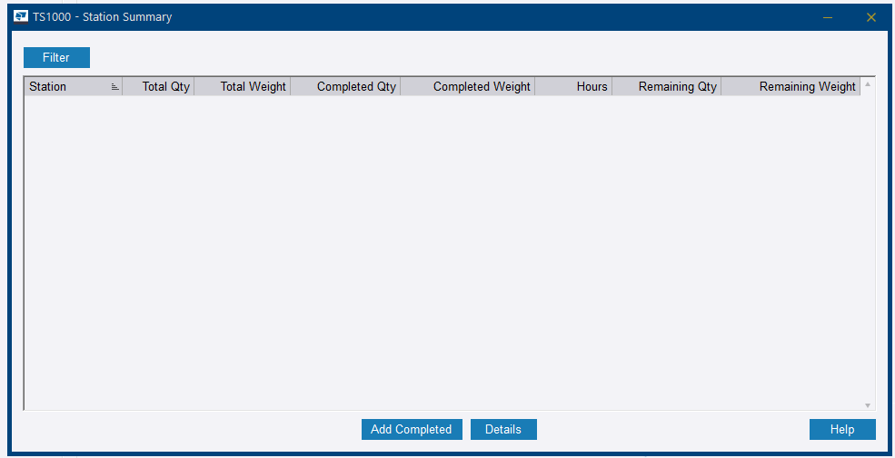
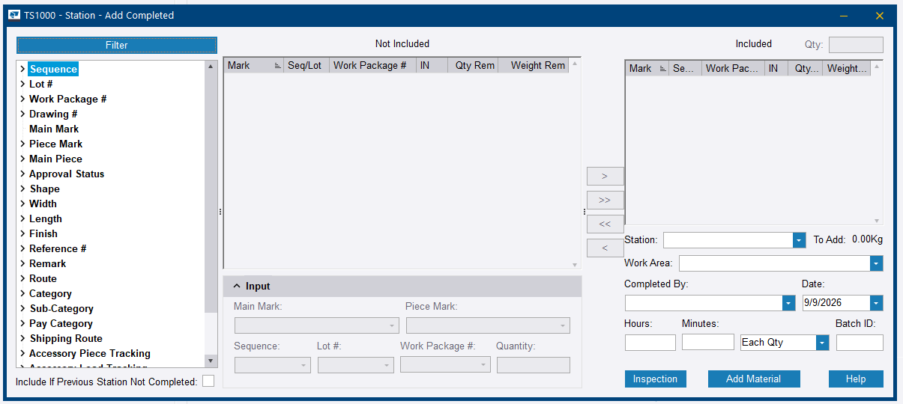

# Step 17 — Production tracking

**Role:** Shop floor supervisor via PowerFab Go, or Production Control Coordinator via Office · **Module:** Production Control

**Why this matters**

Once a piece has a route, every station it passes through needs to be logged so the business knows — in real time — how far along the job actually is. This feeds production dashboards, customer status updates, the Trimble Connect model colouring, and, in PowerFab Go, shipping eligibility.

=== "In PowerFab Office"

    1. Go to **Production Control** ribbon tab **> Piece Tracking**.

        
        <figcaption>Figure 17.1. <strong>Piece Tracking</strong> is the entry point. <em>TFS Entry</em> and <em>Load Tracking</em> further down the same menu belong to Steps 16 and 18.</figcaption>

    2. Read the *Station Summary* it opens: every station with assigned work, and its **Total Qty**, **Completed Qty**, **Hours** and **Remaining Qty**.

        
        <figcaption>Figure 17.2. This is the empty state, and it is worth recognising on sight. No rows does not mean no work has been done — it means no station list exists to report against. The warning below is about exactly this screen.</figcaption>

    3. Select a station and click **Add Completed**.
    4. In the *Station - Add Completed* dialog, pick the station from the **Station** dropdown if it is not already selected. Items only populate the *Not Included* list once a station is chosen.

        
        <figcaption>Figure 17.3. Captured with no station chosen — which is why both lists are empty and the <strong>Input</strong> panel is greyed out. <strong>To Add</strong> beside the station dropdown keeps a running weight of what is about to be committed, and the <strong>Include If Previous Station Not Completed</strong> tickbox at the bottom left is the per-entry counterpart to the route setting described below.</figcaption>

    5. Move the items that finished that station from *Not Included* to *Included* using the arrow buttons.
    6. Set **Completed By** and **Date**, and optionally **Work Area**, **Hours**, **Minutes** and **Batch ID**.
    7. Check the **To Add** weight, then click **Add Material** to save.
    8. Repeat for each station as work progresses.

=== "In PowerFab Go (shop floor)"

    1. Sign in to PowerFab Go and open the job.
    2. Navigate to **Production Tracking**, or the Production dashboard.
    3. Filter or scan to find the item at its current station.
    4. Confirm the quantity complete. This syncs back to Office in real time.

    !!! info "No captures for this path yet"
        The screenshots on this page are all from PowerFab Office. The Go steps are documented from the trainer handout, not from a captured run.

**You should now have:** live progress visible in **Production Status** and reflected in the Trimble Connect model.

!!! warning "A blank Station Summary points back to Step 14"
    If tracking appears to work but the Station Summary stays empty — as in Figure 17.2 — the material has no route assigned. Fix the routing rather than troubleshooting the tracking screen — the tracking is behaving correctly, it simply has no stations to report against.

    And if the route was assigned *after* TFS, the Cut/Saw credit was never back-filled. Enter it manually via **Add Completed**.

!!! info "Complete Previous Station First — and its counterpart here"
    If a route's **Complete Previous Station First** checkbox is left unticked, stations can be logged out of order. That is genuinely useful when shop work happens out of sequence — but it should be a deliberate choice confirmed with the customer, not something discovered later.

    The *Station - Add Completed* dialog carries the other half of the same rule: **Include If Previous Station Not Completed**, bottom left in Figure 17.3. The route setting is the standing policy; this tickbox is the one-off exception for a single entry.

??? question "Frequently asked questions"
    **Why does one station show a higher Total Qty than every other station on the same route?**

    Total Qty reflects every item eligible to be tracked at that station — which includes items on the route, plus any item with a standalone **Inspection** requirement pointing at that station, even if that item has no route, no stock, and no TFS activity at all. See the [Day 4 afternoon session](../../day-4/afternoon.md) for the worked example.

    **Why do items not appear in the Not Included list?**

    A station has to be chosen in the **Station** dropdown first. The list only populates once it is selected — Figure 17.3 is the dialog in exactly that state, with the dropdown empty and both lists blank.

    **What is the Inspection button on the Add Completed dialog?**

    It records an inspection against the selection rather than a production completion. It is the same mechanism behind the standalone Inspection requirements described in the first question above — which is why an item can carry inspection activity at a station without ever having been routed through it.

    **Do I need to log in both Office and Go?**

    No. Both write to the same database. Go is for the shop floor in real time; Office is what a coordinator uses, and what this walkthrough demonstrates.

??? note "Field notes — from the live test run"
    Tekla PowerFab 2026, Trimble Malaysia install.

    - On `TRN-001`, UC column main mark `C1` — Route blank, REQ 2/2, INV 0/2, TFS 0/2 — still inflated Quality Control's **Total Qty** by 2 pieces and 729.40 kg compared with every other station. It was traced to a standalone Inspection requirement on that mark, entirely independent of routing.
    - Station Summary was completely blank until the route was retroactively assigned, and Cut/Saw still read 0 Completed Qty afterwards. Late route assignment does not back-fill TFS credit.

---

Next: [Step 18 — Create a load and ship](step-18.md)
