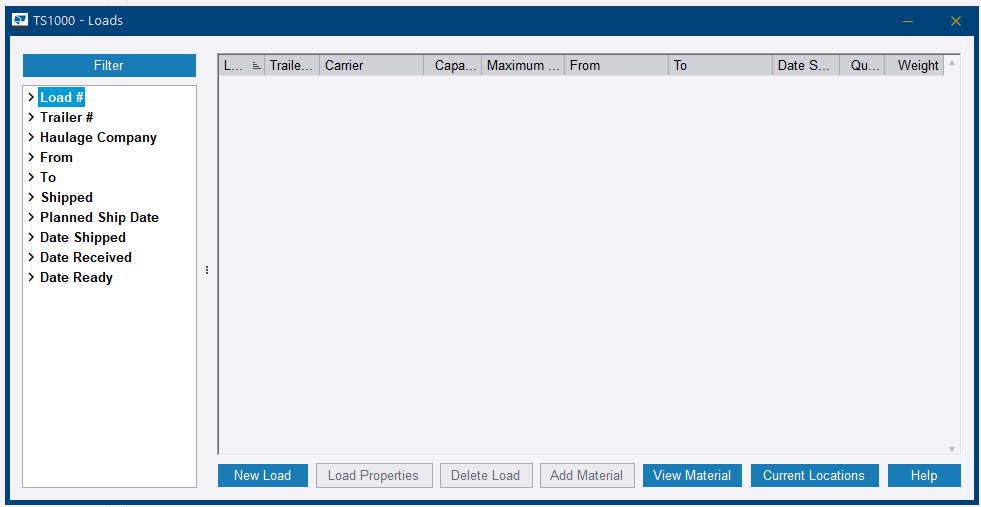
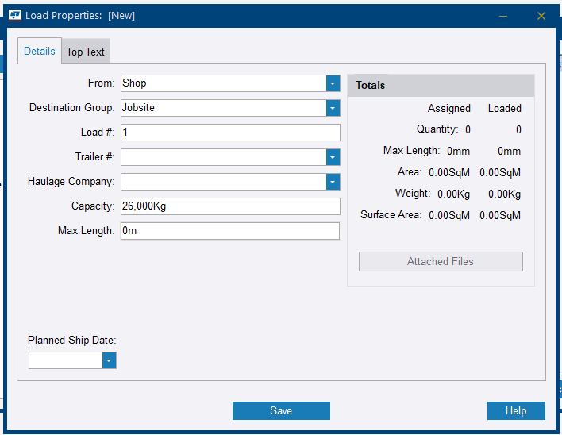
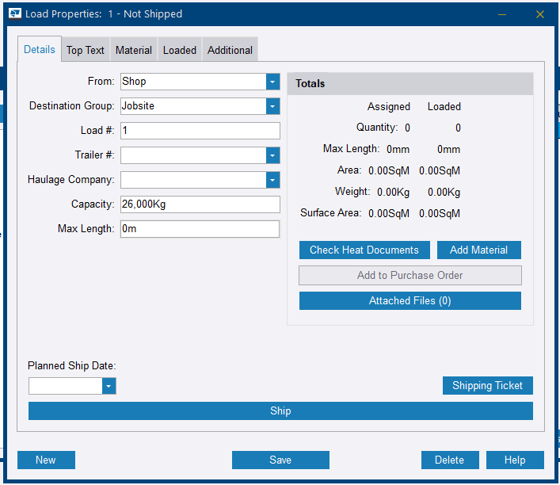
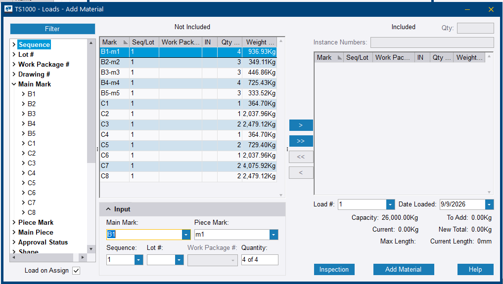
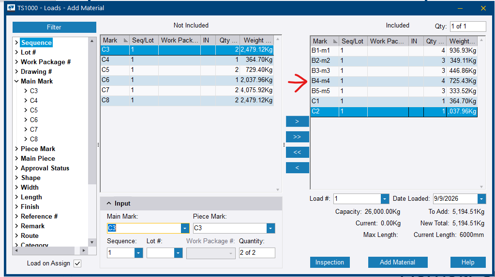
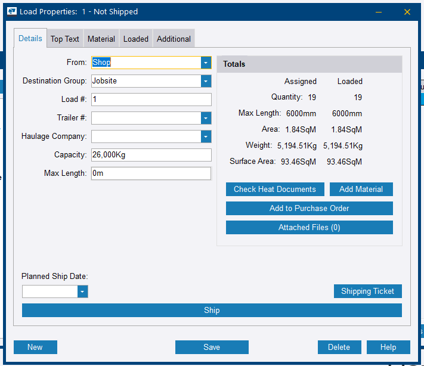
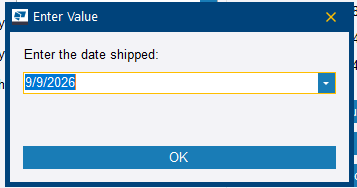
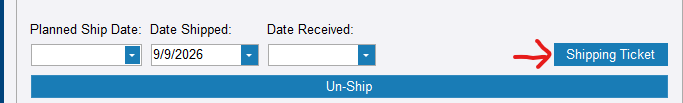
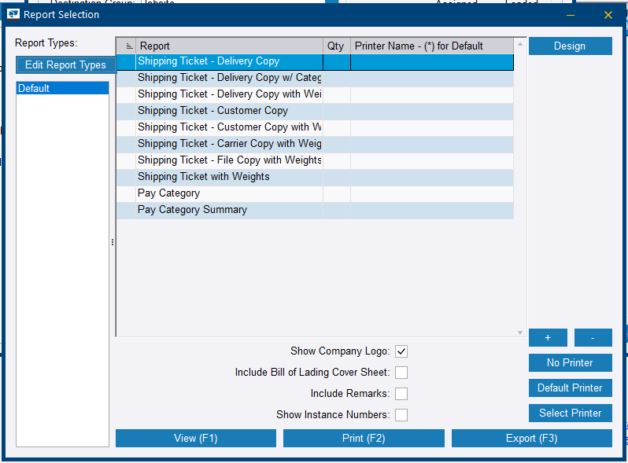
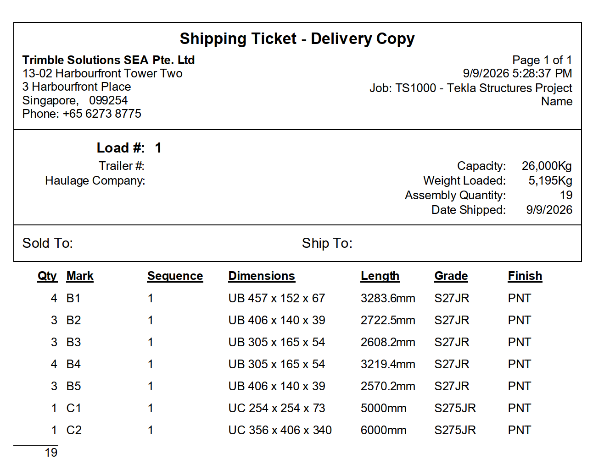

# Step 18 — Create a load and ship

**Role:** Shipping / Logistics Coordinator · **Module:** Production Control (Load Tracking)

**Why this matters**

Load Tracking manages what physically goes on a truck, to where, and when. It generates the paperwork the driver needs — shipping ticket, bill of lading — and keeps an accurate record of what has left the shop versus what is still on site.

**How to do it**

1. Go to **Production Control** ribbon tab **> Load Tracking**. The *Loads* dialog opens.

    
    <figcaption>Figure 18.1. The third and last of the tracking entries on this menu. Steps 16 and 17 used the two above it.</figcaption>

2. Click **New Load**.

    
    <figcaption>Figure 18.2. Every button except <strong>New Load</strong>, <strong>View Material</strong> and <strong>Current Locations</strong> is greyed until a load exists. <strong>Current Locations</strong> answers the question this screen is usually opened for — where is a given piece right now.</figcaption>

3. In *Load Properties*, set **From** (Shop), **Destination Group** (Jobsite), **Load #**, **Trailer #**, **Haulage Company**, and **Capacity / Max Length** if relevant.

    
    <figcaption>Figure 18.3. A new load has two tabs and no <strong>Add Material</strong> button. Setting <strong>Capacity</strong> here is what makes the weight check at step 6 meaningful — left at zero, nothing is being compared against.</figcaption>

4. Click **Save**. The dialog reopens as *Load Properties - Not Shipped* with three more tabs and the buttons the rest of this step needs.

    
    <figcaption>Figure 18.4. Compare against Figure 18.3: <strong>Material</strong>, <strong>Loaded</strong> and <strong>Additional</strong> tabs appear, and so do <strong>Add Material</strong>, <strong>Ship</strong> and <strong>Shipping Ticket</strong>. Saving is not optional bookkeeping — it is what unlocks the step. <strong>Check Heat Documents</strong> is the certification chase Step 13's tip warns about leaving this late.</figcaption>

5. Click **Add Material**.

    
    <figcaption>Figure 18.5. Everything eligible starts on the left. The <strong>Load on Assign</strong> tickbox at the bottom left decides whether moving an item across also marks it physically loaded, rather than merely assigned to the load.</figcaption>

6. Move the items for this load into the *Included* list, adjust quantities if needed, and watch **New Total** against **Capacity**. Click **Add Material** to confirm.

    
    <figcaption>Figure 18.6. <strong>To Add</strong>, <strong>Current</strong> and <strong>New Total</strong> update as items move across, and <strong>Current Length</strong> tracks against <strong>Max Length</strong> the same way. This is the truck being loaded on paper — overloading it is arithmetic you can see before the crane moves.</figcaption>

7. Check the **Totals** panel on the load. **Assigned** and **Loaded** should agree.

    
    <figcaption>Figure 18.7. Two columns, and they are not the same thing. <strong>Assigned</strong> is what belongs to this load; <strong>Loaded</strong> is what has physically gone on. A gap between them means material is spoken for but still on the ground.</figcaption>

8. When ready to physically ship, click **Ship** and enter the **Date Shipped** when prompted.

    
    <figcaption>Figure 18.8. One prompt, pre-filled with today. Back-date it if the truck left earlier — this timestamp is what the delivery record is built on.</figcaption>

9. Confirm the load now reads as shipped, and set **Date Received** once it is delivered.

    
    <figcaption>Figure 18.9. <strong>Ship</strong> becomes <strong>Un-Ship</strong>. Shipping is reversible from this screen, which is the practical answer to the warning below — a load sent early can be pulled back, provided someone notices.</figcaption>

10. Click **Shipping Ticket**, choose a report — *Shipping Ticket - Delivery Copy*, for example — and tick **Include Bill of Lading Cover Sheet** if the carrier needs one. Click **View (F1)** to confirm, then **Print (F2)** or **Export (F3)**.

    
    <figcaption>Figure 18.10. Four copies of the same ticket — <em>Delivery</em>, <em>Customer</em>, <em>Carrier</em>, <em>File</em> — because four parties need one. The bill of lading is not among them: it is the <strong>cover sheet</strong> tickbox beneath.</figcaption>

11. Check the ticket before it goes to the driver.

    
    <figcaption>Figure 18.11. The end of the eighteen steps, on one page: marks, dimensions, grades and finish, with <strong>Weight Loaded</strong> shown against <strong>Capacity</strong>. Every value on it was entered somewhere earlier in this workflow.</figcaption>

**You should now have:** a shipped load with **Assigned** and **Loaded** agreeing, a printed shipping ticket — with a bill of lading cover sheet if the carrier needs one — and a complete delivery record against the job.

!!! warning "Office will not stop an incomplete load from shipping"
    Tekla PowerFab 2026 blocks loading an item in **PowerFab Go** until every station on its assigned route shows complete. Desktop **Office** Load Tracking does not currently enforce the same gate.

    Confirmed during this session by shipping a load from Office with several stations still incomplete and no warning shown. An office user can therefore ship steel the shop has not finished. Where this matters, the control has to come from process discipline or from routing shipping through Go — Office will not prevent it.

    The captures on this page come from the same job as Figure 17.2, whose Station Summary is empty because nothing was ever routed. The load in Figures 18.5 to 18.11 shipped anyway, with nothing on screen objecting. **Un-Ship** in Figure 18.9 is the way back, but only if somebody notices.

??? question "Frequently asked questions"
    **Can I ship an item that has not completed every station on its route?**

    In PowerFab Go (2026), no — all stations must be complete first. In PowerFab Office, the desktop Load Tracking dialog currently allows it with no warning, so this is a behaviour gap worth confirming against each customer's process.

    **What is the difference between the shipping ticket and the bill of lading?**

    The shipping ticket is the delivery record, and the *Report Selection* dialog offers it in four copies — Delivery, Customer, Carrier and File — for the four parties who need one. The bill of lading is not a separate report in that list: it is the **Include Bill of Lading Cover Sheet** tickbox on the same dialog, which prepends the carrier document to whichever ticket you print.

    **Can a load be un-shipped?**

    Yes. Once shipped, the **Ship** button becomes **Un-Ship** on the same screen. That is the correction path for a load sent in error — including one shipped before the shop finished it, which Office will not stop on its own.

    **What does Destination Group do?**

    It groups destinations — jobsite, galvaniser, third-party processor — so loads can be routed and reported by where they are going, not just by individual address.

??? note "Field notes — from the live test run"
    Tekla PowerFab 2026, Trimble Malaysia install.

    - A load was shipped from PowerFab Office on `TRN-001` with Cut/Saw, Layout/Weld, and Quality Control all showing incomplete stations, with no warning from the desktop client. The 2026 Go shipping gate does not apply to Office.

---

That completes the workflow. Use the [Practice Checklist](../practice-checklist.md) for a second hands-on run.
